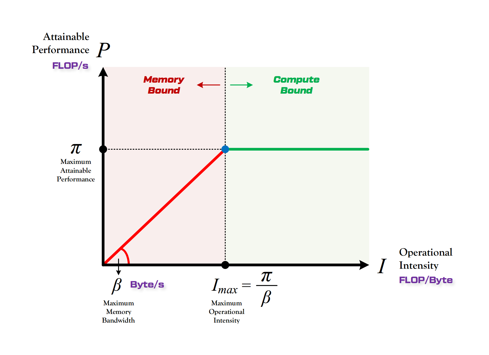
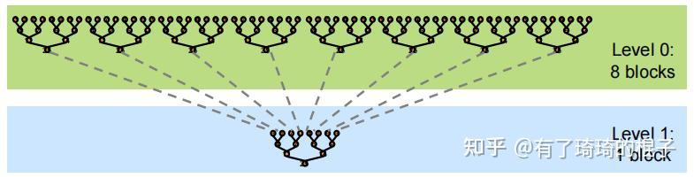

# cudaCode
此仓库是本人在秋招准备过程中关于 `CUDA` 编程技巧的总结

## NVIDIA Nsight Compute 和 NVIDIA Nsight Systems
* `Nsight Systems` 提供全局视图的性能分析, 包括整体应用的执行流程、资源使用和性能特性。`Nsight Systems` 不仅能够分析 GPU 性能, 也能够分析 CPU、内存和系统级的性能特性。使用时主要关注: 应用整个上各个核函数以及操作消耗的事情顺序, CPU 和 GPU 之间的数据传输耗时, 多个 Stream 之间的调度信息, SM warp occupancy。
* `Nsight Compute` 对核函数的性能特性和瓶颈进行详细的分析。使用时主要关注: SM 的吞吐量, 依据 roofline model 分析当前核函数是属于计算密集型, 还是访存密集型, 估算核函数不同线程配置对 warp occupancy 的影响。L1 cache 和 L2 cache 的吞吐量和命中率。

# Roofline Model 的介绍
* Roofline Model 其实是说明模型在一个计算平台的限制下, 到底能够达到多快的浮点计算速度。具体来说解决的问题是 `计算量为A且访存量为B的模型在算力为C且带宽为D的计算平台所能达到的理论性能上限E是多少`。Roofline 划分出了计算瓶颈取余和贷款瓶颈区域。模型是实际表现一定是越贴近于边界越好的, 最理想的情况, 是实际表现达到拐点处。


# Reduce 优化
* reduce 算法也就是规约运算, 本质上是 $ x = x_0 \otimes x_1 \otimes x_2 \cdots \otimes x_n $。在并行计算中通常采用树形的及计算方式。比如计算长度为 $N$ 的数组的所有元素之和。首先将数组分成 $m$ 个小份, 开启 $m$ 个 block 计算出 $m$ 个小份的 reduce 的值。接下来再使用一个 block 将 $m$ 个小份再次进行 reduce, 得到最终的结果。

* 对于线程模型的分配, 线程模型的块的个数尽量给到 `SM` 个数的整数倍, 一个块内线程的个数通常是 `128, 256, 512, 1024`。在线程与元素一一对应不能满足的时候, 通常先满足块的个数是整数的要求, 然后再分配适当的线程, 使用 `块跨步` 的方法使得一个线程块的线程能够遍历完分配其的所有数据。进行一个 block 内规约的方法通常有两种, 第一种方法如下所示:
```C++
__global__ void Kernel_A(int *d_s, int *d_o)
{
    int tid = threadIdx.x;
    int *b_s = d_s + blockIdx.x * num_per_block;

    // 1) 每个线程先将负责的部分的数据规约到自己的寄存器中
    int sum = 0;
    for(int i=tid; i<num_per_block; i+=blockDim.x)
    {
        sum += b_s[i];
    }
    
    // 2) 每个块中都分配共享内存, 共享内存负责存储每个线程的变量的值
    __shared__ int tmp_sum[thread_per_block];
    tmp_sum[tid] = sum;
    __syncthreads();

    // 3) 这样规约的好处, 1) 避免了线程束的分歧 2) 不存在 bank 冲突 3) 最后一个 warp 内不需要同步, 避免了同步造成的影响
    for(int s=blockDim.x/2; s>16; s>>=1)
    {
        if(tid<s)
        {
            tmp_sum[tid] += tmp_sum[tid+s];
        }
        __syncthreads();  // 这个不能放到 if 里面
    }

    // 一个 warp 中的所有线程无论什么时候, 都是处在同一种状态, SIMD 的特点
    if(tid<16)  // 因为是同一个 warp 所以不需要同步
    {
        tmp_sum[tid] += tmp_sum[tid+16];
        tmp_sum[tid] += tmp_sum[tid+8];
        tmp_sum[tid] += tmp_sum[tid+4];
        tmp_sum[tid] += tmp_sum[tid+2];
        tmp_sum[tid] += tmp_sum[tid+1];
    }

    // 4) 将每个块规约之后的值赋值到输出
    if(tid==0) d_o[blockIdx.x] = tmp_sum[0];
}
```
* 对于代码中的 `1)`, 每个线程都将自己负责的部分首先进行归约到自己的寄存器变量中。尽可能每个块分配比较少的线程, 让一个线程负责多个数据, 不然每次进行一次规约都有很多的线程不干活。
* 对于代码中的 `2)`, 根据每个块中线程的个数分配共享内存的大小, 让后把每个线程中寄存器的值, 写入到共享内存中。这里的 `__syncthreads()` 是为了同步每个块中的线程, `同一warp中的线程一定是处于同一状态和进度的, 但是不同 warp 的线程所处状态是不确定的, 也就是不同 warp 执行到的地方可能不相同`。读入共享内存中, 是因为 `共享内存能够进行块间数据的共享和同步`(因为我们需要进行块内规约, 需要这一特点)。
* 对于代码中的 `3)`, 这里 `blockDim.x` 一定是能够被 `32` 整除的。这样的写法有很多优势
    * 避免了线程束的分歧, 因为最后一次规约的时候, 步长为 `32`, 所有 `warp` 都是同一状态, 要么执行, 要么不执行。
    * 避免了共享内存中的 bank 冲突, 以 `warp 0` 为例分析, 当 `s=128` 时, `warp 0` 中的 0 线程访问 0 和 128 元素, 都是位于 0 bank,  1 线程访问 1 和 129 元素, 都是位于 1 bank, ... 31 线程方位 31 和 159 元素, 都位于 31 bank, 不存在冲突。
    * 对于最后一个 warp 内值的规约, 这里并没有在循环中使用, 因为最后一个 `warp` 内的所有线程都是同步的, 对共享内存的访问也是同步的, 不需要同步。
* 对于代码中的 `4)`, 这里并没有做同步, 因为所有对共享内存的操作都是在一个 warp 内完成的, 减少同步损耗。
* 规约之后规约的值就位于每个块中共享内存中的第一个值。
* 规约注意的事项就是, 是共享内存块的规约, 也就是每个块规约出一个值, 如果想不同块之间再进行规约, 可以
    * 每个块的结果传回主机端, 然后 host 端进行规约(数据拷贝造成损耗)
    * 先把每个块规约的结果写到全局内存中, 然后利用 `一个块` 对这些数据进行规约(两步规约的办法)。
* 第二种方法如下所示:
```C++
// 每个 warp 进行规约, 规约后的值在 warp 中的 0 号线程
// __shfl_down_sync 相比于 __shfl_down 允许开发者指定一个线程掩码, 确保只有在指定的线程都完成数据交换后, 才继续执行后续的操作
__device__ int warpReduceSum(int sum)
{
    sum += __shfl_down_sync(0xffffffff, sum, 16);
    sum += __shfl_down_sync(0xffffffff, sum, 8);
    sum += __shfl_down_sync(0xffffffff, sum, 4);
    sum += __shfl_down_sync(0xffffffff, sum, 2);
    sum += __shfl_down_sync(0xffffffff, sum, 1);
    
    // sum += __shfl_xor_sync(0xffffffff, sum, 16);
    // sum += __shfl_xor_sync(0xffffffff, sum, 8);
    // sum += __shfl_xor_sync(0xffffffff, sum, 4);
    // sum += __shfl_xor_sync(0xffffffff, sum, 2);
    // sum += __shfl_xor_sync(0xffffffff, sum, 1);

    return sum;
}

__device__ int blockReduceSum(int sum)
{
    int laneId = threadIdx.x % warpSize;  // 每个 warp 中第几个线程
    int warpId = threadIdx.x / warpSize;  // 属于第几个 warp

    // 填充进去
    sum = warpReduceSum(sum);
    __shared__ int reduceSum[32];         // 最多也就 32 个 warp
    if(laneId==0)
    {
        reduceSum[warpId] = sum;
    }
    __syncthreads();

    bool pred = (warpId==0) && (laneId < blockDim.x / warpSize);
    int value =  (int)pred * reduceSum[laneId];  // 在范围内的为正常的数字, 否则为 0
    if(warpId==0) value = warpReduceSum(value);
    if(warpId==0 && laneId==0) sum=value;

    return sum;
}


__global__ void Kernel_B(int *d_s, int *d_o)
{
    int tid = threadIdx.x;  // 每个块内线程的 id
    int *b_s = d_s + blockIdx.x * num_per_block;

    // 1) 每个线程先将负责的部分的数据规约到自己的寄存器中
    int sum = 0;
    for(int i=tid; i<num_per_block; i+=blockDim.x)
    {
        sum += b_s[i];
    }
    sum = blockReduceSum(sum);

    if(tid==0) d_o[blockIdx.x] = sum;
}
```
* 对于第二种方法, 其实整体思路就是, 每个线程先将负责的那部分数据归约到总计的寄存器中, 然后 `warp` 内先进行一次规约, 规约的结果存储在每个 `warp` 的第一个线程中。然后再分配共享内存, 此时共享内存只需要再分配最多 32 个元素字节的大小(因为一个块内最多有 1024 个线程, 对应 32 个 `warp`)。但是这里有个问题, 就是得确定真正参与规约的每个块内有多少个 `warp`(确定个数来给共享内存32个无效的位置填充适当的数字)。最后再对这个 32 个共享内存数据进行规约, 这里使用的方法是, 每个块内 0 号 `warp` 读取这 32 个值, 然后再来一次 warp 内的规约。其实也可以像第一种方法一样, 直接操作共享内存(这里涉及到需要给共享内存写没用到的值, 或者依据线程个数只规约想要的部分)。

## PTX 与 SASS 的区别
* CUDA 的汇编语言分成两种, 一种是 Parallel Thread Execution(PTX), 另一种是 Streaming Assembly(SASS)。SASS 指令集与 GPU 架构是有直接的联系的, 是机器码的指令集合, 编译 SASS 的 GPU 架构与当前 GPU 架构不对应的话是不能运行的。PTX 是从 SASS 抽象出来的更上层的软件编程模型, 介于 CUDA C 和 SASS 之间, 与硬件架构有比较弱的耦合性。
* 看生成汇编代码的目的是, 做完优化以后, 我们要判断机器是否能够真正地按照我们设想的模式运行。使用 float4 后, GPU 是否真正使用了向量化的指令。采用循环展开后, GPU 是否真正地会进行展开。
* 对于访存密集型的 `kernel`, 主要关注有没有采用 `LDG.128` 的访存指令, `#pragma unroll` 是否有效展开了, 计算指令占比是不是不太多。对于计算密集型的 `kernel`, 重点关注计算指令的占比。如果并行策略不太行，那么计算指令的占比会很低，这样的话，访存所导致的 latency 很难被计算指令掩盖，计算效率会非常差。如果并行策略比较好，那么计算指令的占比也会非常地高。也只有当计算指令占比非常高的时候，才有可能地去逼近峰值性能。
* CUDA 微架构和指令集是两个重要的概念。CUDA 的微架构一般指的是 `SM` 的架构。指令集是 GPU 执行的机器码(SASS)。PTX 是构建在 SASS 上的虚拟中间代码指令集(PTX 与 `SM` 架构只有比较弱的耦合关系)。SM 架构的设计决定了指令集(SASS)所支持的指令形式(SASS 与 `SM` 是直接对应关系)。

## 向量化内存访问
* 硬件的 FLOPS 与带宽比例不断增加, 使得很多 CUDA 内核都是受带宽限制的。使用向量化访存可以减少访存指令, 指令 cache 里能够存下更多指令, 提高指令 cache 的命中率, 提高带宽利用率。
* 小数据规模的情况下, 可以不考虑向量化的内存访问的优化方式。大规模数据情况下, 考虑使用向量化访存。使用向量化加载的最简单方法是使用 CUDA C/C++ 标准头文件中定义的向量数据类型，例如 `int2, int4, float2, float4`。大体的思路就是使用 `reinterpret_cast()` 将指针转换为向量化的数据类型的形式, 但是要注意线程数的变化, (因为接下来一个例子中, 每个线程处理 2 个 `int`)。使用向量化读取仍然可以使用网格跨步法, 要注意不能够凑够整数个向量的情况下, 是如何处理的(先向量读取能够向量化的部分, 对于余下的部分, 再单独处理)。
```C++
// 每个线程负责的元素个数不能被线程数整除
__global__ void kernel_C(int *d_s, int *d_o){
    int tid = threadIdx.x;  // 每个块内的线程 id
    
    // 网格跨步法处理能够向量化读取的部分
    for(int i=tid; i < num_per_block/2; i+=blockDim.x)
    {
        reinterpret_cast<int2*>(d_o)[i] = reinterpret_cast<int2*>(d_s)[i];
    }

    // 处理不够 2 的部分
    int remainder = num_per_block % 2;  // 余数
    int quotient = num_per_block / 2;  // 商
    if(tid < remainder)
    {
        d_o[2*quotient+tid] = d_s[2*quotient+tid];
    }

}
```
* 向量化内存访问比较适用于 `element-wise`(对每个元素单独组一个算数操作, 然后直接输出, 如 `add`, `mul`, `concat`)。判断是否用上了向量化的访存是看 SASS 代码中有没有 `LDG.E.128 Rx, [Rx.64]` 或 `STG.E.128 [R6.64], Rx` 这些指令的存在。有则向量化成功，没有则向量化失败(所以有时即使在 CUDA C/C++ 端使用了向量化读取, 速度还没不使用的快)。

## 数据预取(Prefetching)
* 对于 GPU 来说, 一般会考虑使用更多的 warp 来隐藏内存延迟。如果延迟仍然很高, 可以考虑以软件的方式使用预取。使用数据预取可以提前将数据从主机内存或全局内存加载到 GPU 的高速缓存(共享内存或寄存器), 避免在计算过程中等待内存访问所产生的延迟, 提高带宽利用率。数据预取分为批量预取和滚动预取。
* 接下来举的例子中每个线程网格都是一维的
```C++
// 网格块跨步法, 依据全局内存中 arr 的元素个数, 每个线程迭代几次, 将数据从全局加载在到其寄存器中
for (i=threadIdx.x; i<imax; i+= BLOCKDIMX) {
    double locvar = arr[i];
    /* 接下来很多指令使用 locvar 变量*/
}

// 每个线程都引入了计数器 ctr, 来记录当前线程迭代的步数, 这里的预取距离(PDIST)是 4, 这里必须假设每个线程的迭代步数都能够被 4 整除
// 这个是批量预取到寄存器中, 通常预取的值越多, 方法越有效
double v0, v1, v2, v3;
for (i=threadIdx.x, ctr=0; i<imax; i+= BLOCKDIMX, ctr++) {
    int ctr_mod = ctr%4;
    if (ctr_mod==0) {  // 一个线程每迭代四步, 就填充 buffer
        v0=arr[i+0* BLOCKDIMX]; 
        v1=arr[i+1* BLOCKDIMX]; 
        v2=arr[i+2* BLOCKDIMX]; 
        v3=arr[i+3* BLOCKDIMX];
    }
    switch (ctr_mod) { // 依据当前的迭代步数, 从预取的寄存器中得到值
        case 0: double locvar = v0; break;
        case 1: double locvar = v1; break;
        case 2: double locvar = v2; break;
        case 3: double locvar = v3; break;
    }
    /* 接下来很多指令使用 locvar 变量*/
}

// 当寄存器数组中元素个数比较少的时候, 才是放到寄存器中
double v[4];
for (int i=threadIdx.x, ctr=0; i<imax; i+= BLOCKDIMX, ctr++) {
    int ctr_mod = ctr%4;
    if (ctr_mod==0) {  // 一个线程每迭代四步, 就填充 buffer
        for(int k=0; k<4; ++k){
            v[i] = arr[i+k* BLOCKDIMX];
        }
    }
    double locvar = v[ctr_mod];
    /* 接下来很多指令使用 locvar 变量*/
}

/*
    这种对共享内存的操作, 不需要加共享内存同步指令
    1) 每个线程只会访问自己所需要的共享内存数据, 不会出现数据竞争问题
    2) 每个线程都是写完才读的, 不存在其他线程写的, 自己来读这种情况
*/
// 批量预取到共享内存中, 也要保证每个线程的迭代步数能够被 PDIST 整除
constexpr int PDIST = 4;  // PDIST 是预取举例
// 用共享变量来存储预取的数据, index 是线程迭代次数 % PDIST 后的结果.
#define vsmem(index)  v[index+PDIST*threadIdx.x]

__shared__ double v[PDIST* BLOCKDIMX];  // 分配空间, 每个线程预留 PDIST 个空间
for (int i=threadIdx.x, int ctr=0; i<imax; i+= BLOCKDIMX, ctr++) {
    int ctr_mod = ctr % PDIST;
    if (ctr_mod==0) {
        for (int k=0; k<PDIST; ++k) vsmem(k) = arr[i+k* BLOCKDIMX];
    }
    double locvar = vsmem(ctr_mod);
    /* 接下来很多指令使用 locvar 变量*/
}


/* 以上的批量预取到寄存器和批量预取到共享内存, 都有一个问题, 就是需要每个线程的迭代步数, 都能整除 PDIST, 接下来的滚动预取, 能够克服这一点*/

/*

*/
// 仍然是每个线程预取 PDIST 的空间, 但是不再要求每个线程的迭代步数能够整除 PDIST
constexpr int PDIST = 4;
#define vsmem(index)  v[index+PDIST*threadIdx.x]
__shared__ double v[PDIST* BLOCKDIMX];  // 仍然是每个线程预取 PDIST 的空间

for (int k=0; k<PDIST; ++k) vsmem(k) = arr[threadIdx.x+k* BLOCKDIMX];  // 要求第一次预取能够达到
for (int i=threadIdx.x, ctr=0; i<imax; i+= BLOCKDIMX, ctr++) {
    int ctr_mod= ctr%PDIST;
    double locvar = vsmem(ctr_mod);
    // 这个判断条件可能 i+PDIST*BLOCKDIMX < imax 能更好理解一些, 判断这个线程是否还有需要的缓冲元素
    if (i<imax-PDIST* BLOCKDIMX) vsmem(ctr_mod) = arr[i+PDIST* BLOCKDIMX];

    /* 接下来很多指令使用 locvar 变量*/
}

/*以上可能共享内存会存在 bank 冲突, 在共享内存中填充(padding)数组大小，以避免错误的跨步*/
#define vsmem(index) v[index+(PDIST+PADDING)*threadIdx.x]
```
* 循环最简单的优化, 称为展开。因为如果循环足够短, 可以告诉编译器完全展开循环, 并显式展开迭代。因为迭代是独立的，编译器可以预先发出所有数据请求(“加载”)，只要它为每个加载分配不同的寄存器。这些请求可以相互重叠, 这样整个加载的过程只会经历一个内存延迟，而不是所有单个延迟的总和。就是可能需要大量的寄存器来接受加载的结果。

## SGEMM 的优化
* 矩阵乘法 (GEMM) 通常是模型里最耗时的部分(卷积, attention), 所以其优化是非常重要的。GEMM 的优化的手段主要是 `数据分块` 和 `利用多级存储进行数据搬运`。假设计算矩阵乘法 $C = A\times B$, 其中 A 的大小为 $M\times K$, B 的大小为 $K \times N$, C 的大小为 $M \times N$。针对 C 进行第一次分块, 分块的大小为 $block_m \times block_n$, 那么分成的总的块数为 $(M/block_m) \times (N/block_n)$。让每个线程网格中的每个线程块负责一个 C 中的数据块的计算, 即 `dim3 grid(M/block_m \times N/block_n)`。对这个大小为 $block_m \times block_n$ 的数据块再次进行划分, 分块大小为 $thread_m \times thread_n$, 每个线程负责这一块的计算, 即 `dim3 block(block_m/thread_m, block_n/thread_n)`。
* 对应每个块负责的 C 中输出的部分, 其结果是由大小为 $block_m \times K$ 和 $K \times block_n$ 两个矩阵做乘法得到的。但是 K 的大小通常是很大的, 一次性可能放不下这么多数据, 那么将 K 这个维度进行分块, 每个块的大小为 $block_k$。$block_m \times block_k$ 和 $block_k \times block_n$ 的乘积大小仍然是 $block_k \times block_n$, 迭代 $K/block_k$ 次, 将每次迭代的结果进行对应元素相加就是原始长度矩阵相乘的结果。通过这种方法, 我们就节省了每个块存储数据所需要的共享内存的大小。通过这样的变换, 每个块内的线程只需要负责处理好这一迭代块的数据即可。
* 对于每个线程负责的 C 中输出的部分, 其每次处理的是一个迭代块的共享内存的数据, 其每次取得的数据块应该是 $thread_m \times block_k$ 和 $block_k \times thread_n$, 仍将其进行分成多个迭代($block_k$), 每个线程有一个寄存器大小为 $thread_m \times thread_n$, 每次迭代都生成这么大的大小, 然后与其进行累加。通过$block_k$ 次小迭代之后, 会得每个迭代的对应分块的结果。通过 $K/block_k$ 次大迭代之后, 每个块能够得到对应矩阵 C 中分块的结果。
* 其中也使用数据预取的技术(这里也有人认为是双缓冲的技术), `kernel` 整体的流程如下:
```C++
// 分配双倍的共享存储空间
__shared__ float As[2][BLOCK_SIZE_K][BLOCK_SIZE_M];
__shared__ float Bs[2][BLOCK_SIZE_K][BLOCK_SIZE_N];

// 分配双倍的寄存器存储空间
float frag_a[2][THREAD_SIZE_Y];
float frag_b[2][THREAD_SIZE_X];

// 分配双倍的寄存器存储空间, 要先将全局存储数据搬运到寄存器中再搬运到共享内存中
float ldg_a_reg[4*ldg_num_a];
float ldg_b_reg[4*ldg_num_b];

// 每个寄存器的结果, 迭代完 256 个大迭代后, 将结果写入全局内存中
float accum[THREAD_SIZE_Y][THREAD_SIZE_X] = {0};  // 这个最后直接赋值到输出矩阵 C 中

// 把第一个大迭代块所需要的数据从全局内存读入到共享内存
// 把第一个小迭代块所需要的数据从共享内存读入到寄存器中
for k in 256 大迭代:
    // 将下一个大迭代块所需要的数据从共享内存预取到寄存器中
    for k in 7 小迭代:
        // 将下一个迭代所需要的数据从共享内存预取到寄存器中
        // 依靠本次寄存器中的数据进行本次迭代计算, 结果写到 accum 中
    // 将下一个大迭代块所需要的数据从寄存器取到共享内存中
    // 计算最后一个小迭代, 结果写到 accum 中

// 完成 256 次大迭代后, 每个线程将结果写到全局内存中
```

## GEMV 的优化
* `gemv` 是矩阵向量乘法操作, 即一个大小为 $m\times n$ 的矩阵 $A$ 和一个大小为 $n\times 1$ 的向量 $x$ 做乘法, 得到大小为 $m\times 1$ 的向量 $y$。可以每个 block 负责一行, 然后每个块进行规约运算。这里的做法是每个 warp 负责一行, warp 内使用 `shuffle` 指令进行规约运算得到每行的结果。当 $n$ 较小时可以让一个 warp 负责多行, 当 $n$ 较大时的时候使用向量化的读取方式。

## 全局内存合并
* 全局内存主要用在 `主机和设备之间数据的传输`, `内核数据的输入和输出`。
* 全局内存访问指的是多个线程同时访问全局内存时, 这些访问被合并成更少的内存事务, 这样可以提高内存访问效率。设备可以通过 32 字节, 64 字节, 128 字节的事务来访问全局内存。为了保证实现最佳的全局内存合并效果, 通常要注意
    * 保持全局内存访问的连续性, 尽可能让同一个 warp 访问连续的全局内存地址(CUDA 架构中的全局内存合并机制是基于线程束内的线程的访存模式的，而不是线程束之间的。这意味着可以在设计 CUDA 内核时，让不同的线程束访问不连续的内存地址，只要保证同一个线程束内的线程访问的地址是连续的即可)。
    * 尽量避免跨越内存段(即跨越 32 位或者 64 位边界)的访问(因为缓存机制的出现, 使得不对齐的现象影响比较小)。
```C++
/*
    以下的内核代码都是一维网格一维线程模型来启动的
*/

// 访问数组元素有偏移(偏移可能会造成不对齐的情况发生)
template<typename T>
__global__ void offset(T* a, int s)
{
  int i = blockDim.x * blockIdx.x + threadIdx.x + s;
  a[i] = a[i] + 1;
}

// 这个是跨步访问, s 是跨步的步长。这个导致了同一个 warp 中的线程访问的全局内存地址是不连续的
template<typename T>
__global__ void stride(T* a, int s)
{
  int i = (blockDim.x * blockIdx.x + threadIdx.x) * s;
  a[i] = a[i] + 1;
}
```
* 在早期的 CUDA 硬件中, 全局内存的对齐访问和跨步访问对带宽都有比较大的影响。但是在最近的硬件上, 对齐访问并不是大的问题(因为缓存的出现)。如果不可避免的要出现对全局内存的跨步访问, 可以先逐行的将数据读取到共享内存中, 然后再使用跨步访问的办法(这时候要注意一个 warp 中是否存在 bank 冲突)。对于共享内存的访问，通常不会像全局内存一样涉及到内存事务，而是直接通过存储器的端口进行访问。因此，共享内存的访问模式不同于全局内存，不需要考虑内存事务的问题。但是，仍然需要注意bank冲突的问题，以最大程度地利用共享内存的带宽和性能。

## transpose 优化
* 矩阵转置的优化, 主要是考虑全局内存合并访问的的问题。最简单实现矩阵的转置是针对全局内存上的输入矩阵分块逐行读取, 然后再对全局内存上的输出矩阵逐列写入。全局内存的逐行读取能够全局内存合并访问的特性, 但是逐列的写入, 就是非常低效了, 最长情况, warp 中的每个线程都需要一次内存事务。解决的办法是从全局内存中逐行地读取元素到共享内存中, 然后逐列的读取共享内存的数据, 逐行的写入到全局内存中(其中要注意 bank 冲突的问题, 通过填充解决)。
* 这里是将输入矩阵进行分块, 每个块的大小为 `block_size_M` 和 `block_size_N`。然后让每个线程块, 负责每个数据块。数据块的长和宽最好是 `32` 的整数倍(比较好分配线程)。
```C++
// 32*16 大小的线程块要操作 block_size_m*block_size_n 大小的数据块
template<int block_size_m, int block_size_n> 
__global__ void Kernel_A(
    float* __restrict__ d_i,   // 输入矩阵大小为 M*N
    float* __restrict__ d_o,   // 转置输入矩阵大小为 N*M
    const int M,
    const int N
){
    /*
        第一步将全局内存中的数据读入到共享内存中
    */
    __shared__ float sm_data[block_size_m][block_size_n+1];  // 每个共享内存块都要读入这么多的数据

    int tx = threadIdx.x;  // laneId
    int ty = threadIdx.y;  // warpId
    int bx = blockIdx.x;   // x 方向是第几个块
    int by = blockIdx.y;   // y 方向是第几个块

    for(int i=0; i<block_size_m; i+=blockDim.y)
    {
        int idx_glo = (by*block_size_m+i+ty)*N+bx*block_size_n;  // 定位到第几行, 第几列的起始位置
        reinterpret_cast<float2*>(&sm_data[i+ty][tx*2])[0] = reinterpret_cast<float2*>(&d_i[idx_glo])[tx];
    }

    __syncthreads();  // 不同的线程要操作相同的共享内存, 所以要先进行同步

    /*
        将共享内存中的数据逐列读取, 逐行写入到全局内存中
    */
    for(int i=0; i<block_size_n; i+=blockDim.y) 
    {
        int idx_glo = (bx*block_size_n+ty+i)*M + by*block_size_m+tx;
        d_o[idx_glo] = sm_data[tx][ty+i];
    }
}
```
* 这里编写的时候, 有一个技巧, 就是每次先确定共享内存的行和列的索引(这个就是对应实际矩阵的行和列), 然后再思考如何与全局内存对应。记着, 输入全局内存逐行读取, 逐行写入共享内存。逐列读取共享内存, 逐行写入全局内存。而且不要忘记了要避免 `bank` 冲突。

## prefix_sum
* 前缀扫描接受一个二元关系运算符 $\oplus$ 和一个数组 $\big[a_0, a_1, \cdots, a_n-1\big]$, 返回一个相同长度的数组 $\big[a_0, \big(a_0 \oplus a_1\big), \cdots, \big(a_0 \oplus a_1 \oplus \cdots \oplus a_n-1\big)\big]$。这个是包含扫描的形式, 独占扫描的形式就是只扫描前面的, 而不包含当前的。
```C++
int input_arr[] = {3, 1,  7,  0,  4,  1,  6,  3};
// 包含扫描和为    [3, 4, 11, 11, 15, 16, 22, 25]
// 独占扫描和为    [0, 3,  4, 11, 11, 15, 16, 22]

// input_arr 末尾填充一些 0
int input_arr[] = {3, 1,  7,  0,  4,  1,  6,  3,  0,  0,  0};
// 包含扫描和为    [3, 4, 11, 11, 15, 16, 22, 25, 25, 25, 25]
// 独占扫描和为    [0, 3,  4, 11, 11, 15, 16, 22, 25, 25, 25]
```
* 接下来介绍的前缀和并行算法是独占扫描。首先介绍输入数组元素个数比较少的时候(元素个数小于等于 `2048`), 算法的整体思路。
    * 先依据输入元素的个数 `N` 找到大于等于其最小的 2 的幂次的数 `padding_N`(接下来的上扫和下扫都是树形规约, 必须要求元素个数是 2 的幂次)。
    * 依据 `padding_N` 来设置共享内存, `kernel` 的启动方式是 `<<<1, padding_N/2>>>` (如果元素个数等于线程个数, 那么在第一次树形规约的时候, 就会有一半的线程不干活)。
    * 每个线程负责将两个数据从全局内存读取到共享存储(因为 `N` 的奇偶性不能确定, 所以把循环展开, 超出 N 个元素的都填充为 0)。
    * 上扫的过程(树形规约)。整体的思路是 a. padding_N/2 的大小决定了循环的次数(int d=pdding_N/2 为初始条件, 一直到 d==0 时停止。d其实就是参与本次循环的线程个数) b. 通过 a 确定了每次运行的线程总数, 那么每次就放出前 d 个线程参与操作。c. 给每个线程分配要处理的数据的索引, 这里用到 offset, offset 为 1 是初始条件(offset 表示, 本次循环中, 从多少个数据中取一个数据出来参与运算, 每次循环结束时, offset 都会乘以 2)。d. 任何时候, 一个线程都是处理两个数据。
    * 利用一个线程将共享存储最后一个元素置为 0(此时整个共享存储已经进行一次树形规约的操作).
    * 下扫过程(逆向树形规约)。a. 仍然是线程个数确定了循环的次数(线程个数从 1, 2, ..., padding_N/2 变化) b. 依据每次循环的线程个数, 放出前 d 个线程参与操作。c. 给每个线程分配要处理的数据索引, 这里也用到 offset, offset 为 padding_N/2 是初始条件, 从这么多数据选取一个。
    * 最后要将共享内存的数据写入到全局内存中, 仍然是将循环展开, 解决奇偶性的问题。
```C++
__global__ void parallel_block_scan_kernel(int *data, int *prefix_sum, int N)  // 这里的 N 是填充前, 真实元素的个数
{
    extern __shared__ int tmp[];
    int tid = threadIdx.x;
    int leaf_num = blockDim.x * 2;  // equals to length of tmp

    // 这里其实是循环展开了, 每个线程负责运输两个数据, 用 0 来补充
    tmp[tid * 2] = tid * 2 < N ? data[tid * 2] : 0;
    tmp[tid * 2 + 1] = tid * 2 + 1 < N ? data[tid * 2 + 1] : 0;
    __syncthreads();  // 同步不能忘记了

    // 上扫过程, 每个线程处理两个元素
    int offset = 1;  // 相隔多少个元素取一个元素
    // 先确定要使用的线程, 再给这些线程分配操纵的数据
    for (int d = leaf_num >> 1; d > 0; d >>= 1)
    {
        if (tid < d)  // 先筛选出需要的线程个数, 选好后的每个线程总是负责两个数据
        {
            int ai = offset * (2 * tid + 1) - 1;  // 2*tid 是每个线程处理 2*tid*offset 个元素, +1 是指取出第一个块的后一个元素
            int bi = offset * (2 * tid + 2) - 1;
            tmp[bi] += tmp[ai];
        }
        offset *= 2;
        __syncthreads();
    }

    // 每个块都使用 tid 为 0 的线程, 将共享存储中最后一个元素置为0, 只有完成这一步才能下扫
    if (tid == 0)
    {
        tmp[leaf_num - 1] = 0;
    }
    __syncthreads();

    // 下扫过程, 每个线程处理两个元素
    for (int d = 1; d < leaf_num; d *= 2)
    {
        offset >>= 1;
        if (tid < d)
        {
            int ai = offset * (2 * tid + 1) - 1;
            int bi = offset * (2 * tid + 2) - 1;

            float v = tmp[ai];
            tmp[ai] = tmp[bi];
            tmp[bi] += v;
        }
        __syncthreads();
    }

    // 每个线程处理两个元素, N 的个数可能为奇数, 也可能为偶数, 这里其实也是展开了
    // 先搬所有偶数, 再搬所有奇数
    if (tid * 2 < N)
    {
        prefix_sum[tid * 2] = tmp[tid * 2];
    }
    if (tid * 2 + 1 < N)
    {
        prefix_sum[tid * 2 + 1] = tmp[tid * 2 + 1];
    }
}
```
* 代码优化到这里已经可以了, 但是仍然存在问题就是共享存储中存在 bank 冲突。在上扫和下扫的过程中, 当 offset 是 32 的整数倍的时候, 甚至存在 32 路的 bank 冲突。仍然是通过填充来减少 bank 冲突问题。通用的 bank 填充方式。
```C++
#define NUM_BANKS 32
#define LOG_NUM_BANKS 5
#define CONFLICT_FREE_OFFSET(n) (((n) >> LOG_NUM_BANKS) + ((n) >> (2 * LOG_NUM_BANKS)))
```
* 以上是解决 bank 冲突问题的宏定义, `CONFLICT_FREE_OFFSET(n) = n / num_banks + n / (num_banks^2)`。其实思路仍然是每 32 个元素填充一个。
    * 首先由数组元素的个数分配共享内存 `padding_N + CONFLICT_FREE_OFFSET(padding_N - 1)`, 启动方式仍然是 `<<<1, padding_N/2>>>`
    * 在 kernel 内部, 仍然是认为规约元素个数是 `padding_N`, 只不过 `padding_N` 个元素要放到分配的共享内存的位置。共享内存多分配的空间既不会读到, 也不会写到。这些只是空间只是占位的作用。
    * 按照正常的线程对应元素的逻辑来找在 `padding_N` 中的索引位置, 这个索引位置在经过一次 `CONFLICT_FREE_OFFSET()` 求出其前面的 padding 个数, 加到之前的索引上再索引共享内存就可以了。
```C++
// 有 bank 填充的时候, tmp 分配的空间更多了, 这些空间既不会读到, 也不会写到。
// 仍然是正常的逻辑来处理元素, 只不过放入共享内存, 或者从共享内存读取的时候, 需要依据其所在元素的位置计算偏移
__global__ void parallel_block_scan_bcao_kernel(int *data, int *prefix_sum, int N)
{
    extern __shared__ int tmp[];
    int tid = threadIdx.x;
    int leaf_num = blockDim.x * 2; // not equals to length of tmp, 填充到 2 的幂次的大小, 但是没有填充 bank

    int ai = tid;  // 前一半中的元素
    int bi = tid + (leaf_num >> 1);  // 后一半中对应的元素
    int offset_ai = CONFLICT_FREE_OFFSET(ai);  // ai 前有多少个元素的填充
    int offset_bi = CONFLICT_FREE_OFFSET(bi);  // bi 前有多少个元素的填充

    tmp[ai + offset_ai] = ai < N ? data[ai] : 0;
    tmp[bi + offset_bi] = bi < N ? data[bi] : 0;
    __syncthreads();

    // 加 bank 的 offset 是是先算出来原本的索引, 再依据原本的索引添加 offset
    int offset = 1;
    for (int d = leaf_num >> 1; d > 0; d >>= 1)
    {
        if (tid < d)
        {
            int ai = offset * (2 * tid + 1) - 1;
            int bi = offset * (2 * tid + 2) - 1;
            ai += CONFLICT_FREE_OFFSET(ai);
            bi += CONFLICT_FREE_OFFSET(bi);
            tmp[bi] += tmp[ai];
        }
        offset *= 2;
        __syncthreads();
    }

    if (tid == 0)
    {
        tmp[leaf_num - 1 + CONFLICT_FREE_OFFSET(leaf_num - 1)] = 0;
    }
    __syncthreads();

    for (int d = 1; d < leaf_num; d *= 2)
    {
        offset >>= 1;
        if (tid < d)
        {
            int ai = offset * (2 * tid + 1) - 1;
            int bi = offset * (2 * tid + 2) - 1;
            ai += CONFLICT_FREE_OFFSET(ai);
            bi += CONFLICT_FREE_OFFSET(bi);

            float v = tmp[ai];
            tmp[ai] = tmp[bi];
            tmp[bi] += v;
        }
        __syncthreads();
    }

    if (ai < N)
    {
        prefix_sum[ai] = tmp[ai + offset_ai];
    }
    if (bi < N)
    {
        prefix_sum[bi] = tmp[bi + offset_bi];
    }
}
```
* 接下来介绍输入数组元素个数比较多的时候(元素个数大于 `2048`), 算法的整体思路。
    * 元素多的时候, 就不再纠结某个块的填充个数, 而是直接对块的个数进行向上取整, 每个块都认为要处理的元素个数是最大值。以 `<<<block_num, max_threads_per_block>>>` 的方式启动 `kernel`, `block_num` 的计算方式是 `N/max_elements_per_block`。
    * 这是一个递归函数 `recursive_scan`。 递归的思路是将当前的数据块进行分块, 每个块进行扫描和(与此同时求得每个扫描快的和), 转变为求扫描块的和, 然后讲扫描块的递归和加到原始的已经分块递归好的数据中。
```C++
void recursive_scan(int *d_data, int *d_prefix_sum, int N, bool bcao)
{
    // 这两行是一个向上取整的操作
    int block_num = N / MAX_ELEMENTS_PER_BLOCK;  // 分配几个块
    if (N % MAX_ELEMENTS_PER_BLOCK != 0)
    {
        block_num += 1;
    }

    // 将每个段的和再次规约
    int *d_sums, *d_sums_prefix_sum;  // 数组中存放的是每个块的数据
    CUDA_CHECK(cudaMalloc(&d_sums, block_num * sizeof(int)));
    CUDA_CHECK(cudaMalloc(&d_sums_prefix_sum, block_num * sizeof(int)));

    // 依据当前数据所需要的块来进行前缀扫描和
    if (bcao)
    {
        parallel_large_scan_bcao_kernel<<<block_num, MAX_THREADS_PER_BLOCK>>>(d_data, d_prefix_sum, N, d_sums);
    }
    else
    {
        parallel_large_scan_kernel<<<block_num, MAX_THREADS_PER_BLOCK>>>(d_data, d_prefix_sum, N, d_sums);
    }
    CUDA_CHECK(cudaGetLastError());
    CUDA_CHECK(cudaDeviceSynchronize());

    // 当 block_num 的个数不为 1 的时候, 就需要再次递归, 转化为子问题。
    // 当 block_num 的个数为 1 的时候, 就不需要递归了, 函数就结束了(递归结束的条件, 数学归纳法的初始条件)。
    if (block_num != 1)  // 判断块的个数是否为1
    {
        recursive_scan(d_sums, d_sums_prefix_sum, block_num, bcao);
        add_kernel<<<block_num, MAX_THREADS_PER_BLOCK>>>(d_prefix_sum, d_sums_prefix_sum, N);
        CUDA_CHECK(cudaGetLastError());
        CUDA_CHECK(cudaDeviceSynchronize());
    }

    CUDA_CHECK(cudaFree(d_sums));
    CUDA_CHECK(cudaFree(d_sums_prefix_sum));
}
```