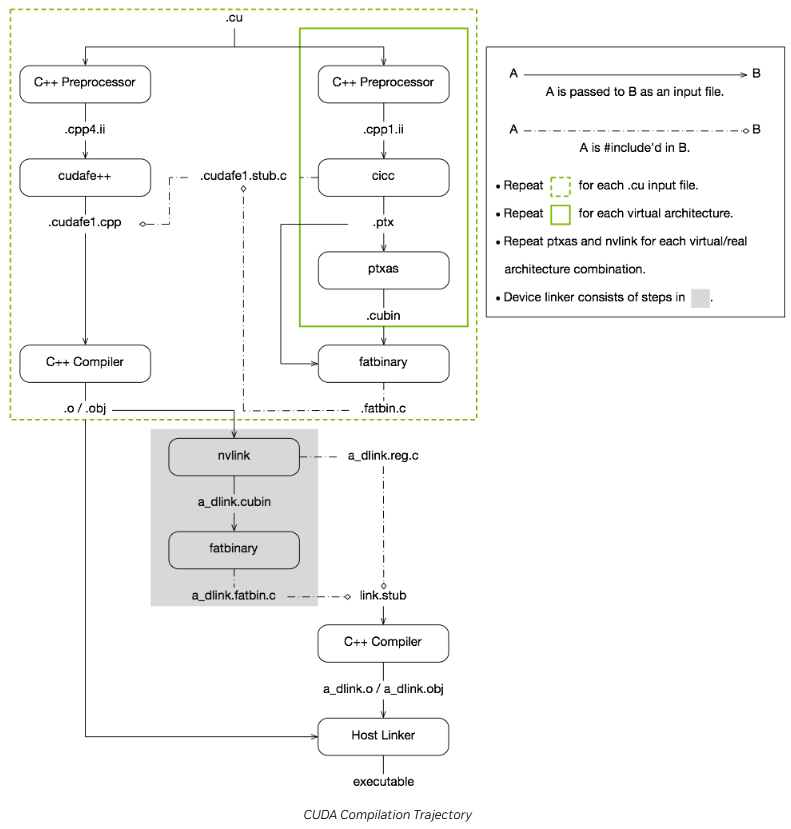
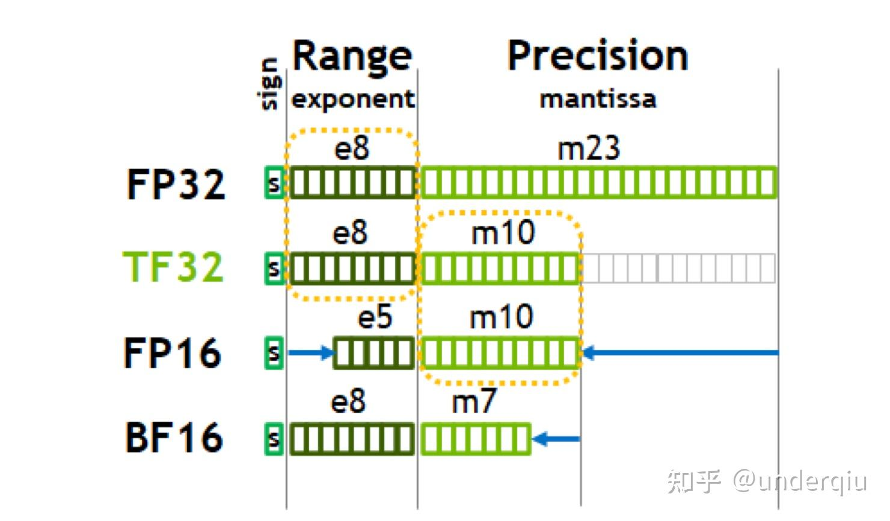
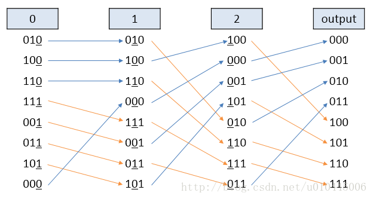
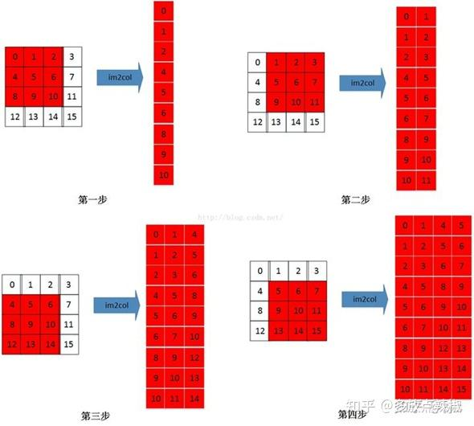

# cudaCode
此仓库是本人在秋招准备过程中关于 `CUDA` 编程技巧的总结

## NVIDIA Nsight Compute 和 NVIDIA Nsight Systems
* `Nsight Systems` 提供全局视图的性能分析, 包括整体应用的执行流程、资源使用和性能特性。`Nsight Systems` 不仅能够分析 GPU 性能, 也能够分析 CPU、内存和系统级的性能特性。使用时主要关注: 应用整个上各个核函数以及操作消耗的事情顺序, CPU 和 GPU 之间的数据传输耗时, 多个 Stream 之间的调度信息, SM warp occupancy。
* `Nsight Compute` 对核函数的性能特性和瓶颈进行详细的分析。使用时主要关注: SM 的吞吐量, 依据 roofline model 分析当前核函数是属于计算密集型, 还是访存密集型, 估算核函数不同线程配置对 warp occupancy 的影响。L1 cache 和 L2 cache 的吞吐量和命中率。

# Roofline Model 的介绍
* Roofline Model 其实是说明模型在一个计算平台的限制下, 到底能够达到多快的浮点计算速度。具体来说解决的问题是 `计算量为A且访存量为B的模型在算力为C且带宽为D的计算平台所能达到的理论性能上限E是多少`。Roofline 划分出了计算瓶颈区域和带宽瓶颈区域。模型的实际表现一定是越贴近于边界越好的, 最理想的情况, 是实际表现达到拐点处。


# Reduce 优化 [原文](https://zhuanlan.zhihu.com/p/426978026)
* reduce 算法也就是规约运算, 本质上是 $ x = x_0 \otimes x_1 \otimes x_2 \cdots \otimes x_n $。在并行计算中通常采用树形的计算方式。比如计算长度为 $N$ 的数组的所有元素之和。首先将数组分成 $m$ 个小份, 开启 $m$ 个 block 计算出 $m$ 个小份的 reduce 的值。接下来再使用一个 block 将 $m$ 个小份再次进行 reduce, 得到最终的结果。

* 对于线程模型的分配, 线程模型的块的个数尽量给到 `SM` 个数的整数倍, 一个块内线程的个数通常是 `128, 256, 512, 1024`。在线程与元素一一对应不能满足的时候, 通常先满足块的个数是整数的要求, 然后再分配适当的线程, 使用 `块跨步` 的方法使得一个线程块的线程能够遍历完分配其的所有数据。进行一个 block 内规约的方法通常有两种, 第一种方法如下所示:
```C++
__global__ void Kernel_A(int *d_s, int *d_o)
{
    int tid = threadIdx.x;
    int *b_s = d_s + blockIdx.x * num_per_block;

    // 1) 每个线程先将负责的部分的数据规约到自己的寄存器中
    int sum = 0;
    for(int i=tid; i<num_per_block; i+=blockDim.x)
    {
        sum += b_s[i];
    }
    
    // 2) 每个块中都分配共享内存, 共享内存负责存储每个线程的变量的值
    __shared__ int tmp_sum[thread_per_block];
    tmp_sum[tid] = sum;
    __syncthreads();

    // 3) 这样规约的好处, 1) 避免了线程束的分歧 2) 不存在 bank 冲突 3) 最后一个 warp 内不需要同步, 避免了同步造成的影响
    for(int s=blockDim.x/2; s>16; s>>=1)
    {
        if(tid<s)
        {
            tmp_sum[tid] += tmp_sum[tid+s];
        }
        __syncthreads();  // 这个不能放到 if 里面
    }

    // 一个 warp 中的所有线程无论什么时候, 都是处在同一种状态, SIMD 的特点
    if(tid<16)  // 因为是同一个 warp 所以不需要同步
    {
        tmp_sum[tid] += tmp_sum[tid+16];
        tmp_sum[tid] += tmp_sum[tid+8];
        tmp_sum[tid] += tmp_sum[tid+4];
        tmp_sum[tid] += tmp_sum[tid+2];
        tmp_sum[tid] += tmp_sum[tid+1];
    }

    // 4) 将每个块规约之后的值赋值到输出
    if(tid==0) d_o[blockIdx.x] = tmp_sum[0];
}
```
* 对于代码中的 `1)`, 每个线程都将自己负责的部分首先进行归约到自己的寄存器变量中。尽可能每个块分配比较少的线程, 让一个线程负责多个数据, 不然每次进行一次规约都有很多的线程不干活。
* 对于代码中的 `2)`, 根据每个块中线程的个数分配共享内存的大小, 让后把每个线程中寄存器的值, 写入到共享内存中。这里的 `__syncthreads()` 是为了同步每个块中的线程, `同一warp中的线程一定是处于同一状态和进度的, 但是不同 warp 的线程所处状态是不确定的, 也就是不同 warp 执行到的地方可能不相同`。读入共享内存中, 是因为 `共享内存能够进行块内数据的共享和同步`(因为我们需要进行块内规约, 需要这一特点)。
* 对于代码中的 `3)`, 这里 `blockDim.x` 一定是能够被 `32` 整除的。这样的写法有很多优势
    * 避免了线程束的分歧, 因为最后一次规约的时候, 步长为 `32`, 所有 `warp` 都是同一状态, 要么执行, 要么不执行。
    * 避免了共享内存中的 bank 冲突, 以 `warp 0` 为例分析, 当 `s=128` 时, `warp 0` 中的 0 线程访问 0 和 128 元素, 都是位于 0 bank,  1 线程访问 1 和 129 元素, 都是位于 1 bank, ... 31 线程访问 31 和 159 元素, 都位于 31 bank, 不存在冲突。
    * 对于最后一个 warp 内值的规约, 这里并没有在循环中使用, 因为最后一个 `warp` 内的所有线程都是同步的, 对共享内存的访问也是同步的, 不需要同步。
* 对于代码中的 `4)`, 这里并没有做同步, 因为所有对共享内存的操作都是在一个 warp 内完成的, 减少同步损耗。
* 规约之后规约的值就位于每个块中共享内存中的第一个值。
* 规约注意的事项就是, 是共享内存块的规约, 也就是每个块规约出一个值, 如果想不同块之间再进行规约, 可以
    * 每个块的结果传回主机端, 然后 host 端进行规约(数据拷贝造成损耗)
    * 先把每个块规约的结果写到全局内存中, 然后利用 `一个块` 对这些数据进行规约(两步规约的办法)。
* 第二种方法如下所示:
```C++
#define FINAL_MASK 0xffffffff

template <typename T>
__inline__ __device__
T warpReduceSum(T val)
{
  for(int mask = 16; mask > 0; mask >>= 1)
    val += __shfl_xor_sync(FINAL_MASK, val, mask, 32);
  return val;
}

template <typename T>
__inline__ __device__
T blockReduceSum(T val)
{
  static __shared__ T shared[32]; 
  int lane = threadIdx.x & 0x1f;  // 相当于取余
  int wid = threadIdx.x >> 5;  

  val = warpReduceSum<T>(val);

  if(lane == 0)
    shared[wid] = val;
  __syncthreads();

  val = (threadIdx.x < (blockDim.x >> 5 )) ? shared[lane] : (T)0.0f;
  val = warpReduceSum(val);

  return val;  // 返回是都要返回的, 只不过只有部分线程的值为想要的值
}

// 每个 warp 进行规约, 规约后的值在 warp 中的 0 号线程
// __shfl_down_sync 相比于 __shfl_down 允许开发者指定一个线程掩码, 确保只有在指定的线程都完成数据交换后, 才继续执行后续的操作
__device__ int warpReduceSum(int sum)
{
    sum += __shfl_down_sync(0xffffffff, sum, 16);
    sum += __shfl_down_sync(0xffffffff, sum, 8);
    sum += __shfl_down_sync(0xffffffff, sum, 4);
    sum += __shfl_down_sync(0xffffffff, sum, 2);
    sum += __shfl_down_sync(0xffffffff, sum, 1);
    
    // sum += __shfl_xor_sync(0xffffffff, sum, 16);
    // sum += __shfl_xor_sync(0xffffffff, sum, 8);
    // sum += __shfl_xor_sync(0xffffffff, sum, 4);
    // sum += __shfl_xor_sync(0xffffffff, sum, 2);
    // sum += __shfl_xor_sync(0xffffffff, sum, 1);

    return sum;
}

__device__ int blockReduceSum(int sum)
{
    int laneId = threadIdx.x % warpSize;  // 每个 warp 中第几个线程
    int warpId = threadIdx.x / warpSize;  // 属于第几个 warp

    // 填充进去
    sum = warpReduceSum(sum);
    __shared__ int reduceSum[32];         // 最多也就 32 个 warp
    if(laneId==0)
    {
        reduceSum[warpId] = sum;
    }
    __syncthreads();

    bool pred = (warpId==0) && (laneId < blockDim.x / warpSize);
    int value =  (int)pred * reduceSum[laneId];  // 在范围内的为正常的数字, 否则为 0
    if(warpId==0) value = warpReduceSum(value);
    if(warpId==0 && laneId==0) sum=value;

    return sum;
}


__global__ void Kernel_B(int *d_s, int *d_o)
{
    int tid = threadIdx.x;  // 每个块内线程的 id
    int *b_s = d_s + blockIdx.x * num_per_block;

    // 1) 每个线程先将负责的部分的数据规约到自己的寄存器中
    int sum = 0;
    for(int i=tid; i<num_per_block; i+=blockDim.x)
    {
        sum += b_s[i];
    }
    sum = blockReduceSum(sum);

    if(tid==0) d_o[blockIdx.x] = sum;
}
```
* 对于第二种方法, 其实整体思路就是, 每个线程先将负责的那部分数据归约到自己的寄存器中, 然后 `warp` 内先进行一次规约, 规约的结果存储在每个 `warp` 的第一个线程中。然后再分配共享内存, 此时共享内存只需要再分配最多 32 个元素字节的大小(因为一个块内最多有 1024 个线程, 对应 32 个 `warp`)。但是这里有个问题, 就是得确定真正参与规约的每个块内有多少个 `warp`(确定个数来给共享内存32个无效的位置填充适当的数字)。最后再对这个 32 个共享内存数据进行规约, 这里使用的方法是, 每个块内 0 号 `warp` 读取这 32 个值, 然后再来一次 warp 内的规约。其实也可以像第一种方法一样, 直接操作共享内存(这里涉及到需要给共享内存写没用到的值, 或者依据线程个数只规约想要的部分)。

## PTX 与 SASS 的区别
* CUDA 的汇编语言分成两种, 一种是 Parallel Thread Execution(PTX), 另一种是 Streaming Assembly(SASS)。SASS 指令集与 GPU 架构是有直接的联系的, 是机器码的指令集合, 编译 SASS 的 GPU 架构与当前 GPU 架构不对应的话是不能运行的。PTX 是从 SASS 抽象出来的更上层的软件编程模型, 介于 CUDA C 和 SASS 之间, 与硬件架构有比较弱的耦合性。
* 看生成汇编代码的目的是, 做完优化以后, 我们要判断机器是否能够真正地按照我们设想的模式运行。使用 float4 后, GPU 是否真正使用了向量化的指令。采用循环展开后, GPU 是否真正地会进行展开。
* 对于访存密集型的 `kernel`, 主要关注有没有采用 `LDG.128` 的访存指令, `#pragma unroll` 是否有效展开了, 计算指令占比是不是不太多。对于计算密集型的 `kernel`, 重点关注计算指令的占比。如果并行策略不太行，那么计算指令的占比会很低，这样的话，访存所导致的 latency 很难被计算指令掩盖，计算效率会非常差。如果并行策略比较好，那么计算指令的占比也会非常地高。也只有当计算指令占比非常高的时候，才有可能地去逼近峰值性能。
* CUDA 微架构和指令集是两个重要的概念。CUDA 的微架构一般指的是 `SM` 的架构。指令集是 GPU 执行的机器码(SASS)。PTX 是构建在 SASS 上的虚拟中间代码指令集(PTX 与 `SM` 架构只有比较弱的耦合关系)。SM 架构的设计决定了指令集(SASS)所支持的指令形式(SASS 与 `SM` 是直接对应关系)。

## CUDA 代码的编译流程
* 在 CUDA 编程模型中，CUDA 代码会在主机端（Host）用 nvcc 编译器编译生成适合 GPU 执行的机器指令，然后再发送给 GPU 执行。主要分成以下几个部分:
    - 预处理。处理头文件的包含(`#include`), 宏定义(`#define`), 条件编译(`#if`)
    - 分离主机代码和 CUDA 代码。nvcc 编译器会将 CUDA 代码(CUDA代码主要是包含 `__global__` 和 `__device__` 等修饰符的代码段)与主机代码分离。
    - 编译和汇编。nvcc 调用C++编译器(g++)对C++代码进行编译, 生成目标文件(.o)。nvcc 将CUDA代码编译成PTX代码或再次使用 ptxas 编译器 将 ptx 编译成二进制的 SASS 代码。
    - 链接阶段。nvcc 会将主机目标文件、CUDA目标文件、CUDA运行时库链接在一起, 最终生成可执行文件。

* 从图中我们可以看到, 其实首先是利用 `g++` 进行预处理。然后 GPU 端, 是利用 `cicc` 编译 GPU 端的代码生成 `.ptx`, 再使用 `ptxas` 将 ptx 编译成 `.cubin`。最后利用 `fatbinary` 将 ptx 和 cubin 打包成 `fatbin`。然后最后整合到一起再利用 g++ 一起编译。
* CPU 是基于已经发布的指令集架构, 使得针对同样架构的新的 CPU 不需要修改编译选项即可运行。而 GPU 的架构是不断迭代的, 难以保证二进制的兼容, 所以利用两端编译模型来保证这一点。从cuda到ptx再到cubin。其中PTX可以被视作一种虚拟的GPU架构的组装。他不和实际的硬件直接对应，而是类似CPU的ISA提供了一个通用的指令集，这也是一种虚拟的中间体系结构。而cubin即可认为是运行在硬件上的最终的代码，与GPU的代际强相关。
* nvcc 通常使用 `computer_xy` 表示 ptx 的架构, 而使用 `sm_xy` 表示 cubin 的架构。
* ISA(Instruction Set Architecture) 是指令集体系结构。其对上限定了软件的基本功能, 对下制定了硬件实现的功能目标, 因此指令系统的设计(指令集包含那些指令, 指令用什么格式表示) 是计算机系统设计的重要一环。ISA 按照指令系统的复杂程度不同, 可以分为 CISC(Complex Instruction Set Computer) 和 SISC(Reduced Instruction Set Computer)。
* CISC 追求的是 `强化指令功能, 减少程序的指令条数`, 指令庞大且复杂。SISC 追求的是 `减少指令种类、规范指令格式、简化寻址方式`, 只保留功能简单, 能在一个节拍内完成的指令, 时钟频率通常很高。CISC 主要是 桌面和服务器领域, RISC 主要是 移动和互联网领域。
* CPU 端运行到 CUDA 程序时, 会使用 `cudaLaunchKernel()` 函数来启动这个 kernel 程序。这个程序要传入 `grid维度`, `block维度`, `shareMemoryBytes`, `stream`。调用完 `cudaLaunchKernel` 之后, (接下来的叙述就是 kernel 的 launch 开销)会把 kernel函数及其参数发送到设备上, 并启动GPU上的执行单元来执行这个函数。

## 向量化内存访问 [原文](https://zhuanlan.zhihu.com/p/572817996)
* 硬件的 FLOPS 与带宽比例不断增加, 使得很多 CUDA 内核都是受带宽限制的。使用向量化访存可以减少访存指令, 指令 cache 里能够存下更多指令, 提高指令 cache 的命中率, 提高带宽利用率。
* 小数据规模的情况下, 可以不考虑向量化的内存访问的优化方式。大规模数据情况下, 考虑使用向量化访存。使用向量化加载的最简单方法是使用 CUDA C/C++ 标准头文件中定义的向量数据类型，例如 `int2, int4, float2, float4`。大体的思路就是使用 `reinterpret_cast()` 将指针转换为向量化的数据类型的形式, 但是要注意线程数的变化, (因为接下来一个例子中, 每个线程处理 2 个 `int`)。使用向量化读取仍然可以使用网格跨步法, 要注意不能够凑够整数个向量的情况下, 是如何处理的(先向量读取能够向量化的部分, 对于余下的部分, 再单独处理)。
```C++
// 每个线程负责的元素个数不能被线程数整除
__global__ void kernel_C(int *d_s, int *d_o){
    int tid = threadIdx.x;  // 每个块内的线程 id
    
    // 网格跨步法处理能够向量化读取的部分
    for(int i=tid; i < num_per_block/2; i+=blockDim.x)
    {
        reinterpret_cast<int2*>(d_o)[i] = reinterpret_cast<int2*>(d_s)[i];
    }

    // 处理不够 2 的部分
    int remainder = num_per_block % 2;  // 余数
    int quotient = num_per_block / 2;  // 商
    if(tid < remainder)
    {
        d_o[2*quotient+tid] = d_s[2*quotient+tid];
    }

}
```
* 向量化内存访问比较适用于 `element-wise`(对每个元素单独组一个算数操作, 然后直接输出, 如 `add`, `mul`, `concat`)。判断是否用上了向量化的访存是看 SASS 代码中有没有 `LDG.E.128 Rx, [Rx.64]` 或 `STG.E.128 [R6.64], Rx` 这些指令的存在。有则向量化成功，没有则向量化失败(所以有时即使在 CUDA C/C++ 端使用了向量化读取, 速度还没不使用的快)。

## 数据预取(Prefetching) [原文](https://zhuanlan.zhihu.com/p/596598301)
* 对于 GPU 来说, 一般会考虑使用更多的 warp 来隐藏内存延迟。如果延迟仍然很高, 可以考虑以软件的方式使用预取。使用数据预取可以提前将数据从主机内存或全局内存加载到 GPU 的高速缓存(共享内存或寄存器), 避免在计算过程中等待内存访问所产生的延迟, 提高带宽利用率。数据预取分为批量预取和滚动预取。
* 接下来举的例子中每个线程网格都是一维的
```C++
// 网格块跨步法, 依据全局内存中 arr 的元素个数, 每个线程迭代几次, 将数据从全局加载在到其寄存器中
for (i=threadIdx.x; i<imax; i+= BLOCKDIMX) {
    double locvar = arr[i];
    /* 接下来很多指令使用 locvar 变量*/
}

// 每个线程都引入了计数器 ctr, 来记录当前线程迭代的步数, 这里的预取距离(PDIST)是 4, 这里必须假设每个线程的迭代步数都能够被 4 整除
// 这个是批量预取到寄存器中, 通常预取的值越多, 方法越有效
double v0, v1, v2, v3;
for (i=threadIdx.x, ctr=0; i<imax; i+= BLOCKDIMX, ctr++) {
    int ctr_mod = ctr%4;
    if (ctr_mod==0) {  // 一个线程每迭代四步, 就填充 buffer
        v0=arr[i+0* BLOCKDIMX]; 
        v1=arr[i+1* BLOCKDIMX]; 
        v2=arr[i+2* BLOCKDIMX]; 
        v3=arr[i+3* BLOCKDIMX];
    }
    switch (ctr_mod) { // 依据当前的迭代步数, 从预取的寄存器中得到值
        case 0: double locvar = v0; break;
        case 1: double locvar = v1; break;
        case 2: double locvar = v2; break;
        case 3: double locvar = v3; break;
    }
    /* 接下来很多指令使用 locvar 变量*/
}

// 当寄存器数组中元素个数比较少的时候, 才是放到寄存器中
double v[4];
for (int i=threadIdx.x, ctr=0; i<imax; i+= BLOCKDIMX, ctr++) {
    int ctr_mod = ctr%4;
    if (ctr_mod==0) {  // 一个线程每迭代四步, 就填充 buffer
        for(int k=0; k<4; ++k){
            v[i] = arr[i+k* BLOCKDIMX];
        }
    }
    double locvar = v[ctr_mod];
    /* 接下来很多指令使用 locvar 变量*/
}

/*
    这种对共享内存的操作, 不需要加共享内存同步指令
    1) 每个线程只会访问自己所需要的共享内存数据, 不会出现数据竞争问题
    2) 每个线程都是写完才读的, 不存在其他线程写的, 自己来读这种情况
*/
// 批量预取到共享内存中, 也要保证每个线程的迭代步数能够被 PDIST 整除
constexpr int PDIST = 4;  // PDIST 是预取举例
// 用共享变量来存储预取的数据, index 是线程迭代次数 % PDIST 后的结果.
#define vsmem(index)  v[index+PDIST*threadIdx.x]

__shared__ double v[PDIST* BLOCKDIMX];  // 分配空间, 每个线程预留 PDIST 个空间
for (int i=threadIdx.x, int ctr=0; i<imax; i+= BLOCKDIMX, ctr++) {
    int ctr_mod = ctr % PDIST;
    if (ctr_mod==0) {
        for (int k=0; k<PDIST; ++k) vsmem(k) = arr[i+k* BLOCKDIMX];
    }
    double locvar = vsmem(ctr_mod);
    /* 接下来很多指令使用 locvar 变量*/
}


/* 以上的批量预取到寄存器和批量预取到共享内存, 都有一个问题, 就是需要每个线程的迭代步数, 都能整除 PDIST, 接下来的滚动预取, 能够克服这一点*/

/*

*/
// 仍然是每个线程预取 PDIST 的空间, 但是不再要求每个线程的迭代步数能够整除 PDIST
constexpr int PDIST = 4;
#define vsmem(index)  v[index+PDIST*threadIdx.x]
__shared__ double v[PDIST* BLOCKDIMX];  // 仍然是每个线程预取 PDIST 的空间

for (int k=0; k<PDIST; ++k) vsmem(k) = arr[threadIdx.x+k* BLOCKDIMX];  // 要求第一次预取能够达到
for (int i=threadIdx.x, ctr=0; i<imax; i+= BLOCKDIMX, ctr++) {
    int ctr_mod= ctr%PDIST;
    double locvar = vsmem(ctr_mod);
    // 这个判断条件可能 i+PDIST*BLOCKDIMX < imax 能更好理解一些, 判断这个线程是否还有需要的缓冲元素
    if (i<imax-PDIST* BLOCKDIMX) vsmem(ctr_mod) = arr[i+PDIST* BLOCKDIMX];

    /* 接下来很多指令使用 locvar 变量*/
}

/*以上可能共享内存会存在 bank 冲突, 在共享内存中填充(padding)数组大小，以避免错误的跨步*/
#define vsmem(index) v[index+(PDIST+PADDING)*threadIdx.x]
```
* 循环最简单的优化, 称为展开。因为如果循环足够短, 可以告诉编译器完全展开循环, 并显式展开迭代。因为迭代是独立的，编译器可以预先发出所有数据请求(“加载”)，只要它为每个加载分配不同的寄存器。这些请求可以相互重叠, 这样整个加载的过程只会经历一个内存延迟，而不是所有单个延迟的总和。就是可能需要大量的寄存器来接受加载的结果。

## SGEMM 的优化 [原文](https://zhuanlan.zhihu.com/p/435908830)
* 矩阵乘法 (GEMM) 通常是模型里最耗时的部分(卷积, attention), 所以其优化是非常重要的。GEMM 的优化的手段主要是 `数据分块` 和 `利用多级存储进行数据搬运`。假设计算矩阵乘法 $C = A\times B$, 其中 A 的大小为 $M\times K$, B 的大小为 $K \times N$, C 的大小为 $M \times N$。针对 C 进行第一次分块, 分块的大小为 $block_m \times block_n$, 那么分成的总的块数为 $(M/block_m) \times (N/block_n)$。让每个线程网格中的每个线程块负责一个 C 中的数据块的计算, 即 `dim3 grid(M/block_m \times N/block_n)`。对这个大小为 $block_m \times block_n$ 的数据块再次进行划分, 分块大小为 $thread_m \times thread_n$, 每个线程负责这一块的计算, 即 `dim3 block(block_m/thread_m, block_n/thread_n)`。
* 对应每个块负责的 C 中输出的部分, 其结果是由大小为 $block_m \times K$ 和 $K \times block_n$ 两个矩阵做乘法得到的。但是 K 的大小通常是很大的, 一次性可能放不下这么多数据, 那么将 K 这个维度进行分块, 每个块的大小为 $block_k$。$block_m \times block_k$ 和 $block_k \times block_n$ 的乘积大小仍然是 $block_k \times block_n$, 迭代 $K/block_k$ 次, 将每次迭代的结果进行对应元素相加就是原始长度矩阵相乘的结果。通过这种方法, 我们就节省了每个块存储数据所需要的共享内存的大小。通过这样的变换, 每个块内的线程只需要负责处理好这一迭代块的数据即可。
* 对于每个线程负责的 C 中输出的部分, 其每次处理的是一个迭代块的共享内存的数据, 其每次取得的数据块应该是 $thread_m \times block_k$ 和 $block_k \times thread_n$, 仍将其进行分成多个迭代($block_k$), 每个线程有一个寄存器大小为 $thread_m \times thread_n$, 每次迭代都生成这么大的大小, 然后与其进行累加。通过$block_k$ 次小迭代之后, 会得每个迭代的对应分块的结果。通过 $K/block_k$ 次大迭代之后, 每个块能够得到对应矩阵 C 中分块的结果。
* 其中也使用数据预取的技术(这里也有人认为是双缓冲的技术), `kernel` 整体的流程如下:
```C++
// 分配双倍的共享存储空间
__shared__ float As[2][BLOCK_SIZE_K][BLOCK_SIZE_M];
__shared__ float Bs[2][BLOCK_SIZE_K][BLOCK_SIZE_N];

// 分配双倍的寄存器存储空间
float frag_a[2][THREAD_SIZE_Y];
float frag_b[2][THREAD_SIZE_X];

// 分配双倍的寄存器存储空间, 要先将全局存储数据搬运到寄存器中再搬运到共享内存中
float ldg_a_reg[4*ldg_num_a];
float ldg_b_reg[4*ldg_num_b];

// 每个寄存器的结果, 迭代完 256 个大迭代后, 将结果写入全局内存中
float accum[THREAD_SIZE_Y][THREAD_SIZE_X] = {0};  // 这个最后直接赋值到输出矩阵 C 中

// 把第一个大迭代块所需要的数据从全局内存读入到共享内存
// 把第一个小迭代块所需要的数据从共享内存读入到寄存器中
for k in 256 大迭代:
    // 将下一个大迭代块所需要的数据从共享内存预取到寄存器中
    for k in 7 小迭代:
        // 将下一个迭代所需要的数据从共享内存预取到寄存器中
        // 依靠本次寄存器中的数据进行本次迭代计算, 结果写到 accum 中
    // 将下一个大迭代块所需要的数据从寄存器取到共享内存中
    // 计算最后一个小迭代, 结果写到 accum 中

// 完成 256 次大迭代后, 每个线程将结果写到全局内存中
```

## GEMV 的优化 [原文](https://zhuanlan.zhihu.com/p/494144694)
* `gemv` 是矩阵向量乘法操作, 即一个大小为 $m\times n$ 的矩阵 $A$ 和一个大小为 $n\times 1$ 的向量 $x$ 做乘法, 得到大小为 $m\times 1$ 的向量 $y$。可以每个 block 负责一行, 然后每个块进行规约运算。这里的做法是每个 warp 负责一行, warp 内使用 `shuffle` 指令进行规约运算得到每行的结果。当 $n$ 较小时可以让一个 warp 负责多行, 当 $n$ 较大时的时候使用向量化的读取方式。

## 全局内存合并
* 全局内存主要用在 `主机和设备之间数据的传输`, `内核数据的输入和输出`。
* 全局内存访问指的是多个线程同时访问全局内存时, 这些访问被合并成更少的内存事务, 这样可以提高内存访问效率。设备可以通过 32 字节, 64 字节, 128 字节的事务来访问全局内存。为了保证实现最佳的全局内存合并效果, 通常要注意
    * 保持全局内存访问的连续性, 尽可能让同一个 warp 访问连续的全局内存地址(CUDA 架构中的全局内存合并机制是基于线程束内的线程的访存模式的，而不是线程束之间的。这意味着可以在设计 CUDA 内核时，让不同的线程束访问不连续的内存地址，只要保证同一个线程束内的线程访问的地址是连续的即可)。
    * 尽量避免跨越内存段(即跨越 32 位或者 64 位边界)的访问(因为缓存机制的出现, 使得不对齐的现象影响比较小)。
```C++
/*
    以下的内核代码都是一维网格一维线程模型来启动的
*/

// 访问数组元素有偏移(偏移可能会造成不对齐的情况发生)
template<typename T>
__global__ void offset(T* a, int s)
{
  int i = blockDim.x * blockIdx.x + threadIdx.x + s;
  a[i] = a[i] + 1;
}

// 这个是跨步访问, s 是跨步的步长。这个导致了同一个 warp 中的线程访问的全局内存地址是不连续的
template<typename T>
__global__ void stride(T* a, int s)
{
  int i = (blockDim.x * blockIdx.x + threadIdx.x) * s;
  a[i] = a[i] + 1;
}
```
* 在早期的 CUDA 硬件中, 全局内存的对齐访问和跨步访问对带宽都有比较大的影响。但是在最近的硬件上, 对齐访问并不是大的问题(因为缓存的出现)。如果不可避免的要出现对全局内存的跨步访问, 可以先逐行的将数据读取到共享内存中, 然后再使用跨步访问的办法(这时候要注意一个 warp 中是否存在 bank 冲突)。对于共享内存的访问，通常不会像全局内存一样涉及到内存事务，而是直接通过存储器的端口进行访问。因此，共享内存的访问模式不同于全局内存，不需要考虑内存事务的问题。但是，仍然需要注意bank冲突的问题，以最大程度地利用共享内存的带宽和性能。

## transpose 优化 [原文](https://zhuanlan.zhihu.com/p/568769940)
* 矩阵转置的优化, 主要是考虑全局内存合并访问的的问题。最简单实现矩阵的转置是针对全局内存上的输入矩阵分块逐行读取, 然后再对全局内存上的输出矩阵逐列写入。全局内存的逐行读取能够全局内存合并访问的特性, 但是逐列的写入, 就是非常低效了, 最差情况, warp 中的每个线程都需要一次内存事务。解决的办法是从全局内存中逐行地读取元素到共享内存中, 然后逐列的读取共享内存的数据, 逐行的写入到全局内存中(其中要注意 bank 冲突的问题, 通过填充解决)。
* 这里是将输入矩阵进行分块, 每个块的大小为 `block_size_M` 和 `block_size_N`。然后让每个线程块, 负责每个数据块。数据块的长和宽最好是 `32` 的整数倍(比较好分配线程)。
```C++
// 32*16 大小的线程块要操作 block_size_m*block_size_n 大小的数据块
template<int block_size_m, int block_size_n> 
__global__ void Kernel_A(
    float* __restrict__ d_i,   // 输入矩阵大小为 M*N
    float* __restrict__ d_o,   // 转置输入矩阵大小为 N*M
    const int M,
    const int N
){
    /*
        第一步将全局内存中的数据读入到共享内存中
    */
    __shared__ float sm_data[block_size_m][block_size_n+1];  // 每个共享内存块都要读入这么多的数据

    int tx = threadIdx.x;  // laneId
    int ty = threadIdx.y;  // warpId
    int bx = blockIdx.x;   // x 方向是第几个块
    int by = blockIdx.y;   // y 方向是第几个块

    for(int i=0; i<block_size_m; i+=blockDim.y)
    {
        int idx_glo = (by*block_size_m+i+ty)*N+bx*block_size_n;  // 定位到第几行, 第几列的起始位置
        reinterpret_cast<float2*>(&sm_data[i+ty][tx*2])[0] = reinterpret_cast<float2*>(&d_i[idx_glo])[tx];
    }

    __syncthreads();  // 不同的线程要操作相同的共享内存, 所以要先进行同步

    /*
        将共享内存中的数据逐列读取, 逐行写入到全局内存中
    */
    for(int i=0; i<block_size_n; i+=blockDim.y) 
    {
        int idx_glo = (bx*block_size_n+ty+i)*M + by*block_size_m+tx;
        d_o[idx_glo] = sm_data[tx][ty+i];
    }
}
```
* 这里编写的时候, 有一个技巧, 就是每次先确定共享内存的行和列的索引(这个就是对应实际矩阵的行和列), 然后再思考如何与全局内存对应。记着, 输入全局内存逐行读取, 逐行写入共享内存。逐列读取共享内存, 逐行写入全局内存。而且不要忘记了要避免 `bank` 冲突。

## prefix_sum [原文](https://zhuanlan.zhihu.com/p/661460705)
* 前缀扫描接受一个二元关系运算符 $\oplus$ 和一个数组 $\big[a_0, a_1, \cdots, a_n-1\big]$, 返回一个相同长度的数组 $\big[a_0, \big(a_0 \oplus a_1\big), \cdots, \big(a_0 \oplus a_1 \oplus \cdots \oplus a_n-1\big)\big]$。这个是包含扫描的形式, 独占扫描的形式就是只扫描前面的, 而不包含当前的。
```C++
int input_arr[] = {3, 1,  7,  0,  4,  1,  6,  3};
// 包含扫描和为    [3, 4, 11, 11, 15, 16, 22, 25]
// 独占扫描和为    [0, 3,  4, 11, 11, 15, 16, 22]

// input_arr 末尾填充一些 0
int input_arr[] = {3, 1,  7,  0,  4,  1,  6,  3,  0,  0,  0};
// 包含扫描和为    [3, 4, 11, 11, 15, 16, 22, 25, 25, 25, 25]
// 独占扫描和为    [0, 3,  4, 11, 11, 15, 16, 22, 25, 25, 25]
```
* 接下来介绍的前缀和并行算法是独占扫描。首先介绍输入数组元素个数比较少的时候(元素个数小于等于 `2048`), 算法的整体思路。
    * 先依据输入元素的个数 `N` 找到大于等于其最小的 2 的幂次的数 `padding_N`(接下来的上扫和下扫都是树形规约, 必须要求元素个数是 2 的幂次)。
    * 依据 `padding_N` 来设置共享内存, `kernel` 的启动方式是 `<<<1, padding_N/2>>>` (如果元素个数等于线程个数, 那么在第一次树形规约的时候, 就会有一半的线程不干活)。
    * 每个线程负责将两个数据从全局内存读取到共享存储(因为 `N` 的奇偶性不能确定, 所以把循环展开, 超出 N 个元素的都填充为 0)。
    * 上扫的过程(树形规约)。整体的思路是 a. padding_N/2 的大小决定了循环的次数(int d=pdding_N/2 为初始条件, 一直到 d==0 时停止。d其实就是参与本次循环的线程个数) b. 通过 a 确定了每次运行的线程总数, 那么每次就放出前 d 个线程参与操作。c. 给每个线程分配要处理的数据的索引, 这里用到 offset, offset 为 1 是初始条件(offset 表示, 本次循环中, 从多少个数据中取一个数据出来参与运算, 每次循环结束时, offset 都会乘以 2)。d. 任何时候, 一个线程都是处理两个数据。
    * 利用一个线程将共享存储最后一个元素置为 0(此时整个共享存储已经进行一次树形规约的操作).
    * 下扫过程(逆向树形规约)。a. 仍然是线程个数确定了循环的次数(线程个数从 1, 2, ..., padding_N/2 变化) b. 依据每次循环的线程个数, 放出前 d 个线程参与操作。c. 给每个线程分配要处理的数据索引, 这里也用到 offset, offset 为 padding_N/2 是初始条件, 从这么多数据选取一个。
    * 最后要将共享内存的数据写入到全局内存中, 仍然是将循环展开, 解决奇偶性的问题。
```C++
__global__ void parallel_block_scan_kernel(int *data, int *prefix_sum, int N)  // 这里的 N 是填充前, 真实元素的个数
{
    extern __shared__ int tmp[];
    int tid = threadIdx.x;
    int leaf_num = blockDim.x * 2;  // equals to length of tmp

    // 这里其实是循环展开了, 每个线程负责运输两个数据, 用 0 来补充
    tmp[tid * 2] = tid * 2 < N ? data[tid * 2] : 0;
    tmp[tid * 2 + 1] = tid * 2 + 1 < N ? data[tid * 2 + 1] : 0;
    __syncthreads();  // 同步不能忘记了

    // 上扫过程, 每个线程处理两个元素
    int offset = 1;  // 相隔多少个元素取一个元素
    // 先确定要使用的线程, 再给这些线程分配操纵的数据
    for (int d = leaf_num >> 1; d > 0; d >>= 1)
    {
        if (tid < d)  // 先筛选出需要的线程个数, 选好后的每个线程总是负责两个数据
        {
            int ai = offset * (2 * tid + 1) - 1;  // 2*tid 是每个线程处理 2*tid*offset 个元素, +1 是指取出第一个块的后一个元素
            int bi = offset * (2 * tid + 2) - 1;
            tmp[bi] += tmp[ai];
        }
        offset *= 2;
        __syncthreads();
    }

    // 每个块都使用 tid 为 0 的线程, 将共享存储中最后一个元素置为0, 只有完成这一步才能下扫
    if (tid == 0)
    {
        tmp[leaf_num - 1] = 0;
    }
    __syncthreads();

    // 下扫过程, 每个线程处理两个元素
    for (int d = 1; d < leaf_num; d *= 2)
    {
        offset >>= 1;
        if (tid < d)
        {
            int ai = offset * (2 * tid + 1) - 1;
            int bi = offset * (2 * tid + 2) - 1;

            float v = tmp[ai];
            tmp[ai] = tmp[bi];
            tmp[bi] += v;
        }
        __syncthreads();
    }

    // 每个线程处理两个元素, N 的个数可能为奇数, 也可能为偶数, 这里其实也是展开了
    // 先搬所有偶数, 再搬所有奇数
    if (tid * 2 < N)
    {
        prefix_sum[tid * 2] = tmp[tid * 2];
    }
    if (tid * 2 + 1 < N)
    {
        prefix_sum[tid * 2 + 1] = tmp[tid * 2 + 1];
    }
}
```
* 代码优化到这里已经可以了, 但是仍然存在问题就是共享存储中存在 bank 冲突。在上扫和下扫的过程中, 当 offset 是 32 的整数倍的时候, 甚至存在 32 路的 bank 冲突。仍然是通过填充来减少 bank 冲突问题。通用的 bank 填充方式。
```C++
#define NUM_BANKS 32
#define LOG_NUM_BANKS 5
#define CONFLICT_FREE_OFFSET(n) (((n) >> LOG_NUM_BANKS) + ((n) >> (2 * LOG_NUM_BANKS)))
```
* 以上是解决 bank 冲突问题的宏定义, `CONFLICT_FREE_OFFSET(n) = n / num_banks + n / (num_banks^2)`。其实思路仍然是每 32 个元素填充一个。
    * 首先由数组元素的个数分配共享内存 `padding_N + CONFLICT_FREE_OFFSET(padding_N - 1)`, 启动方式仍然是 `<<<1, padding_N/2>>>`
    * 在 kernel 内部, 仍然是认为规约元素个数是 `padding_N`, 只不过 `padding_N` 个元素要放到分配的共享内存的位置。共享内存多分配的空间既不会读到, 也不会写到。这些只是空间只是占位的作用。
    * 按照正常的线程对应元素的逻辑来找在 `padding_N` 中的索引位置, 这个索引位置在经过一次 `CONFLICT_FREE_OFFSET()` 求出其前面的 padding 个数, 加到之前的索引上再索引共享内存就可以了。
```C++
// 有 bank 填充的时候, tmp 分配的空间更多了, 这些空间既不会读到, 也不会写到。
// 仍然是正常的逻辑来处理元素, 只不过放入共享内存, 或者从共享内存读取的时候, 需要依据其所在元素的位置计算偏移
__global__ void parallel_block_scan_bcao_kernel(int *data, int *prefix_sum, int N)
{
    extern __shared__ int tmp[];
    int tid = threadIdx.x;
    int leaf_num = blockDim.x * 2; // not equals to length of tmp, 填充到 2 的幂次的大小, 但是没有填充 bank

    int ai = tid;  // 前一半中的元素
    int bi = tid + (leaf_num >> 1);  // 后一半中对应的元素
    int offset_ai = CONFLICT_FREE_OFFSET(ai);  // ai 前有多少个元素的填充
    int offset_bi = CONFLICT_FREE_OFFSET(bi);  // bi 前有多少个元素的填充

    tmp[ai + offset_ai] = ai < N ? data[ai] : 0;
    tmp[bi + offset_bi] = bi < N ? data[bi] : 0;
    __syncthreads();

    // 加 bank 的 offset 是是先算出来原本的索引, 再依据原本的索引添加 offset
    int offset = 1;
    for (int d = leaf_num >> 1; d > 0; d >>= 1)
    {
        if (tid < d)
        {
            int ai = offset * (2 * tid + 1) - 1;
            int bi = offset * (2 * tid + 2) - 1;
            ai += CONFLICT_FREE_OFFSET(ai);
            bi += CONFLICT_FREE_OFFSET(bi);
            tmp[bi] += tmp[ai];
        }
        offset *= 2;
        __syncthreads();
    }

    if (tid == 0)
    {
        tmp[leaf_num - 1 + CONFLICT_FREE_OFFSET(leaf_num - 1)] = 0;
    }
    __syncthreads();

    for (int d = 1; d < leaf_num; d *= 2)
    {
        offset >>= 1;
        if (tid < d)
        {
            int ai = offset * (2 * tid + 1) - 1;
            int bi = offset * (2 * tid + 2) - 1;
            ai += CONFLICT_FREE_OFFSET(ai);
            bi += CONFLICT_FREE_OFFSET(bi);

            float v = tmp[ai];
            tmp[ai] = tmp[bi];
            tmp[bi] += v;
        }
        __syncthreads();
    }

    if (ai < N)
    {
        prefix_sum[ai] = tmp[ai + offset_ai];
    }
    if (bi < N)
    {
        prefix_sum[bi] = tmp[bi + offset_bi];
    }
}
```
* 接下来介绍输入数组元素个数比较多的时候(元素个数大于 `2048`), 算法的整体思路。
    * 元素多的时候, 就不再纠结某个块的填充个数, 而是直接对块的个数进行向上取整, 每个块都认为要处理的元素个数是最大值。以 `<<<block_num, max_threads_per_block>>>` 的方式启动 `kernel`, `block_num` 的计算方式是 `N/max_elements_per_block`。
    * 这是一个递归函数 `recursive_scan`。 递归的思路是将当前的数据块进行分块, 每个块进行扫描和(与此同时求得每个扫描快的和), 转变为求扫描块的和, 然后讲扫描块的递归和加到原始的已经分块递归好的数据中。
```C++
void recursive_scan(int *d_data, int *d_prefix_sum, int N, bool bcao)
{
    // 这两行是一个向上取整的操作
    int block_num = N / MAX_ELEMENTS_PER_BLOCK;  // 分配几个块
    if (N % MAX_ELEMENTS_PER_BLOCK != 0)
    {
        block_num += 1;
    }

    // 将每个段的和再次规约
    int *d_sums, *d_sums_prefix_sum;  // 数组中存放的是每个块的数据
    CUDA_CHECK(cudaMalloc(&d_sums, block_num * sizeof(int)));
    CUDA_CHECK(cudaMalloc(&d_sums_prefix_sum, block_num * sizeof(int)));

    // 依据当前数据所需要的块来进行前缀扫描和
    if (bcao)
    {
        parallel_large_scan_bcao_kernel<<<block_num, MAX_THREADS_PER_BLOCK>>>(d_data, d_prefix_sum, N, d_sums);
    }
    else
    {
        parallel_large_scan_kernel<<<block_num, MAX_THREADS_PER_BLOCK>>>(d_data, d_prefix_sum, N, d_sums);
    }
    CUDA_CHECK(cudaGetLastError());
    CUDA_CHECK(cudaDeviceSynchronize());

    // 当 block_num 的个数不为 1 的时候, 就需要再次递归, 转化为子问题。
    // 当 block_num 的个数为 1 的时候, 就不需要递归了, 函数就结束了(递归结束的条件, 数学归纳法的初始条件)。
    if (block_num != 1)  // 判断块的个数是否为1
    {
        recursive_scan(d_sums, d_sums_prefix_sum, block_num, bcao);
        add_kernel<<<block_num, MAX_THREADS_PER_BLOCK>>>(d_prefix_sum, d_sums_prefix_sum, N);
        CUDA_CHECK(cudaGetLastError());
        CUDA_CHECK(cudaDeviceSynchronize());
    }

    CUDA_CHECK(cudaFree(d_sums));
    CUDA_CHECK(cudaFree(d_sums_prefix_sum));
}
```
## Reduced Precision

* `fp16 bf16` 相对于 `float` 有着更低的位数, 是为了在满足一定精度要求的前提下，尽可能地减少存储空间和计算成本。
* `tf32` 与 `float` 相比能够提供相似的计算精度(因为指数相同), 但是具有更高的计算性能和存储成本。
* 在编译含有 FP16 的 `kernel` 时，必须要计算力大于等于 `5.3` 的 `GPU` 来启用 `FP16` 支持。GTX1050 之前的GPU不支持, Tesla K 和 M 系列也不支持。
* cuda 中使用 `fp16` 的一些注意事项:
    * `fp16` 应用场景通常就是 a. host 端 `float` 转为 `fp16`, `kernel` 中利用 `fp16` 进行计算, 结果传回 host 端, 再将 `fp16` 转回 `float`; b. host 端传输 `float`, kernel 内转换为 `fp16`, 再计算, 转换为 `float` 再传出。
    * 一般情况下 `half2` 用的比较多, 向量化的进行运算和操作。
    * `half` 或者 `half2` 的算数运算, 数学函数, 都需要相关的指令函数。
```C++
__global__ void kernel_scalarProduct(half2 *vec1, half2 *vec2, float* result, int num_ele){

    extern __shared__ half2 sm_value[];
    const int tid = threadIdx.x;
    const int id = tid + blockIdx.x * blockDim.x;

    // 每个线程先将自己负责的数据归约到共享内存中
    for(int i=0; i<(num_ele>>1); i+=gridDim.x*blockDim.x)
    {
        sm_value[tid] = __hadd2(sm_value[tid], __hmul2(vec1[i+id], vec2[i+id]));
    }
    __syncthreads();

    for(int s=(blockDim.x>>1); s>=32; s>>=1)
    {
        if(tid<s)
        {
            sm_value[tid] = __hadd2(sm_value[tid], sm_value[tid+s]);
        }
        __syncthreads();
    }

    if(tid<32)
    {
        sm_value[tid] = __hadd2(sm_value[tid], sm_value[tid+16]);
        sm_value[tid] = __hadd2(sm_value[tid], sm_value[tid+8]);
        sm_value[tid] = __hadd2(sm_value[tid], sm_value[tid+4]);
        sm_value[tid] = __hadd2(sm_value[tid], sm_value[tid+2]);
        sm_value[tid] = __hadd2(sm_value[tid], sm_value[tid+1]);
    }
    __syncthreads();

    if(tid==0)
    {
        result[blockIdx.x] = __high2float(sm_value[0]) + __low2float(sm_value[0]);
    }
}
```
## 检查函数的使用
* 检查 cuda 错误的函数主要分为两种。一种是同步的函数, 一种是异步的函数。同步的函数的话, 直接用用宏接收到这个函数的 cudaSuccess 类型变量的返回值即可。异步函数的话, 无任何返回值。所以要用 `cudaGetLastError()` 来检测一次函数的是否运行成功。当然 `cudaGetLastError()` 也能用来检测同步函数。但是这个函数运行前必须调用 `cudaDeviceSynchronize()` 来同步主机和设备。

```C++
// host 端调用, 依据传入的 cudaError_t 类型的变量来打印错误所在位置和错误信息
// #var 是一种预处理器操作，被称为字符串化操作符。将宏参数 val 转换为一个字符串。也就是说，它会把 val 所代表的实际值转换为字符串形式。
#define checkCudaErrors(val) check((val), #val, __FILE__, __LINE__)

// host 端调用, 主要是打印 kernel 内发生的错误信息。因为 kernel 并不能使用 checkCudaErrors。但是有几点注意事项
// 1) 其主要是用于 kernel 的检查。因为核函数是异步的, 也没有任何返回值。所以必须在核函数启动之后调用 cudaGetLastError 来检索核函数是否启动成功
// 2) 我们要确保核函数启动之前 cudaError_t 类型的变量是 cudaSuccess, 排除核函数以外的错误信息。
// 3) 由于核函数的启动是异步的, 所以必须在调用 cudaGetLastError() 前同步核函数(其实也好理解, 只有核函数执行完, 才能得到 cudaError_t 类型的变量)。
#define getLastCudaError(msg) __getLastCudaError(msg, __FILE__, __LINE__)

template <typename T>
void check(T result, char const *const func, const char *const file,
           int const line) {
  if (result) {
    fprintf(stderr, "CUDA error at %s:%d code=%d(%s) \"%s\" \n", file, line,
            static_cast<unsigned int>(result), cudaGetErrorName(result), func);
    exit(EXIT_FAILURE);
  }
}

inline void __getLastCudaError(const char *errorMessage, const char *file,
                               const int line) {
  cudaError_t err = cudaGetLastError();

  if (cudaSuccess != err) {
    fprintf(stderr,
            "%s(%i) : getLastCudaError() CUDA error :"
            " %s : (%d) %s.\n",
            file, line, errorMessage, static_cast<int>(err),
            cudaGetErrorString(err));
    exit(EXIT_FAILURE);
  }
}
```
## CUDA Steam 和 Event [原文](https://zhuanlan.zhihu.com/p/561596986)
* CUDA Event 的操作其实就是向指定 stream 中插入一个眼, 这个插入操作也会进入插入的 stream 中顺序执行。能够检测这个流是否执行到了这个眼, 还能在 host 端阻塞进程, 等待这个流中 event 的完成。
* CUDA Event 的常见作用是 a. 同步 stream 执行 b. 操控 devcie 运行步调 c. 记录运行时间
* 与 CUDA Event 相关的常见函数有
    * cudaEventCreate(cudaEvent_t *event)  // 在当前设备上产生一个 Event 对象
    * cudaEventRecord(cudaEvent_t event, cudaStream_t stream=0);  // 向指定的流中插入时间, 默认向默认的流(0)中插入 event。把这条事件放入指定流未完成的队列中。此函数可以在同一个事件上多次调用, 该事件会被重置, 并且其时间戳会被更新为最后一次记录的时间。当使用 cudaEventSynchronize 或 cudaEventElapsedTime 时，这些函数会基于最后一次记录的时间戳进行同步和计算。只有当流中完成了 cudaEventRecord 之前的所有语句之后, 事件才会被记录下来。
    * cudaEventSynchronize(cudaEvent event)  // 阻塞 host 线程, 直到中 event 被完成(其实也是等待 event 所在流中在 event 之前的任务被完成)。
    * cudaEventElapsedTime(float *ms, cudaEvent_t start, cudaEvent_t end);  // 记录两个 event 之间的时间, 以 ms 为单位, 分辨率是 0.5 us
* CUDA Stream 是指一系列的操作, 这些操作按照在主机代码发出的顺序在设备上执行。同一个 Stream 里的操作是按照主机代码发出的顺序顺序执行的, 不同 Stream 里面的操作可以异步执行, 在可能的情况下可以并发执行。
* CUDA 的 Stream 分为两种, 默认流(default stream 或 null stream) 和显示流。默认流与显示流的区别主要是:
    * 默认流中有未完成的操作, 那么默认流之后启动的任何其他流中的操作将会等待这些操作完成后才会开始执行。
    * 非默认流中的操作正在执行, 那么在非默认流中启动的任何操作都会将等待这些非默认流中的操作完成后才会开始执行。
    * 不同的非默认流之间没有这种隐式同步, 不同非默认流中的操作可以并行执行。
* 对于非默认流中一些常见函数有
    * cudaStreamCreate(ccudaStream_t *pStream);  // 创建一个异步流
    * cudaStreamDestroy(cudaStream_t stream);  // 销毁一个异步流
    * cudaMemcpyAsync(void *dst, const void *src, size_t count, enum cudaMemcpyKind kind, cudaStream_t stream __dv(0));  // 在流中异步传送数据, 异步传送表示在指定流中启动完异步传送后, host 就会跳到下一行执行。
    * cudaDeviceSynchronize();  // 阻止主机代码等待之前在设备上发出的所有流中所有操作完成都完成。
    * cudaStreamSynchronize(cudaStream_t stream);  // 阻止主机进程, 直到指定流中以前发出的所有操作都完成。
    * cudaMallocHost(void **ptr, size_t size);  // 分配页锁定内存
    * cudaFreeHost(void *ptr);  // 释放页锁定内存
* 通过 overlap 来加速
    * 单个 Stream 中通过 Host 计算与 GPU 计算的 Overlap 来提高效率。接下来的流中, cudaMemcpy() 是同步的数据拷贝(阻塞 host 进程, 直到数据拷贝完成)。而 `kernel` increment 是异步的, 也就是说 `kernel` 被启动, Host 就可以运行下一行的代码, 那么 `kernel` 就会与 Host 代码出现 Overlap, 如果二者计算相等, 那么第四行基本可以无缝衔接。
    ```C++
    cudaMemcpy(d_a, a, numBytes, cudaMemcpyHostToDevice);
    increment<<<1,N>>>(d_a)
    myCpuFunction(b)
    cudaMemcpy(a, d_a, numBytes, cudaMemcpyDeviceToHost);
    ```
    * 多个 stream 通过内核执行, 数据传输之间的 Overlap 来提高效率。有以下几点需要注意
    * 多个流之间的 Overlap 一定是发生在非默认流之间的, 默认流不会与任何非默认流并行执行。
    * 数据传输所涉及的主机内存必须是`锁页内存(pinned memory)`。
    * CUDA 包含用于各种任务的引擎, 在 host 发出操作时, 这些引擎会对操作进行排队。不同引擎中的任务之间的依赖关系得到维护, 每个引擎中的任务将会按照它们的发出顺序顺序执行。比如有些设备有 `H2D` `kernel` `D2H` 三种引擎, 而有些设备只有 `H2D`/`D2H` 和 `kernel` 两个引擎。这使得不同的启动顺序就会有差别。
    ```C++
    checkCuda(cudaEventRecord(startEvent, 0));
    for (int i = 0; i < nStreams; ++i){
    int offset = i * streamSize;
    checkCuda(cudaMemcpyAsync(&d_a[offset], &a[offset], 
                                streamBytes, cudaMemcpyHostToDevice, 
                                stream[i]));
    kernel<<<streamSize/blockSize, blockSize, 0, stream[i]>>>(d_a, offset);
    checkCuda(cudaMemcpyAsync(&a[offset], &d_a[offset], 
                                streamBytes, cudaMemcpyDeviceToHost,
                                stream[i]));
    }
    checkCuda(cudaEventRecord(stopEvent, 0));
    checkCuda(cudaEventSynchronize(stopEvent));
    checkCuda(cudaEventElapsedTime(&ms, startEvent, stopEvent));
    printf("Time for asynchronous V1 transfer and execute (ms): %f\n", ms);
    printf("  max error: %e\n", maxError(a, n));
    ```
    * 以上的代码中, 测量非默认流的时间, 也是在默认流中记录 Event, 然后同步 Event 的执行。这是因为默认流与隐式流不会并行执行, 所以 cudaEventSynchronize(stopEvent) 等待 stopEvent 完成时, 其间测量的其他流一定是完成了其操作了。
* 编写多 `stream` 代码时候的注意事项: a. 拷贝要用 `cudaMemcpyAsync()`, 并且最后一个参数还要指定 stream b. 运行 `kernel` 的时候也要指定 `stream`。c. 如果是将数据分段, 每个段交给不同的流来处理, 那么只需要每个找到每个段的起始位置指针和这个段元素的大小, 然后分段拷贝, 分段处理。
```C++
// 使用多个流, 实现 copy 与 kernel 的并行操作
checkCudaErrors(cudaEventRecord(start_event, 0));  // default 上这个执行完了, 才会执行非默认流中的操作
for(int i=0; i<numStream; ++i)
{
    int cur = i * streamSize;  // 当前处理的元素个数
    checkCudaErrors(cudaMemcpyAsync(&d_i[cur], &h_i[cur], streamBytes, cudaMemcpyHostToDevice, streamVec[i]));
    kernel_A<<<streamSize/blockSize, blockSize, 0, streamVec[i]>>>(&d_i[cur], &d_o[cur], 0);
    checkCudaErrors(cudaMemcpyAsync(&h_o[cur], &d_o[cur], streamBytes, cudaMemcpyDeviceToHost, streamVec[i]));
}
checkCudaErrors(cudaEventRecord(stop_event, 0));
checkCudaErrors(cudaEventSynchronize(stop_event));
checkCudaErrors(cudaEventElapsedTime(&letancy, start_event, stop_event));
std::cout << "multiple stream letancy: " << letancy << " ms" << std::endl;
```
## CUDA 中锁页内存和分页内存
* 我们的主机支持虚拟内存系统, 也就是使用硬盘空间来替代内存。大多数系统中虚拟内存空间被划分为许多页, 虚拟寻址能够使一个连续的虚拟内存地址空间映射到物理内存并不连续的一些页。如果某页的物理内存被标记为换出状态, 它就可能被更换到磁盘上(被踢出内存)。当下次再访问这一页的时候, 重新加载到内存里。
* 分页内存(pageable memory): CPU 的 `malloc` 分配的就是分页内存, 能够被换出到磁盘上, 利用 `free` 释放。
* 页锁定内存(pinned memory): 被锁定的页面会被操作系统标记为不可换出, host 和 device 可以使用页面的物理地址直接访问, 避免了过多的复制操作。`cudaMallocHost` 和 `cudaHostAlloc` 分配页锁定内存, 利用 `cudaFreeHost` 释放。
* 默认情况下 Host 分配的是可分页内存, GPU 不能直接从可分页主机内存访问数据。因此当调用从可分页主机内存到设备内存的数据传输时, CUDA 驱动程序必须首先创建一个临时缓冲区(锁页内存), 把数据从可分页内存复制到锁页内存上, 然后 GPU 再从锁页内存读取数据。但是 CPU 将数据从可分页内存拷贝到临时的锁页内存是有时间开销的，而且这个锁页内存还只是临时的，所以用完之后会被销毁。

## 利用 TensorCore 加速矩阵乘法 [原文](https://github.com/gty111/GEMM_WMMA/tree/master)
* 利用 TensorCore 加速矩阵乘法的操作要在计算能力7.0及更高的设备中才能支持。这需要一个 warp 中所有线程合作。
* 这里的整个思路是以 warp 分为主体, 一个 warp 中的所有线程要处于同一个状态。
* WMMA 的全称是 warp-level matrix Operations, 这个 API 包含了专门矩阵加载、矩阵相乘相加和累加、矩阵存储操作，来有效的地使用 TensorCore。
* 依据GPU的架构不同，WMMA 支持的矩阵运算大小和数据类型也不相同, 定义了宏以后，直接看那些亮了就可以使用。我们选用 `M_TILE=16, K_TILE=16, N_TILE=16` 来进行计算。
* 整体的思路就是先将 `M, K, N` 依据 `M_TILE, K_TILE, N_TILE` 来进行填充，用0来填充(这样不影响计算结果)。然后依据 `M_PAD/M_TILE` 和 `N_PAD/N_TILE` 来得到所需要的 warp 的个数。依据 warp 的个数来决定使用单个 block, 还是多个 block。kernel 中每个warp迭代 `K_PAD/K_TILE` 次，得到最终的这个块的结果。
* 一些相关 API 的解释(以下所有函数和类型都在 `nvcuda::wmma` 中定义)：`D=A*B+C` [API原文](https://blog.csdn.net/kunhe0512/article/details/125094319)
    - `fragment` 是包含矩阵的一部分的重载类，分布在 warp 的所有线程中。当 wmma::matrix_a 当作 fragment 的第一个参数时，为 A。当 wmma::matrix_b 当作 fragment 的第一个参数时，为 B。当 wmma::accumulator 当作 fragment 的第一个参数时，为累加器。后三个参数 `m,n,k` 描述 warp-wide 的形状，matrix_a 为 `m*k`, matrix_b 为 `k*n`, 累加器为 `m*n`。必须为 matrix_a 和 matrix_b 指定 `layout`, `raw_major` 表示行在内存中市连续的。累加器的 `layout` 保留默认值即可。
    - `load_matrix_sync`：等待warp中所有线程都到达 `load_matrix_sync` 时候，从内存中加载矩阵片段。其中 Layout 是从 fragment 中推断出来的。

## flash-attention 优化
* flash-attention 是从优化访存的角度优化 attention 计算，而且其在推理和训练上都是有效的。主要的技巧有这两个(Tiling 和 Recomputation)：将多个 operation 融合成一个 operation; 推理过程中不将中间结果(Q*KT 和 softmax 的结果)存储到 HBM 中，只将运算结果 output 存回 HBM 中; 在反向传播时候，重新计算 S(Q*KT) 和 P(Softmax) 反而是可以更快(因为Q, K, V 本身就需要加载到 SRAM 中, 直接计算，比访存 HBM 更快)。
* flash-attentionV2 相比于 V1 有如下改进：
    - 减少了非矩阵乘法的计算，可以利用 TensorCore
    - 调整了内外循环，Q 为外层循环，KV为内存循环。通过此种做法减少在 shared memory 上的读写次数。
    - 如果一个 Block 处于矩阵上三角部分，不进行 attention 计算。

## radix_sort 优化(GTC 2020, 在2009年牛津大学的一篇论文上改进的)
### cpu 端写法
* 基数排序(radix sort) 属于分配式排序, 又称 bin sort。透过键值的部分信息, 将要排序得元素分配到某些桶中, 达到排序的作用。基数排序法的效率高于其他稳定性的排序算法。
* 基数排序是一种`非比较型整数`排序算法，其原理是将整数按位数切割成不同的数字，然后按每个位数分别比较。由于整数也可以表达字符串（比如名字或日期）和特定格式的浮点数，所以基数排序也不是只能使用于整数。
* 时间复杂度为 `O(n*k)`, 空间复杂度为 `O(k)`。其中 `n` 是需要比较的位数, `k` 是桶的个数(k 其实是每一位有多少种状态)。而且算法是稳定的。由于 k 是固定的, 所以其时间复杂度是线性的。

```C++
// CPU 版本的算法流程如下:
// maxBits 是输入元素的最大位数; numBits 是将多少个位做为一组来对比, k = 1 << numBits; 
for(int i=0; i<maxBits; i+=numBits)
{
    // 这个是额外的存储空间, 用来统计每个 k 的每个状态的元素个数和元素个数的前缀和
    std::vector<int> binHistogram(numBins, 0);
    std::vector<int> binScan(numBins, 0);

    // step 1 遍历 inVec, inVec 中第 i 位值为 [0, numBins-1] 的各有多少, 其值分别放到 binHistogram
    // step 2 遍历 binHistogram, 计算 binHistogram 的独占式累加和, 存入 binScan 中
    // step 3 遍历 inVec, 计算其值所属的桶, 得到前缀和, 放到输出的位置 outVec[binScan[bin]++] = inVec[j];
    // step 4 swap(intVec, outVec)
}

#include <iostream>
#include <vector>

// 基数排序是从最低位看起, 把这一位数字值相同的按照扫描顺序放入同一个桶里面, 值小的桶在前面。
// 当所有数字都扫描完，再使用高一位，循环上述步骤，直至达到所有数字所有的最高位数，最后输出的就是排序后的答案。
void radixSort(std::vector<unsigned int>& inputVals, int numBits = 2) {
    int n = inputVals.size();    // 输入元素的个数
    int numBins = 1 << numBits;  // numBins = 2^numBits, 桶的个数
    int maxBits = 32;  // Assuming unsigned int (32-bit)

    std::vector<unsigned int> outputVals(n);  // 存放排序后的结果
    for (int i = 0; i < maxBits; i += numBits){
        std::vector<int> binHistogram(numBins, 0);
        std::vector<int> binScan(numBins, 0);

        // Step 1: 计算统计图
        for (int j = 0; j < n; ++j) {  // 遍历所有元素, 统计每个桶中元素个数
            int bin = (inputVals[j] >> i) & (numBins - 1);
            binHistogram[bin]++;
        }

        // Step 2: 计算前缀和
        for (int j = 1; j < numBins; ++j) {  // 遍历所有桶, 统计元素个数的前缀和
            binScan[j] = binScan[j - 1] + binHistogram[j - 1];
        }

        // Step 3: 基于当前数字来排序
        for (int j = 0; j < n; ++j) {  // 遍历所有元素, 将输入元素赋值到输出对应的位置
            int bin = (inputVals[j] >> i) & (numBins - 1);  // 判断当前数字属于那个 bin, 调整其位置
            outputVals[binScan[bin]++] = inputVals[j];
            // binScan[bin]++;
        }

        // Step 4: 下一轮的排序基于当前排序的结果
        inputVals.swap(outputVals);
    }
}

int main() {
    std::vector<unsigned int> inputVals = {170, 45, 75, 90, 802, 24, 2, 66};
    radixSort(inputVals, 2);

    for (unsigned int val : inputVals) {
        std::cout << val << " ";
    }
    std::cout << std::endl;

    return 0;
}
```
### gpu 端写法
* gpu 端的写法与 cpu 端的写法非常相似。这里核心点主要是获取 `d_scan_block_sum` 和 `d_prefix_sums` 这两个数组。
* `d_scan_block_sum` 的大小为 `4 * num_block`, 其形式是 
    `[0, block0 中 way 0 的元素个数, block0-block1 中 way0 的元素个数, ..., 0, block0 中 way 1 的元素个数, block0-block1 中 way1 的元素个数]`
* `d_scan_block_sum` 的求法, 是先求 d_block_sum, 再在这个基础上进行求前缀和得到。`d_block_sum` 统计每个 block 负责的数据各个 way 的元素个数。
* `d_prefix_sums` 的大小是输入元素的个数, 其每个位置存放的是, 对应输入位置的元素其在 block 中的各个 way 的前缀和。
    `[0, 1, ..., 0, 1, 2, ..., 0, 1, ..., 0, ...]`
* `d_prefix_sums` 的求法。每个 block 迭代 4 次, 求每个 way 的前缀和。
* 当输入数组长度为 400 万时候, 比 `std::sort` 有 17 倍的加速, 在元素个数为 4 万的时候, 有 2 倍的加速比, 在 元素个数为 1 万的时候, 和其持平。
* 基数排序常用于无符号整数(unsigned int), 对于IEEE 754 其存储形式如下图，最高位表示数字的符号，8位表示指数，23位表示尾数。
* IEEE float有一个特性，除了最高的符号位，从0位到30位对数值的权重依次增加，这些位与32位无符号整数的排序方法相同，针对符号位可做如下的预处理：对于正浮点数，将最高的符号位取反(由0转化为1)。对于负浮点数，全部位取反，这样便可应用整数的基数排序方法(对浮点数应用位运算前需要将其转化为整形), 排序完成后再将其转化。
```C++
unsigned int *data_temp = (unsigned int *)(&src_data[i]);
*data_temp = (*data_temp >> 31 & 0x1)? ~(*data_temp): (*data_temp) | 0x80000000; 
```
```C++
void radix_sort(unsigned int* const d_out,
    unsigned int* const d_in,
    unsigned int d_in_len)  // d_in_len 要排序是数据元素总个数
{
    unsigned int block_sz = MAX_BLOCK_SZ;  // 一个 block 最大线程个数
    unsigned int max_elems_per_block = block_sz;
    unsigned int grid_sz = d_in_len / max_elems_per_block;  // 每个线程对应一个元素,总共分成多少个 block
    // Take advantage of the fact that integer division drops the decimals
    if (d_in_len % max_elems_per_block != 0)  // 向上取整
        grid_sz += 1;

    unsigned int* d_prefix_sums;  // 存放相对位置索引
    unsigned int d_prefix_sums_len = d_in_len;
    checkCudaErrors(cudaMalloc(&d_prefix_sums, sizeof(unsigned int) * d_prefix_sums_len));
    checkCudaErrors(cudaMemset(d_prefix_sums, 0, sizeof(unsigned int) * d_prefix_sums_len));

    unsigned int* d_block_sums;  // 统计每个线程块的各个桶的数量
    unsigned int d_block_sums_len = 4 * grid_sz; // 4-way split
    checkCudaErrors(cudaMalloc(&d_block_sums, sizeof(unsigned int) * d_block_sums_len));
    checkCudaErrors(cudaMemset(d_block_sums, 0, sizeof(unsigned int) * d_block_sums_len));

    unsigned int* d_scan_block_sums;  // 每个线程块各个桶的数量的前缀和
    checkCudaErrors(cudaMalloc(&d_scan_block_sums, sizeof(unsigned int) * d_block_sums_len));
    checkCudaErrors(cudaMemset(d_scan_block_sums, 0, sizeof(unsigned int) * d_block_sums_len));

    // shared memory consists of 3 arrays the size of the block-wise input
    // and 2 arrays the size of n in the current n-way split (4)
    unsigned int s_data_len = max_elems_per_block;  // 存放数据, 每个线程对应一个数据
    unsigned int s_mask_out_len = max_elems_per_block + 1;  // 
    unsigned int s_merged_scan_mask_out_len = max_elems_per_block;
    unsigned int s_mask_out_sums_len = 4; // 4-way split
    unsigned int s_scan_mask_out_sums_len = 4;
    unsigned int shmem_sz = (s_data_len 
                            + s_mask_out_len
                            + s_merged_scan_mask_out_len
                            + s_mask_out_sums_len
                            + s_scan_mask_out_sums_len)
                            * sizeof(unsigned int);


    // for every 2 bits from LSB to MSB:
    //  block-wise radix sort (write blocks back to global memory)
    for (unsigned int shift_width = 0; shift_width <= 30; shift_width += 2)
    {
        // 每个 block 上进行排序得到最终的结果
        gpu_radix_sort_local<<<grid_sz, block_sz, shmem_sz>>>(d_out, 
                                                            d_prefix_sums, 
                                                            d_block_sums, 
                                                            shift_width, 
                                                            d_in, 
                                                            d_in_len, 
                                                            max_elems_per_block);


        // scan global block sum array, 四路分别进行规约
        sum_scan_blelloch(d_scan_block_sums, d_block_sums, d_block_sums_len);

        // scatter/shuffle block-wise sorted array to final positions
        gpu_glbl_shuffle<<<grid_sz, block_sz>>>(d_in,
                                                d_out, 
                                                d_scan_block_sums, 
                                                d_prefix_sums, 
                                                shift_width, 
                                                d_in_len, 
                                                max_elems_per_block);
    }

    checkCudaErrors(cudaMemcpy(d_out, d_in, sizeof(unsigned int) * d_in_len, cudaMemcpyDeviceToDevice));
    checkCudaErrors(cudaFree(d_scan_block_sums));
    checkCudaErrors(cudaFree(d_block_sums));
    checkCudaErrors(cudaFree(d_prefix_sums));
}
```

## 快速排序算法
* 通过一趟排序将待定元素分成独立的两个部分, 其中一个部分记录的元素比另一个部分记录的元素要小。然后分别对这两个部分继续进行排序, 直到整个序列有序为止。平均时间复杂度为 `O(nlogn)`, 最坏时间复杂度为 `O(n^2)`, 是不稳定的排序算法。具体做法如下:
    - 选取基准元素base(选取首元素即可)
    - 以基准元素为基准, 将小于基准元素的放在前面, 大于基准元素的方法后面(实现方法, 就是交换 std::swap)。
    - 以基准元素为界限, 分成两组数据。进行递归再排序。
* 整体思路就是一个递归的方法, 使用 `引用&` 直接改变顺序。单次逻辑中 i 和 j 分别指向 start 和 end。当 `i < j` 时, 就一直来交换。因为选取首元素为 base, 所以先判断 j, 交换一次到 i。再从 i 判断, 交换到 j。依据 base 分成了两半, 然后再从这两半来进行遍历。
```C++
std::vector<unsigned int> quickSort(std::vector<unsigned int>&nums, int start, int end)
{
    // 注意这里的 start 和 end 都是左闭右闭
    // start >= end 时候, 这个部分就排序结束啦
    if (start >= end) return nums;

    int base = nums[start];  // 选择最开始的当作 base

    int i = start;
    int j = end;
    while (i < j)  // i 和 j 重合以后, 这段就排序完了
    {
        while (i < j && nums[j] >= base) j--; //从右往左，寻找比base小的数
        std::swap(nums[i], nums[j]);          //找到比base小的数，即与base交换位置, 即使 i == j 也不影响。
        while (i < j && nums[i] <= base) i++; //从左往右，寻找比base大的数
        std::swap(nums[i], nums[j]);          //找到比base大的数，即与base交换位置
    }
    quickSort(nums, start, i - 1);  // 分成两个部分来再次排序
    quickSort(nums, i + 1, end);    // 分成两个部分来再次排序

    return nums;
}
```

## YOLOv5 推理优化
* 预处理部分: yolov5 中的预处理主要由以下三个部分组成:  [B, srcH, srcW, srcC] -> [B, tarC, tarH, tarW]
    - Scale: 直接 Resize 和 LetterBox(保持原图比例, 将图片放到一个正方形的画布中, 多余部分用黑色填充。)
    - Normalization: 归一化, 将像素值(unsigned char)缩放到 [0, 1] 间。
    - BGR2RGB: 颜色通道顺序调整。
    - BHWC->BCHW: 改变特征通道顺序。
    前两个操作其实是必须要经过的步骤, 后两个问题是因为 `OpenCV` 库导致的。
* 对预处理部分优化的思路是
    - 按照目标图像来分配线程, 每个元素对应个一个线程。`dim3 block(16, 16, 1); dim3 grid((tarW+16-1)/16, (tarH+16-1)/16, 3);`
    - 首先获取比率, `scale_w= srcW/tarW, scale_h=srcH/tarH`。处理每个线程的时候, 得到每个线程在目标图中的长 y_id 和宽 x_id, 然后计算其在目标图中的位置 `src_x1 = floor(x_i*scale_w), src_y1 = floor(y_i*scale_h)`, 其中 floor 是为了取到左上角的点。然后 `(src_x1+1, src_y1+1)` 就是其右下角的点。
    - 定位到这个点在原始图中的像素和在目标图中的位置，然后加权平均得到。
* 后处理部分: yolov5 COCO 预训练模型导出 ONNX, 可以查看到 3 个 head(shape 分别是 [255, 80, 80], [255, 40, 40], [255, 20, 20]), 经过 decode 得到最终的输出 output([25200, 85]), 再经过 NMS 就可以得到最终的检测框。一共是 9 个 anchor, 每个 head 对应 3 种 anchor。所以是 [255, 80, 80] 可以转换为 [3, 85, 80, 80]([3, (tx, ty, tw, th, score, [0, 0, 1,...,0,0,0]), 80, 80])。
* 对后处理优化是思路是:
    - 先循环特征图, 然后再循环head。相当于最后的结果为 [batch1_layer1, batch2_layer1, batch1_layer2, batch2_layer2, batch1_layer3, batch2_layer3]
    - 线程组织形式是, `dim3 block(16, 16, 1);  dim3 grid(featureW/block.x, featureH/block.y, numAnchors/block.z);  numAnchors 是每个 head 对应的 anchor 个数`
    - kernel 的逻辑是: 依据每个位置对应的 score, 确定是否要处理, 处理的话就让原子操作 value + 1; 处理的话, 就是取得其在网格中的 x, y 和 对应 anchor 长宽和缩放比例来处理; 每个线程还要进行一次排序, 找到最大的类别是什么; 最后依据原子操作的值, 将其放到对应的位置。

## 全局内存管理
* 全局内存的分配与释放(其实全局内存的分配与释放是没有什么花样的, 都是固定的函数, 有花样的是 host 端内存)
```C++
// 全局内存分配
// count : 所分配全局内存的字节 
// devptr：指针返回该内存的地址
cudaError_t cudaMalloc(void **devPtr, size_t count);

// 全局内存的释放
cudaError_t cudaFree(void *devPtr); 
```
* host 端与 device 端内存的传输(分为同步传输和异步传输)
```C++
// 同步传输
cudaMemcpy(void *dst, const void *src, size_t count, enum cudaMemcpyKind kind);

// 异步传输
cudaMemcpyAsync(void *dst, const void *src, size_t count, enum cudaMemcpyKind kind, cudaStream_t stream);

/*
    * 函数从内存位置 src 复制 count 字节到内存位置 dst
    * kind 表示内存传输方向(要与src到dst保持一致)
        kind取值：
        cudaMemcpyHostToHost
        cudaMemcpyHostToDevice
        cudaMemcpyDeviceToHost
        cudaMemcpyDeviceToDevice
    * 注意同步传输的时候, 主机内存可以是分页内存和页锁定内存。而异步传输的时候，主机内存必须是页锁定内存。
*/
```
* 分页内存和页锁定内存。对于主机端而言，malloc 和 new 分配的都是分页内存。可能被操作系统调度机制交换到硬盘上，导致无法保证 GPU 访问的持续性和稳定性。当可分页内存传输到设备内存时，CUDA会先分配固定的主机内存，将可分页数据拷贝到固定内存(页锁定内存)中，然后再将固定内存传输数据给设备内存。也可以直接分配页锁定内存。锁页内存能够确保内存一直驻留在物理内存中，这使得 GPU 可以直接通过 DMA（直接内存访问）来快速访问这些数据，允许 cudaMemcpyAsync 等异步函数在传输过程中不阻塞 CPU 的执行。
* 固定内存能被设备直接访问，所以比可分页内存进行更高带宽读写。但分配过多的固定内存可能会降低主机系统的性能，同时固定内存的分配和释放成本更高。
```C++
// 页锁定内存分配
cudaError_t cudaMallocHost(void **devPtr, size_t count);
cudaError_t cudaHostAlloc(T **ptr, size_t size, unsigned int flags)

// 页锁定内存释放
cudaError_t cudaFreeHost(void *ptr);
```
* 零拷贝内存(也叫 mapped pinned memory)。GPU 线程可以直接访问零拷贝内存, 这部分内存在主机端一定是页锁定内存。
```C++
// 零拷贝内存的分配
cudaError_t cudaHostAlloc(void **pHost, size_t count, unsigned int flags);
/*
    flags 有以下情况:
    cudaHostAllocDefault: 默认分配策略, 默认分配普通的页锁定内存, 不会为 GPU 提供直接访问能力。
    cudaHostAllocPortable: 分配的内存可以跨不同的 GPU 设备, 意味着在一个设备上分配的内存可以在多个设备之间使用, 适用于多 GPU 环境。但并不意味着分配的主机内存能够被多个 GPU 直接访问。它的实际含义是，这段内存可以跨多个 CUDA 上下文（contexts）共享使用。
    cudaHostAllocMapped: 分配的主机内存是映射的, 允许 GPU 直接访问, 减少了主机和设备之间的数据拷贝开销。
*/

// 零拷贝内存的释放, 其实就是页锁定内存的释放函数
cudaError_t cudaFreeHost(void *ptr); 

// 就是需要注意, 零拷贝虽然不需要显示地传递到设备上, 但是设备不能通过 pHost 直接访问对应的内存地址, 设备需要访问主机上的零拷贝内存, 需要先获得另外一个地址,这个地址帮助设备访问到主机对应的内存。
cudaError_t cudaHostGetDevicePointer(void ** pDevice,void * pHost,unsigned flags);  //这里将flags设置为0
```
* NVIDIA Drive series 和 NVIDIA Jetson series 都是统一内存的, 即 GPU 和 CPU 都是使用相同的一块物理内存。通常可以利用零拷贝消除在独立 CPU 和 GPU 系统中 host->device 的内存拷贝花销。
* 在 CPU 和 GPU 使用同一块物理内存的系统中, 使用零拷贝内存(mapped pinned memory) 是非常有效的。真正能够消除内存拷贝的动作。
* 而在独立的 CPU 和 GPU 的内存系统中, 零拷贝内存相比于普通的页锁定内存来说(non-mapped pinned memory)速度能有 15% 左右的增幅。
* 统一虚拟寻址(UVA)的内存机制, 即设备端和主机端共享同一个地址空间。这样的话cudaHostAlloc函数分配的固定主机内存具有相同的主机和设备地址，可以直接将返回的地址传递给核函数。那么cudaHostGetDevicePointer这个函数基本没啥用了。

## DMA 介绍
* DMA (Direct Memory Access) 即直接存储访问, 借助内部的控制器来实现内存和外设之间的数据传输。有了 DMA, CPU 可以专注于内存数据的存取, 外设数据的搬运过程就交给 DMA 硬件完成。
* DMA 的优势有那些:
    - 降低 CPU 的使用率。 不需要 CPU 的干预就可以服务于外设, 这样 CPU 就可以去处理别的事物, 提高系统效率。
    - 提高设备的吞吐能力。DMA 有块传输和单字传输很多种传输方式, 而CPU通过总线传输，一个时钟周期最多存取一次总线，所以使用DMA能使设备的吞吐能力大为增强。
* 其实为什么异步拷贝的时候，需要分配页锁定内存。就是因为只有页锁定内存才能使用 DMA 来进行内存和 device 的异步传输（不阻塞CPU）。

## CUDA Graph
* CUDA 中启动 kernel 的时候会有一定的开销, 这种开销主要来自以下几个方面:
    - 主机与设备之间的通信(主要耗时)。启动 kernel 时候, 主机需要通过驱动程序将指令发送到GPU(设备), 这就涉及到主机与设备之间的通信, 会产生一定的延迟(CUDA代码会在 host 端通过 `nvcc` 编译器生成适合的 GPU 执行机器指令, 然后发送给 GPU 执行)。
    - 硬件资源的调度。GPU 在执行 kernel 之前, 需要调度线程块、寄存器、共享内存。这些调度涉及到GPU内部的硬件管理, 需要一定时间完成资源分配和调度。
    - 参数解析的开销。驱动程序需要对 kernel 参数进行解析和传递, 这也会引入一定的开销。
* 随着 GPU 算力的提升, 计算任务的执行时间在慢慢的缩小, 一个 GPU 执行单元可能在 us 或者 ms 级别完成。通常一个好的 kernel 运算时间应该长一些, 从而使 GPU 的性能更好地发挥。因为启动 kernel 也是有开销的, 通常是 0.x us。所以如果业务场景中有很多小 us 级别的 kernel 要执行, 整个系统的性能会随着短 kernel 比例增加整体性能输出越来越差。
* CUDA Graph 可以通过 Capture 或 Create 的方式将多个 kernel 组合在一起生成一个 Graph。与 kernel 融合不同, Graph 内仍然是多个 kernel 的形式存在, 但是启动操作只需要一次。如果将尽可能多的 kernel 组合在一起, 理论上能够节约很多 kernel 提交的开销。但是 CUDA graph 的限制如下:
    - CUDA graph 的参数和结构是固定的, 通常难以变换。
    - 实例化这个 graph 是比较耗时的, 但是这个快照被反复执行(replay)足够多的次数, 实例化 graph 的时间是可以忽略不计的。
* 总结一下就是: CUDA Graph 通过组合 Kernel 的方式可以将 Kernel 提交频率大幅降低，提高GPU的性能输出，但对于执行时间长的Kernel性能优化不明显。
* CUDA graph 的使用方式：
    - 定义。程序中创建图中操作的描述以及他们之间的依赖关系。
    - 实例化(获取图模板的快照, 也称为可执行图)。执行大部分工作的设置和初始化, 最大限度的减少启动时需要完成的工作。
    - 在流中启动可执行图。可以在不重复实例化的情况下启动任意多次。
* CUDA graph 创建方式(显示API 和 流捕获的方式):
    - 定义 graph 和 graphExec。
    - 通过捕获提交到 `cudaStreamBeginCapture` 和 `cudaStreamEndCapture` 调用之间流的 GPU 活动来创建 graph。
    - 调用 `cudaStreamInstantiate` 创建 graphExec, 来创建并预初始化所有内核工作描述, 以便他们尽可能的重复启动。
    - 最后通过调用 `cudaGraphLaunch` 将 graphExec 加入到指定的流中。

## Byte Transformer [原文](https://zhuanlan.zhihu.com/p/656342974)
* Byte Transformer 是针对自然语言处理常见的可变长输入, 论文提出了一套优化算法, 在保证正确性的前提下, 成功避免了传统实现中的冗余计算。其实 ByteTransformer 更适合于处理 BERT 这种 encoder-only 的大语言模型。
* Byte Transformer 的创新之处主要在于以下几点:
    - padding-free 的方法, 将变长的输入张量打包, 并计算 bach_seq_offset 和 wordIdx, 避免填充和 padding token 的计算。
    - 融合 MHA(Multi-Head Attention), 减少 MHA 中间矩阵的内存开销, 也利用 WMMA 使用 TensorCore 进行加速。
* paddfing-free:
    - 在整个 Transformer 的结构中, 其实只有在进行求 $softmax(Q\times K^{T})\times V$ 的时候才要求多个 batch 中的句子长度是对齐的, 所以可以在计算这个之前进行 `fused rebuild padding & add bias`, 这里是 fused 是因为为了减小这个操作的影响, 将其与其他的操作进行融合。attention 运算完成之后, 再利用 `fused zero padding & transpose` 来去除 padding, 这里能够融合 transpose 是因为调用的 cublas 是列主序的(内存一定, 列主序就是行主序的转置)。
* 融合 MHA:
    - 整体思路是依据 `seq_len` 的大小来分别撰写不同的 kernel 来减少中间矩阵的存储。当 `seq_len<80` 时(80应该是依据硬件的 shared_memory 的大小得来的), 将 Q, K, V 全部加载到 shared_memory 中, 利用 WMMA 来调用 TensorCore 来加快 attention 的计算, V 复用 K 的shared_memory。当 `seq_len > 80` 时, 分段将 Q 加载到 shared_memory, K 仍然是全部加载, V 复用 K 的 shared_memory。

## PagedAttention
* 文中对 KV Cache 利用 PagedAttention 进行了显存的管理。主要是 CacheManager 类维护了 `block_table`, 数据类型是 `std::unordered_map<int64_t, std::vector<std::pair<int64_t, int64_t>>> block_table`。其中 key 是 batch(相当于每个batch 都有一个自己的映射表), value 是占用的内存块的序号数 和 使用的这个块的大小。还有一个数据成员是 `free_blocks`, 数据类型是 `std::set<int64_t>`, 存放的是空闲 block 的索引。
* 维护了几个成员函数, 核心的成员函数是 `update`, 根据当前 next_token 的状态来判断是否还要继续增加新的 token 的 kv Cache。其中涉及到了某个 batch 生成结束, free 整个 batch 的显存。还有得到新的空闲的 block 索引(依据 free_blocks 来得到, 取出第一个, 并将其中元素删除掉)。

## Im2Col+gemm 卷积计算方法

* 利用 im2col + gemm 实现卷积计算的优点:
    - 可以利用高度优化的矩阵乘法库。将卷积操作转换成了矩阵乘法的操作, 可以利用高度优化的线性代数库, 如 cublas， OpenBlas, 大大提高效率。
    - 更好利用缓存。卷积计算过程设计大量内存访问操作, `im2col` 将对应的感受野区域展平, 更好的利用缓存, 提高数据局部性, 减少内存访问延迟。
    - 方便移植, 矩阵乘法是比较通用的方法, 可以额方便地移动到不同的平台上, 只需要替换底层的 GEMM 实现即可。
* 利用 im2col + gemm 实现卷积计算的缺点:
    - 内存消耗大。将数据展开为一个更大的矩阵, 显著增加内存使用。
    - `im2col` 本身也是一个访存密集型的操作, 也是有比较大的访存开销。

## Winograd 卷积计算方法
* Winograd 的核心思想就是 `通过增加加法操作来减少乘法操作` 从而实现计算加速。
* 