# cudaCode
此仓库是本人在秋招准备过程中关于 `CUDA` 编程技巧的总结

## NVIDIA Nsight Compute 和 NVIDIA Nsight Systems
* `Nsight Systems` 提供全局视图的性能分析, 包括整体应用的执行流程、资源使用和性能特性。`Nsight Systems` 不仅能够分析 GPU 性能, 也能够分析 CPU、内存和系统级的性能特性。使用时主要关注: 应用整个上各个核函数以及操作消耗的事情顺序, CPU 和 GPU 之间的数据传输耗时, 多个 Stream 之间的调度信息, SM warp occupancy。
* `Nsight Compute` 对核函数的性能特性和瓶颈进行详细的分析。使用时主要关注: SM 的吞吐量, 依据 roofline model 分析当前核函数是属于计算密集型, 还是访存密集型, 估算核函数不同线程配置对 warp occupancy 的影响。L1 cache 和 L2 cache 的吞吐量和命中率。

# Roofline Model 的介绍
* Roofline Model 其实是说明模型在一个计算平台的限制下, 到底能够达到多快的浮点计算速度。具体来说解决的问题是 `计算量为A且访存量为B的模型在算力为C且带宽为D的计算平台所能达到的理论性能上限E是多少`。Roofline 划分出了计算瓶颈区域和带宽瓶颈区域。模型的实际表现一定是越贴近于边界越好的, 最理想的情况, 是实际表现达到拐点处。


# Reduce 优化 [原文](https://zhuanlan.zhihu.com/p/426978026)
* reduce 算法也就是规约运算, 本质上是 $ x = x_0 \otimes x_1 \otimes x_2 \cdots \otimes x_n $。在并行计算中通常采用树形的计算方式。比如计算长度为 $N$ 的数组的所有元素之和。首先将数组分成 $m$ 个小份, 开启 $m$ 个 block 计算出 $m$ 个小份的 reduce 的值。接下来再使用一个 block 将 $m$ 个小份再次进行 reduce, 得到最终的结果。
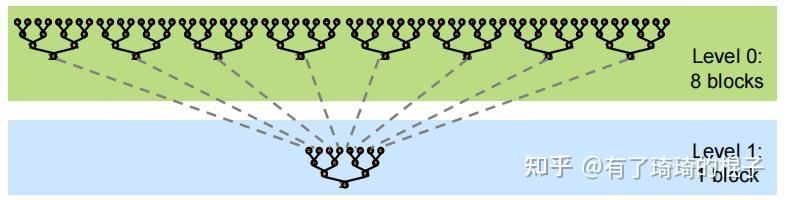
* 对于线程模型的分配, 线程模型的块的个数尽量给到 `SM` 个数的整数倍, 一个块内线程的个数通常是 `128, 256, 512, 1024`。在线程与元素一一对应不能满足的时候, 通常先满足块的个数是整数的要求, 然后再分配适当的线程, 使用 `块跨步` 的方法使得一个线程块的线程能够遍历完分配其的所有数据。进行一个 block 内规约的方法通常有两种, 第一种方法如下所示:
```C++
__global__ void Kernel_A(int *d_s, int *d_o)
{
    int tid = threadIdx.x;
    int *b_s = d_s + blockIdx.x * num_per_block;

    // 1) 每个线程先将负责的部分的数据规约到自己的寄存器中
    int sum = 0;
    for(int i=tid; i<num_per_block; i+=blockDim.x)
    {
        sum += b_s[i];
    }
    
    // 2) 每个块中都分配共享内存, 共享内存负责存储每个线程的变量的值
    __shared__ int tmp_sum[thread_per_block];
    tmp_sum[tid] = sum;
    __syncthreads();

    // 3) 这样规约的好处, 1) 避免了线程束的分歧 2) 不存在 bank 冲突 3) 最后一个 warp 内不需要同步, 避免了同步造成的影响
    for(int s=blockDim.x/2; s>16; s>>=1)
    {
        if(tid<s)
        {
            tmp_sum[tid] += tmp_sum[tid+s];
        }
        __syncthreads();  // 这个不能放到 if 里面
    }

    // 一个 warp 中的所有线程无论什么时候, 都是处在同一种状态, SIMD 的特点
    if(tid<16)  // 因为是同一个 warp 所以不需要同步
    {
        tmp_sum[tid] += tmp_sum[tid+16];
        tmp_sum[tid] += tmp_sum[tid+8];
        tmp_sum[tid] += tmp_sum[tid+4];
        tmp_sum[tid] += tmp_sum[tid+2];
        tmp_sum[tid] += tmp_sum[tid+1];
    }

    // 4) 将每个块规约之后的值赋值到输出
    if(tid==0) d_o[blockIdx.x] = tmp_sum[0];
}
```
* 对于代码中的 `1)`, 每个线程都将自己负责的部分首先进行归约到自己的寄存器变量中。尽可能每个块分配比较少的线程, 让一个线程负责多个数据, 不然每次进行一次规约都有很多的线程不干活。
* 对于代码中的 `2)`, 根据每个块中线程的个数分配共享内存的大小, 让后把每个线程中寄存器的值, 写入到共享内存中。这里的 `__syncthreads()` 是为了同步每个块中的线程, `同一warp中的线程一定是处于同一状态和进度的, 但是不同 warp 的线程所处状态是不确定的, 也就是不同 warp 执行到的地方可能不相同`。读入共享内存中, 是因为 `共享内存能够进行块内数据的共享和同步`(因为我们需要进行块内规约, 需要这一特点)。
* 对于代码中的 `3)`, 这里 `blockDim.x` 一定是能够被 `32` 整除的。这样的写法有很多优势
    * 避免了线程束的分歧, 因为最后一次规约的时候, 步长为 `32`, 所有 `warp` 都是同一状态, 要么执行, 要么不执行。
    * 避免了共享内存中的 bank 冲突, 以 `warp 0` 为例分析, 当 `s=128` 时, `warp 0` 中的 0 线程访问 0 和 128 元素, 都是位于 0 bank,  1 线程访问 1 和 129 元素, 都是位于 1 bank, ... 31 线程访问 31 和 159 元素, 都位于 31 bank, 不存在冲突。
    * 对于最后一个 warp 内值的规约, 这里并没有在循环中使用, 因为最后一个 `warp` 内的所有线程都是同步的, 对共享内存的访问也是同步的, 不需要同步。
* 对于代码中的 `4)`, 这里并没有做同步, 因为所有对共享内存的操作都是在一个 warp 内完成的, 减少同步损耗。
* 规约之后规约的值就位于每个块中共享内存中的第一个值。
* 规约注意的事项就是, 是共享内存块的规约, 也就是每个块规约出一个值, 如果想不同块之间再进行规约, 可以
    * 每个块的结果传回主机端, 然后 host 端进行规约(数据拷贝造成损耗)
    * 先把每个块规约的结果写到全局内存中, 然后利用 `一个块` 对这些数据进行规约(两步规约的办法)。
* 第二种方法如下所示:
```C++
#define FINAL_MASK 0xffffffff

template <typename T>
__inline__ __device__
T warpReduceSum(T val)
{
  for(int mask = 16; mask > 0; mask >>= 1)
    val += __shfl_xor_sync(FINAL_MASK, val, mask, 32);
  return val;
}

template <typename T>
__inline__ __device__
T blockReduceSum(T val)
{
  static __shared__ T shared[32]; 
  int lane = threadIdx.x & 0x1f;  // 相当于取余
  int wid = threadIdx.x >> 5;  

  val = warpReduceSum<T>(val);

  if(lane == 0)
    shared[wid] = val;
  __syncthreads();

  val = (threadIdx.x < (blockDim.x >> 5 )) ? shared[lane] : (T)0.0f;
  val = warpReduceSum<T>(val);

  return val;  // 返回是都要返回的, 只不过只有部分线程的值为想要的值
}

// 每个 warp 进行规约, 规约后的值在 warp 中的 0 号线程
// __shfl_down_sync 相比于 __shfl_down 允许开发者指定一个线程掩码, 确保只有在指定的线程都完成数据交换后, 才继续执行后续的操作
__device__ int warpReduceSum(int sum)
{
    sum += __shfl_down_sync(0xffffffff, sum, 16);
    sum += __shfl_down_sync(0xffffffff, sum, 8);
    sum += __shfl_down_sync(0xffffffff, sum, 4);
    sum += __shfl_down_sync(0xffffffff, sum, 2);
    sum += __shfl_down_sync(0xffffffff, sum, 1);
    
    // sum += __shfl_xor_sync(0xffffffff, sum, 16);
    // sum += __shfl_xor_sync(0xffffffff, sum, 8);
    // sum += __shfl_xor_sync(0xffffffff, sum, 4);
    // sum += __shfl_xor_sync(0xffffffff, sum, 2);
    // sum += __shfl_xor_sync(0xffffffff, sum, 1);

    return sum;
}

__device__ int blockReduceSum(int sum)
{
    int laneId = threadIdx.x % warpSize;  // 每个 warp 中第几个线程
    int warpId = threadIdx.x / warpSize;  // 属于第几个 warp

    // 填充进去
    sum = warpReduceSum(sum);
    __shared__ int reduceSum[32];         // 最多也就 32 个 warp
    if(laneId==0)
    {
        reduceSum[warpId] = sum;
    }
    __syncthreads();

    bool pred = (warpId==0) && (laneId < blockDim.x / warpSize);
    int value =  (int)pred * reduceSum[laneId];  // 在范围内的为正常的数字, 否则为 0
    if(warpId==0) value = warpReduceSum(value);
    if(warpId==0 && laneId==0) sum=value;

    return sum;
}


__global__ void Kernel_B(int *d_s, int *d_o)
{
    int tid = threadIdx.x;  // 每个块内线程的 id
    int *b_s = d_s + blockIdx.x * num_per_block;

    // 1) 每个线程先将负责的部分的数据规约到自己的寄存器中
    int sum = 0;
    for(int i=tid; i<num_per_block; i+=blockDim.x)
    {
        sum += b_s[i];
    }
    sum = blockReduceSum(sum);

    if(tid==0) d_o[blockIdx.x] = sum;
}
```
* 对于第二种方法, 其实整体思路就是, 每个线程先将负责的那部分数据归约到自己的寄存器中, 然后 `warp` 内先进行一次规约, 规约的结果存储在每个 `warp` 的第一个线程中。然后再分配共享内存, 此时共享内存只需要再分配最多 32 个元素字节的大小(因为一个块内最多有 1024 个线程, 对应 32 个 `warp`)。但是这里有个问题, 就是得确定真正参与规约的每个块内有多少个 `warp`(确定个数来给共享内存32个无效的位置填充适当的数字)。最后再对这个 32 个共享内存数据进行规约, 这里使用的方法是, 每个块内 0 号 `warp` 读取这 32 个值, 然后再来一次 warp 内的规约。其实也可以像第一种方法一样, 直接操作共享内存(这里涉及到需要给共享内存写没用到的值, 或者依据线程个数只规约想要的部分)。

## PTX 与 SASS 的区别
* CUDA 的汇编语言分成两种, 一种是 Parallel Thread Execution(PTX), 另一种是 Streaming Assembly(SASS)。SASS 指令集与 GPU 架构是有直接的联系的, 是机器码的指令集合, 编译 SASS 的 GPU 架构与当前 GPU 架构不对应的话是不能运行的。PTX 是从 SASS 抽象出来的更上层的软件编程模型, 介于 CUDA C 和 SASS 之间, 与硬件架构有比较弱的耦合性。
* 看生成汇编代码的目的是, 做完优化以后, 我们要判断机器是否能够真正地按照我们设想的模式运行。使用 float4 后, GPU 是否真正使用了向量化的指令。采用循环展开后, GPU 是否真正地会进行展开。
* 对于访存密集型的 `kernel`, 主要关注有没有采用 `LDG.128` 的访存指令, `#pragma unroll` 是否有效展开了, 计算指令占比是不是不太多。对于计算密集型的 `kernel`, 重点关注计算指令的占比。如果并行策略不太行，那么计算指令的占比会很低，这样的话，访存所导致的 latency 很难被计算指令掩盖，计算效率会非常差。如果并行策略比较好，那么计算指令的占比也会非常地高。也只有当计算指令占比非常高的时候，才有可能地去逼近峰值性能。
* CUDA 微架构和指令集是两个重要的概念。CUDA 的微架构一般指的是 `SM` 的架构。指令集是 GPU 执行的机器码(SASS)。PTX 是构建在 SASS 上的虚拟中间代码指令集(PTX 与 `SM` 架构只有比较弱的耦合关系)。SM 架构的设计决定了指令集(SASS)所支持的指令形式(SASS 与 `SM` 是直接对应关系)。

## CUDA 代码的编译流程
* 在 CUDA 编程模型中，CUDA 代码会在主机端（Host）用 nvcc 编译器编译生成适合 GPU 执行的机器指令，然后再发送给 GPU 执行。主要分成以下几个部分:
    - 预处理。处理头文件的包含(`#include`), 宏定义(`#define`), 条件编译(`#if`)
    - 分离主机代码和 CUDA 代码。nvcc 编译器会将 CUDA 代码(CUDA代码主要是包含 `__global__` 和 `__device__` 等修饰符的代码段)与主机代码分离。
    - 编译和汇编。nvcc 调用C++编译器(g++)对C++代码进行编译, 生成目标文件(.o)。nvcc 将CUDA代码编译成PTX代码或再次使用 ptxas 编译器 将 ptx 编译成二进制的 SASS 代码。
    - 链接阶段。nvcc 会将主机目标文件、CUDA目标文件、CUDA运行时库链接在一起, 最终生成可执行文件。
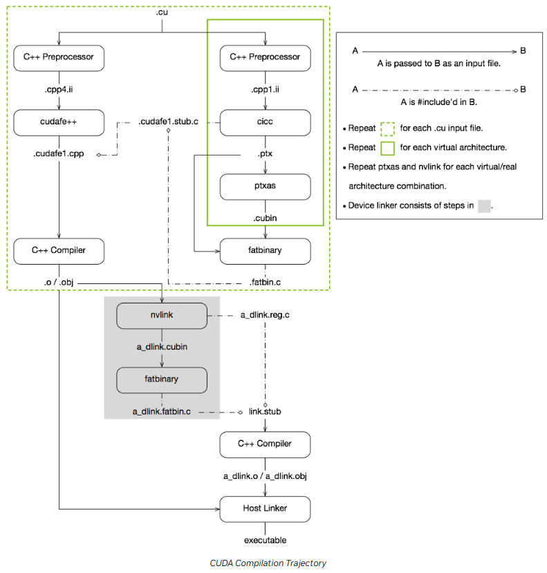
* 从图中我们可以看到, 其实首先是利用 `g++` 进行预处理。然后 GPU 端, 是利用 `cicc` 编译 GPU 端的代码生成 `.ptx`, 再使用 `ptxas` 将 ptx 编译成 `.cubin`。最后利用 `fatbinary` 将 ptx 和 cubin 打包成 `fatbin`。然后最后整合到一起再利用 g++ 一起编译。
* CPU 是基于已经发布的指令集架构, 使得针对同样架构的新的 CPU 不需要修改编译选项即可运行。而 GPU 的架构是不断迭代的, 难以保证二进制的兼容, 所以利用两端编译模型来保证这一点。从cuda到ptx再到cubin。其中PTX可以被视作一种虚拟的GPU架构的组装。他不和实际的硬件直接对应，而是类似CPU的ISA提供了一个通用的指令集，这也是一种虚拟的中间体系结构。而cubin即可认为是运行在硬件上的最终的代码，与GPU的代际强相关。
* nvcc 通常使用 `computer_xy` 表示 ptx 的架构, 而使用 `sm_xy` 表示 cubin 的架构。
* ISA(Instruction Set Architecture) 是指令集体系结构。其对上限定了软件的基本功能, 对下制定了硬件实现的功能目标, 因此指令系统的设计(指令集包含那些指令, 指令用什么格式表示) 是计算机系统设计的重要一环。ISA 按照指令系统的复杂程度不同, 可以分为 CISC(Complex Instruction Set Computer) 和 RISC(Reduced Instruction Set Computer)。
* CISC 追求的是 `强化指令功能, 减少程序的指令条数`, 指令庞大且复杂。SISC 追求的是 `减少指令种类、规范指令格式、简化寻址方式`, 只保留功能简单, 能在一个节拍内完成的指令, 时钟频率通常很高。CISC 主要是 桌面和服务器领域, RISC 主要是 移动和互联网领域。CISC 和 RISC 的区别通常如下:
    - 指令集的复杂程度: CISC 指令集复杂, 每条指令可以完成很多的操作, 旨在减少指令数量。RISC 指令集简单, 只有少量基础指令, 每条指令通常只是执行一个简单的操作。处理器完成指令更高效。
    - 指令长度: CISC 指令长度通常不固定, 解码复杂。RISC指令长度固定, 使得解码变得简单和快速。
    - 执行时间: CISC 由于指令复杂, 许多指令可以需要多个时钟周期来完成。RISC 指令简单, 设计上要求大部分指令在一个时钟周期内完成，从而提高执行效率。
    - 内存使用: CISC 每条指令执行的操作比较多，因此程序所需的指令数量相对较少，占用的内存较少。RISC 指令执行的操作比较少，所以程序通常需要更多的指令来完成同样的任务，导致需要更多的内存空间。

* CPU 端运行到 CUDA 程序时, 会使用 `cudaLaunchKernel()` 函数来启动这个 kernel 程序。这个程序要传入 `grid维度`, `block维度`, `shareMemoryBytes`, `stream`。调用完 `cudaLaunchKernel` 之后, (接下来的叙述就是 kernel 的 launch 开销)会把 kernel函数及其参数发送到设备上, 并启动GPU上的执行单元来执行这个函数。

## 向量化内存访问 [原文](https://zhuanlan.zhihu.com/p/572817996)
* 硬件的 FLOPS 与带宽比例不断增加, 使得很多 CUDA 内核都是受带宽限制的。使用向量化访存可以减少访存指令, 指令 cache 里能够存下更多指令, 提高指令 cache 的命中率, 提高带宽利用率。
* 小数据规模的情况下, 可以不考虑向量化的内存访问的优化方式。大规模数据情况下, 考虑使用向量化访存。使用向量化加载的最简单方法是使用 CUDA C/C++ 标准头文件中定义的向量数据类型，例如 `int2, int4, float2, float4`。大体的思路就是使用 `reinterpret_cast()` 将指针转换为向量化的数据类型的形式, 但是要注意线程数的变化, (因为接下来一个例子中, 每个线程处理 2 个 `int`)。使用向量化读取仍然可以使用网格跨步法, 要注意不能够凑够整数个向量的情况下, 是如何处理的(先向量读取能够向量化的部分, 对于余下的部分, 再单独处理)。
```C++
// 每个线程负责的元素个数不能被线程数整除
__global__ void kernel_C(int *d_s, int *d_o){
    int tid = threadIdx.x;  // 每个块内的线程 id
    
    // 网格跨步法处理能够向量化读取的部分
    for(int i=tid; i < num_per_block/2; i+=blockDim.x)
    {
        reinterpret_cast<int2*>(d_o)[i] = reinterpret_cast<int2*>(d_s)[i];
    }

    // 处理不够 2 的部分
    int remainder = num_per_block % 2;  // 余数
    int quotient = num_per_block / 2;  // 商
    if(tid < remainder)
    {
        d_o[2*quotient+tid] = d_s[2*quotient+tid];
    }

}
```
* 向量化内存访问比较适用于 `element-wise`(对每个元素单独组一个算数操作, 然后直接输出, 如 `add`, `mul`, `concat`)。判断是否用上了向量化的访存是看 SASS 代码中有没有 `LDG.E.128 Rx, [Rx.64]` 或 `STG.E.128 [R6.64], Rx` 这些指令的存在。有则向量化成功，没有则向量化失败(所以有时即使在 CUDA C/C++ 端使用了向量化读取, 速度还没不使用的快)。

## 数据预取(Prefetching) [原文](https://zhuanlan.zhihu.com/p/596598301)
* 对于 GPU 来说, 一般会考虑使用更多的 warp 来隐藏内存延迟。如果延迟仍然很高, 可以考虑以软件的方式使用预取。使用数据预取可以提前将数据从主机内存或全局内存加载到 GPU 的高速缓存(共享内存或寄存器), 避免在计算过程中等待内存访问所产生的延迟, 提高带宽利用率。数据预取分为批量预取和滚动预取。
* 接下来举的例子中每个线程网格都是一维的
```C++
// 网格块跨步法, 依据全局内存中 arr 的元素个数, 每个线程迭代几次, 将数据从全局加载在到其寄存器中
for (i=threadIdx.x; i<imax; i+= BLOCKDIMX) {
    double locvar = arr[i];
    /* 接下来很多指令使用 locvar 变量*/
}

// 每个线程都引入了计数器 ctr, 来记录当前线程迭代的步数, 这里的预取距离(PDIST)是 4, 这里必须假设每个线程的迭代步数都能够被 4 整除
// 这个是批量预取到寄存器中, 通常预取的值越多, 方法越有效
double v0, v1, v2, v3;
for (i=threadIdx.x, ctr=0; i<imax; i+= BLOCKDIMX, ctr++) {
    int ctr_mod = ctr%4;
    if (ctr_mod==0) {  // 一个线程每迭代四步, 就填充 buffer
        v0=arr[i+0* BLOCKDIMX]; 
        v1=arr[i+1* BLOCKDIMX]; 
        v2=arr[i+2* BLOCKDIMX]; 
        v3=arr[i+3* BLOCKDIMX];
    }
    switch (ctr_mod) { // 依据当前的迭代步数, 从预取的寄存器中得到值
        case 0: double locvar = v0; break;
        case 1: double locvar = v1; break;
        case 2: double locvar = v2; break;
        case 3: double locvar = v3; break;
    }
    /* 接下来很多指令使用 locvar 变量*/
}

// 当寄存器数组中元素个数比较少的时候, 才是放到寄存器中
double v[4];
for (int i=threadIdx.x, ctr=0; i<imax; i+= BLOCKDIMX, ctr++) {
    int ctr_mod = ctr%4;
    if (ctr_mod==0) {  // 一个线程每迭代四步, 就填充 buffer
        for(int k=0; k<4; ++k){
            v[i] = arr[i+k* BLOCKDIMX];
        }
    }
    double locvar = v[ctr_mod];
    /* 接下来很多指令使用 locvar 变量*/
}

/*
    这种对共享内存的操作, 不需要加共享内存同步指令
    1) 每个线程只会访问自己所需要的共享内存数据, 不会出现数据竞争问题
    2) 每个线程都是写完才读的, 不存在其他线程写的, 自己来读这种情况
*/
// 批量预取到共享内存中, 也要保证每个线程的迭代步数能够被 PDIST 整除
constexpr int PDIST = 4;  // PDIST 是预取举例
// 用共享变量来存储预取的数据, index 是线程迭代次数 % PDIST 后的结果.
#define vsmem(index)  v[index+PDIST*threadIdx.x]

__shared__ double v[PDIST* BLOCKDIMX];  // 分配空间, 每个线程预留 PDIST 个空间
for (int i=threadIdx.x, int ctr=0; i<imax; i+= BLOCKDIMX, ctr++) {
    int ctr_mod = ctr % PDIST;
    if (ctr_mod==0) {
        for (int k=0; k<PDIST; ++k) vsmem(k) = arr[i+k* BLOCKDIMX];
    }
    double locvar = vsmem(ctr_mod);
    /* 接下来很多指令使用 locvar 变量*/
}


/* 以上的批量预取到寄存器和批量预取到共享内存, 都有一个问题, 就是需要每个线程的迭代步数, 都能整除 PDIST, 接下来的滚动预取, 能够克服这一点*/

/*

*/
// 仍然是每个线程预取 PDIST 的空间, 但是不再要求每个线程的迭代步数能够整除 PDIST
constexpr int PDIST = 4;
#define vsmem(index)  v[index+PDIST*threadIdx.x]
__shared__ double v[PDIST* BLOCKDIMX];  // 仍然是每个线程预取 PDIST 的空间

for (int k=0; k<PDIST; ++k) vsmem(k) = arr[threadIdx.x+k* BLOCKDIMX];  // 要求第一次预取能够达到
for (int i=threadIdx.x, ctr=0; i<imax; i+= BLOCKDIMX, ctr++) {
    int ctr_mod= ctr%PDIST;
    double locvar = vsmem(ctr_mod);
    // 这个判断条件可能 i+PDIST*BLOCKDIMX < imax 能更好理解一些, 判断这个线程是否还有需要的缓冲元素
    if (i<imax-PDIST* BLOCKDIMX) vsmem(ctr_mod) = arr[i+PDIST* BLOCKDIMX];

    /* 接下来很多指令使用 locvar 变量*/
}

/*以上可能共享内存会存在 bank 冲突, 在共享内存中填充(padding)数组大小，以避免错误的跨步*/
#define vsmem(index) v[index+(PDIST+PADDING)*threadIdx.x]
```
* 循环最简单的优化, 称为展开。因为如果循环足够短, 可以告诉编译器完全展开循环, 并显式展开迭代。因为迭代是独立的，编译器可以预先发出所有数据请求(“加载”)，只要它为每个加载分配不同的寄存器。这些请求可以相互重叠, 这样整个加载的过程只会经历一个内存延迟，而不是所有单个延迟的总和。就是可能需要大量的寄存器来接受加载的结果。

## SGEMM 的优化 [原文](https://zhuanlan.zhihu.com/p/435908830)
* 矩阵乘法 (GEMM) 通常是模型里最耗时的部分(卷积, attention), 所以其优化是非常重要的。GEMM 的优化的手段主要是 `数据分块` 和 `利用多级存储进行数据搬运`。假设计算矩阵乘法 $C = A\times B$, 其中 A 的大小为 $M\times K$, B 的大小为 $K \times N$, C 的大小为 $M \times N$。针对 C 进行第一次分块, 分块的大小为 $block_m \times block_n$, 那么分成的总的块数为 $(M/block_m) \times (N/block_n)$。让每个线程网格中的每个线程块负责一个 C 中的数据块的计算, 即 `dim3 grid(M/block_m \times N/block_n)`。对这个大小为 $block_m \times block_n$ 的数据块再次进行划分, 分块大小为 $thread_m \times thread_n$, 每个线程负责这一块的计算, 即 `dim3 block(block_m/thread_m, block_n/thread_n)`。
* 对应每个块负责的 C 中输出的部分, 其结果是由大小为 $block_m \times K$ 和 $K \times block_n$ 两个矩阵做乘法得到的。但是 K 的大小通常是很大的, 一次性可能放不下这么多数据, 那么将 K 这个维度进行分块, 每个块的大小为 $block_k$。$block_m \times block_k$ 和 $block_k \times block_n$ 的乘积大小仍然是 $block_k \times block_n$, 迭代 $K/block_k$ 次, 将每次迭代的结果进行对应元素相加就是原始长度矩阵相乘的结果。通过这种方法, 我们就节省了每个块存储数据所需要的共享内存的大小。通过这样的变换, 每个块内的线程只需要负责处理好这一迭代块的数据即可。
* 对于每个线程负责的 C 中输出的部分, 其每次处理的是一个迭代块的共享内存的数据, 其每次取得的数据块应该是 $thread_m \times block_k$ 和 $block_k \times thread_n$, 仍将其进行分成多个迭代($block_k$), 每个线程有一个寄存器大小为 $thread_m \times thread_n$, 每次迭代都生成这么大的大小, 然后与其进行累加。通过$block_k$ 次小迭代之后, 会得每个迭代的对应分块的结果。通过 $K/block_k$ 次大迭代之后, 每个块能够得到对应矩阵 C 中分块的结果。
* 其中也使用数据预取的技术(这里也有人认为是双缓冲的技术), `kernel` 整体的流程如下:
```C++
// 分配双倍的共享存储空间
__shared__ float As[2][BLOCK_SIZE_K][BLOCK_SIZE_M];
__shared__ float Bs[2][BLOCK_SIZE_K][BLOCK_SIZE_N];

// 分配双倍的寄存器存储空间
float frag_a[2][THREAD_SIZE_Y];
float frag_b[2][THREAD_SIZE_X];

// 分配双倍的寄存器存储空间, 要先将全局存储数据搬运到寄存器中再搬运到共享内存中
float ldg_a_reg[4*ldg_num_a];
float ldg_b_reg[4*ldg_num_b];

// 每个寄存器的结果, 迭代完 256 个大迭代后, 将结果写入全局内存中
float accum[THREAD_SIZE_Y][THREAD_SIZE_X] = {0};  // 这个最后直接赋值到输出矩阵 C 中

// 把第一个大迭代块所需要的数据从全局内存读入到共享内存
// 把第一个小迭代块所需要的数据从共享内存读入到寄存器中
for k in 256 大迭代:
    // 将下一个大迭代块所需要的数据从共享内存预取到寄存器中
    for k in 7 小迭代:
        // 将下一个迭代所需要的数据从共享内存预取到寄存器中
        // 依靠本次寄存器中的数据进行本次迭代计算, 结果写到 accum 中
    // 将下一个大迭代块所需要的数据从寄存器取到共享内存中
    // 计算最后一个小迭代, 结果写到 accum 中

// 完成 256 次大迭代后, 每个线程将结果写到全局内存中
```

## GEMV 的优化 [原文](https://zhuanlan.zhihu.com/p/494144694)
* `gemv` 是矩阵向量乘法操作, 即一个大小为 $m\times n$ 的矩阵 $A$ 和一个大小为 $n\times 1$ 的向量 $x$ 做乘法, 得到大小为 $m\times 1$ 的向量 $y$。可以每个 block 负责一行, 然后每个块进行规约运算。这里的做法是每个 warp 负责一行, warp 内使用 `shuffle` 指令进行规约运算得到每行的结果。当 $n$ 较小时可以让一个 warp 负责多行, 当 $n$ 较大时的时候使用向量化的读取方式。

## 全局内存合并
* 全局内存主要用在 `主机和设备之间数据的传输`, `内核数据的输入和输出`。
* 全局内存访问指的是多个线程同时访问全局内存时, 这些访问被合并成更少的内存事务, 这样可以提高内存访问效率。设备可以通过 32 字节, 64 字节, 128 字节的事务来访问全局内存。为了保证实现最佳的全局内存合并效果, 通常要注意
    * 保持全局内存访问的连续性, 尽可能让同一个 warp 访问连续的全局内存地址(CUDA 架构中的全局内存合并机制是基于线程束内的线程的访存模式的，而不是线程束之间的。这意味着可以在设计 CUDA 内核时，让不同的线程束访问不连续的内存地址，只要保证同一个线程束内的线程访问的地址是连续的即可)。
    * 尽量避免跨越内存段(即跨越 32 位或者 64 位边界)的访问(因为缓存机制的出现, 使得不对齐的现象影响比较小)。
```C++
/*
    以下的内核代码都是一维网格一维线程模型来启动的
*/

// 访问数组元素有偏移(偏移可能会造成不对齐的情况发生)
template<typename T>
__global__ void offset(T* a, int s)
{
  int i = blockDim.x * blockIdx.x + threadIdx.x + s;
  a[i] = a[i] + 1;
}

// 这个是跨步访问, s 是跨步的步长。这个导致了同一个 warp 中的线程访问的全局内存地址是不连续的
template<typename T>
__global__ void stride(T* a, int s)
{
  int i = (blockDim.x * blockIdx.x + threadIdx.x) * s;
  a[i] = a[i] + 1;
}
```
* 在早期的 CUDA 硬件中, 全局内存的对齐访问和跨步访问对带宽都有比较大的影响。但是在最近的硬件上, 对齐访问并不是大的问题(因为缓存的出现)。如果不可避免的要出现对全局内存的跨步访问, 可以先逐行的将数据读取到共享内存中, 然后再使用跨步访问的办法(这时候要注意一个 warp 中是否存在 bank 冲突)。对于共享内存的访问，通常不会像全局内存一样涉及到内存事务，而是直接通过存储器的端口进行访问。因此，共享内存的访问模式不同于全局内存，不需要考虑内存事务的问题。但是，仍然需要注意bank冲突的问题，以最大程度地利用共享内存的带宽和性能。

## transpose 优化 [原文](https://zhuanlan.zhihu.com/p/568769940)
* 矩阵转置的优化, 主要是考虑全局内存合并访问的的问题。最简单实现矩阵的转置是针对全局内存上的输入矩阵分块逐行读取, 然后再对全局内存上的输出矩阵逐列写入。全局内存的逐行读取能够全局内存合并访问的特性, 但是逐列的写入, 就是非常低效了, 最差情况, warp 中的每个线程都需要一次内存事务。解决的办法是从全局内存中逐行地读取元素到共享内存中, 然后逐列的读取共享内存的数据, 逐行的写入到全局内存中(其中要注意 bank 冲突的问题, 通过填充解决)。
* 这里是将输入矩阵进行分块, 每个块的大小为 `block_size_M` 和 `block_size_N`。然后让每个线程块, 负责每个数据块。数据块的长和宽最好是 `32` 的整数倍(比较好分配线程)。
```C++
// 32*16 大小的线程块要操作 block_size_m*block_size_n 大小的数据块
template<int block_size_m, int block_size_n> 
__global__ void Kernel_A(
    float* __restrict__ d_i,   // 输入矩阵大小为 M*N
    float* __restrict__ d_o,   // 转置输入矩阵大小为 N*M
    const int M,
    const int N
){
    /*
        第一步将全局内存中的数据读入到共享内存中
    */
    __shared__ float sm_data[block_size_m][block_size_n+1];  // 每个共享内存块都要读入这么多的数据

    int tx = threadIdx.x;  // laneId
    int ty = threadIdx.y;  // warpId
    int bx = blockIdx.x;   // x 方向是第几个块
    int by = blockIdx.y;   // y 方向是第几个块

    for(int i=0; i<block_size_m; i+=blockDim.y)
    {
        int idx_glo = (by*block_size_m+i+ty)*N+bx*block_size_n;  // 定位到第几行, 第几列的起始位置
        reinterpret_cast<float2*>(&sm_data[i+ty][tx*2])[0] = reinterpret_cast<float2*>(&d_i[idx_glo])[tx];
    }

    __syncthreads();  // 不同的线程要操作相同的共享内存, 所以要先进行同步

    /*
        将共享内存中的数据逐列读取, 逐行写入到全局内存中
    */
    for(int i=0; i<block_size_n; i+=blockDim.y) 
    {
        int idx_glo = (bx*block_size_n+ty+i)*M + by*block_size_m+tx;
        d_o[idx_glo] = sm_data[tx][ty+i];
    }
}
```
* 这里编写的时候, 有一个技巧, 就是每次先确定共享内存的行和列的索引(这个就是对应实际矩阵的行和列), 然后再思考如何与全局内存对应。记着, 输入全局内存逐行读取, 逐行写入共享内存。逐列读取共享内存, 逐行写入全局内存。而且不要忘记了要避免 `bank` 冲突。

## prefix_sum [原文](https://zhuanlan.zhihu.com/p/661460705)
* 前缀扫描接受一个二元关系运算符 $\oplus$ 和一个数组 $\big[a_0, a_1, \cdots, a_n-1\big]$, 返回一个相同长度的数组 $\big[a_0, \big(a_0 \oplus a_1\big), \cdots, \big(a_0 \oplus a_1 \oplus \cdots \oplus a_n-1\big)\big]$。这个是包含扫描的形式, 独占扫描的形式就是只扫描前面的, 而不包含当前的。
```C++
int input_arr[] = {3, 1,  7,  0,  4,  1,  6,  3};
// 包含扫描和为    [3, 4, 11, 11, 15, 16, 22, 25]
// 独占扫描和为    [0, 3,  4, 11, 11, 15, 16, 22]

// input_arr 末尾填充一些 0
int input_arr[] = {3, 1,  7,  0,  4,  1,  6,  3,  0,  0,  0};
// 包含扫描和为    [3, 4, 11, 11, 15, 16, 22, 25, 25, 25, 25]
// 独占扫描和为    [0, 3,  4, 11, 11, 15, 16, 22, 25, 25, 25]
```
* 接下来介绍的前缀和并行算法是独占扫描。首先介绍输入数组元素个数比较少的时候(元素个数小于等于 `2048`), 算法的整体思路。
    * 先依据输入元素的个数 `N` 找到大于等于其最小的 2 的幂次的数 `padding_N`(接下来的上扫和下扫都是树形规约, 必须要求元素个数是 2 的幂次)。
    * 依据 `padding_N` 来设置共享内存, `kernel` 的启动方式是 `<<<1, padding_N/2>>>` (如果元素个数等于线程个数, 那么在第一次树形规约的时候, 就会有一半的线程不干活)。
    * 每个线程负责将两个数据从全局内存读取到共享存储(因为 `N` 的奇偶性不能确定, 所以把循环展开, 超出 N 个元素的都填充为 0)。
    * 上扫的过程(树形规约)。整体的思路是 a. padding_N/2 的大小决定了循环的次数(int d=pdding_N/2 为初始条件, 一直到 d==0 时停止。d其实就是参与本次循环的线程个数) b. 通过 a 确定了每次运行的线程总数, 那么每次就放出前 d 个线程参与操作。c. 给每个线程分配要处理的数据的索引, 这里用到 offset, offset 为 1 是初始条件(offset 表示, 本次循环中, 从多少个数据中取一个数据出来参与运算, 每次循环结束时, offset 都会乘以 2)。d. 任何时候, 一个线程都是处理两个数据。
    * 利用一个线程将共享存储最后一个元素置为 0(此时整个共享存储已经进行一次树形规约的操作).
    * 下扫过程(逆向树形规约)。a. 仍然是线程个数确定了循环的次数(线程个数从 1, 2, ..., padding_N/2 变化) b. 依据每次循环的线程个数, 放出前 d 个线程参与操作。c. 给每个线程分配要处理的数据索引, 这里也用到 offset, offset 为 padding_N/2 是初始条件, 从这么多数据选取一个。
    * 最后要将共享内存的数据写入到全局内存中, 仍然是将循环展开, 解决奇偶性的问题。
```C++
__global__ void parallel_block_scan_kernel(int *data, int *prefix_sum, int N)  // 这里的 N 是填充前, 真实元素的个数
{
    extern __shared__ int tmp[];
    int tid = threadIdx.x;
    int leaf_num = blockDim.x * 2;  // equals to length of tmp

    // 这里其实是循环展开了, 每个线程负责运输两个数据, 用 0 来补充
    tmp[tid * 2] = tid * 2 < N ? data[tid * 2] : 0;
    tmp[tid * 2 + 1] = tid * 2 + 1 < N ? data[tid * 2 + 1] : 0;
    __syncthreads();  // 同步不能忘记了

    // 上扫过程, 每个线程处理两个元素
    int offset = 1;  // 相隔多少个元素取一个元素
    // 先确定要使用的线程, 再给这些线程分配操纵的数据
    for (int d = leaf_num >> 1; d > 0; d >>= 1)
    {
        if (tid < d)  // 先筛选出需要的线程个数, 选好后的每个线程总是负责两个数据
        {
            int ai = offset * (2 * tid + 1) - 1;  // 2*tid 是每个线程处理 2*tid*offset 个元素, +1 是指取出第一个块的后一个元素
            int bi = offset * (2 * tid + 2) - 1;
            tmp[bi] += tmp[ai];
        }
        offset *= 2;
        __syncthreads();
    }

    // 每个块都使用 tid 为 0 的线程, 将共享存储中最后一个元素置为0, 只有完成这一步才能下扫
    if (tid == 0)
    {
        tmp[leaf_num - 1] = 0;
    }
    __syncthreads();

    // 下扫过程, 每个线程处理两个元素
    for (int d = 1; d < leaf_num; d *= 2)
    {
        offset >>= 1;
        if (tid < d)
        {
            int ai = offset * (2 * tid + 1) - 1;
            int bi = offset * (2 * tid + 2) - 1;

            float v = tmp[ai];
            tmp[ai] = tmp[bi];
            tmp[bi] += v;
        }
        __syncthreads();
    }

    // 每个线程处理两个元素, N 的个数可能为奇数, 也可能为偶数, 这里其实也是展开了
    // 先搬所有偶数, 再搬所有奇数
    if (tid * 2 < N)
    {
        prefix_sum[tid * 2] = tmp[tid * 2];
    }
    if (tid * 2 + 1 < N)
    {
        prefix_sum[tid * 2 + 1] = tmp[tid * 2 + 1];
    }
}
```
* 代码优化到这里已经可以了, 但是仍然存在问题就是共享存储中存在 bank 冲突。在上扫和下扫的过程中, 当 offset 是 32 的整数倍的时候, 甚至存在 32 路的 bank 冲突。仍然是通过填充来减少 bank 冲突问题。通用的 bank 填充方式。
```C++
#define NUM_BANKS 32
#define LOG_NUM_BANKS 5
#define CONFLICT_FREE_OFFSET(n) (((n) >> LOG_NUM_BANKS) + ((n) >> (2 * LOG_NUM_BANKS)))
```
* 以上是解决 bank 冲突问题的宏定义, `CONFLICT_FREE_OFFSET(n) = n / num_banks + n / (num_banks^2)`。其实思路仍然是每 32 个元素填充一个。
    * 首先由数组元素的个数分配共享内存 `padding_N + CONFLICT_FREE_OFFSET(padding_N - 1)`, 启动方式仍然是 `<<<1, padding_N/2>>>`
    * 在 kernel 内部, 仍然是认为规约元素个数是 `padding_N`, 只不过 `padding_N` 个元素要放到分配的共享内存的位置。共享内存多分配的空间既不会读到, 也不会写到。这些只是空间只是占位的作用。
    * 按照正常的线程对应元素的逻辑来找在 `padding_N` 中的索引位置, 这个索引位置在经过一次 `CONFLICT_FREE_OFFSET()` 求出其前面的 padding 个数, 加到之前的索引上再索引共享内存就可以了。
```C++
// 有 bank 填充的时候, tmp 分配的空间更多了, 这些空间既不会读到, 也不会写到。
// 仍然是正常的逻辑来处理元素, 只不过放入共享内存, 或者从共享内存读取的时候, 需要依据其所在元素的位置计算偏移
__global__ void parallel_block_scan_bcao_kernel(int *data, int *prefix_sum, int N)
{
    extern __shared__ int tmp[];
    int tid = threadIdx.x;
    int leaf_num = blockDim.x * 2; // not equals to length of tmp, 填充到 2 的幂次的大小, 但是没有填充 bank

    int ai = tid;  // 前一半中的元素
    int bi = tid + (leaf_num >> 1);  // 后一半中对应的元素
    int offset_ai = CONFLICT_FREE_OFFSET(ai);  // ai 前有多少个元素的填充
    int offset_bi = CONFLICT_FREE_OFFSET(bi);  // bi 前有多少个元素的填充

    tmp[ai + offset_ai] = ai < N ? data[ai] : 0;
    tmp[bi + offset_bi] = bi < N ? data[bi] : 0;
    __syncthreads();

    // 加 bank 的 offset 是是先算出来原本的索引, 再依据原本的索引添加 offset
    int offset = 1;
    for (int d = leaf_num >> 1; d > 0; d >>= 1)
    {
        if (tid < d)
        {
            int ai = offset * (2 * tid + 1) - 1;
            int bi = offset * (2 * tid + 2) - 1;
            ai += CONFLICT_FREE_OFFSET(ai);
            bi += CONFLICT_FREE_OFFSET(bi);
            tmp[bi] += tmp[ai];
        }
        offset *= 2;
        __syncthreads();
    }

    if (tid == 0)
    {
        tmp[leaf_num - 1 + CONFLICT_FREE_OFFSET(leaf_num - 1)] = 0;
    }
    __syncthreads();

    for (int d = 1; d < leaf_num; d *= 2)
    {
        offset >>= 1;
        if (tid < d)
        {
            int ai = offset * (2 * tid + 1) - 1;
            int bi = offset * (2 * tid + 2) - 1;
            ai += CONFLICT_FREE_OFFSET(ai);
            bi += CONFLICT_FREE_OFFSET(bi);

            float v = tmp[ai];
            tmp[ai] = tmp[bi];
            tmp[bi] += v;
        }
        __syncthreads();
    }

    if (ai < N)
    {
        prefix_sum[ai] = tmp[ai + offset_ai];
    }
    if (bi < N)
    {
        prefix_sum[bi] = tmp[bi + offset_bi];
    }
}
```
* 接下来介绍输入数组元素个数比较多的时候(元素个数大于 `2048`), 算法的整体思路。
    * 元素多的时候, 就不再纠结某个块的填充个数, 而是直接对块的个数进行向上取整, 每个块都认为要处理的元素个数是最大值。以 `<<<block_num, max_threads_per_block>>>` 的方式启动 `kernel`, `block_num` 的计算方式是 `N/max_elements_per_block`。
    * 这是一个递归函数 `recursive_scan`。 递归的思路是将当前的数据块进行分块, 每个块进行扫描和(与此同时求得每个扫描快的和), 转变为求扫描块的和, 然后讲扫描块的递归和加到原始的已经分块递归好的数据中。
```C++
void recursive_scan(int *d_data, int *d_prefix_sum, int N, bool bcao)
{
    // 这两行是一个向上取整的操作
    int block_num = N / MAX_ELEMENTS_PER_BLOCK;  // 分配几个块
    if (N % MAX_ELEMENTS_PER_BLOCK != 0)
    {
        block_num += 1;
    }

    // 将每个段的和再次规约
    int *d_sums, *d_sums_prefix_sum;  // 数组中存放的是每个块的数据
    CUDA_CHECK(cudaMalloc(&d_sums, block_num * sizeof(int)));
    CUDA_CHECK(cudaMalloc(&d_sums_prefix_sum, block_num * sizeof(int)));

    // 依据当前数据所需要的块来进行前缀扫描和
    if (bcao)
    {
        parallel_large_scan_bcao_kernel<<<block_num, MAX_THREADS_PER_BLOCK>>>(d_data, d_prefix_sum, N, d_sums);
    }
    else
    {
        parallel_large_scan_kernel<<<block_num, MAX_THREADS_PER_BLOCK>>>(d_data, d_prefix_sum, N, d_sums);
    }
    CUDA_CHECK(cudaGetLastError());
    CUDA_CHECK(cudaDeviceSynchronize());

    // 当 block_num 的个数不为 1 的时候, 就需要再次递归, 转化为子问题。
    // 当 block_num 的个数为 1 的时候, 就不需要递归了, 函数就结束了(递归结束的条件, 数学归纳法的初始条件)。
    if (block_num != 1)  // 判断块的个数是否为1
    {
        recursive_scan(d_sums, d_sums_prefix_sum, block_num, bcao);
        add_kernel<<<block_num, MAX_THREADS_PER_BLOCK>>>(d_prefix_sum, d_sums_prefix_sum, N);
        CUDA_CHECK(cudaGetLastError());
        CUDA_CHECK(cudaDeviceSynchronize());
    }

    CUDA_CHECK(cudaFree(d_sums));
    CUDA_CHECK(cudaFree(d_sums_prefix_sum));
}
```
## Reduced Precision
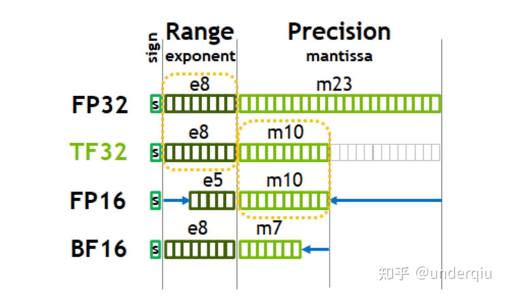
* `fp16 bf16` 相对于 `float` 有着更低的位数, 是为了在满足一定精度要求的前提下，尽可能地减少存储空间和计算成本。
* `tf32` 与 `float` 相比能够提供相似的计算精度(因为指数相同), 但是具有更高的计算性能和存储成本。
* 在编译含有 FP16 的 `kernel` 时，必须要计算力大于等于 `5.3` 的 `GPU` 来启用 `FP16` 支持。GTX1050 之前的GPU不支持, Tesla K 和 M 系列也不支持。
* cuda 中使用 `fp16` 的一些注意事项:
    * `fp16` 应用场景通常就是 a. host 端 `float` 转为 `fp16`, `kernel` 中利用 `fp16` 进行计算, 结果传回 host 端, 再将 `fp16` 转回 `float`; b. host 端传输 `float`, kernel 内转换为 `fp16`, 再计算, 转换为 `float` 再传出。
    * 一般情况下 `half2` 用的比较多, 向量化的进行运算和操作。
    * `half` 或者 `half2` 的算数运算, 数学函数, 都需要相关的指令函数。
```C++
__global__ void kernel_scalarProduct(half2 *vec1, half2 *vec2, float* result, int num_ele){

    extern __shared__ half2 sm_value[];
    const int tid = threadIdx.x;
    const int id = tid + blockIdx.x * blockDim.x;

    // 每个线程先将自己负责的数据归约到共享内存中
    for(int i=0; i<(num_ele>>1); i+=gridDim.x*blockDim.x)
    {
        sm_value[tid] = __hadd2(sm_value[tid], __hmul2(vec1[i+id], vec2[i+id]));
    }
    __syncthreads();

    for(int s=(blockDim.x>>1); s>=32; s>>=1)
    {
        if(tid<s)
        {
            sm_value[tid] = __hadd2(sm_value[tid], sm_value[tid+s]);
        }
        __syncthreads();
    }

    if(tid<32)
    {
        sm_value[tid] = __hadd2(sm_value[tid], sm_value[tid+16]);
        sm_value[tid] = __hadd2(sm_value[tid], sm_value[tid+8]);
        sm_value[tid] = __hadd2(sm_value[tid], sm_value[tid+4]);
        sm_value[tid] = __hadd2(sm_value[tid], sm_value[tid+2]);
        sm_value[tid] = __hadd2(sm_value[tid], sm_value[tid+1]);
    }
    __syncthreads();

    if(tid==0)
    {
        result[blockIdx.x] = __high2float(sm_value[0]) + __low2float(sm_value[0]);
    }
}
```
## 检查函数的使用
* 检查 cuda 错误的函数主要分为两种。一种是同步的函数, 一种是异步的函数。同步的函数的话, 直接用宏接收到这个函数的 cudaSuccess 类型变量的返回值即可。异步函数的话, 无任何返回值。所以要用 `cudaGetLastError()` 来检测一次函数的是否运行成功。当然 `cudaGetLastError()` 也能用来检测同步函数。但是这个函数运行前必须调用 `cudaDeviceSynchronize()` 来同步主机和设备。

```C++
// host 端调用, 依据传入的 cudaError_t 类型的变量来打印错误所在位置和错误信息
// #var 是一种预处理器操作，被称为字符串化操作符。将宏参数 val 转换为一个字符串。也就是说，它会把 val 所代表的实际值转换为字符串形式。
#define checkCudaErrors(val) check((val), #val, __FILE__, __LINE__)

// host 端调用, 主要是打印 kernel 内发生的错误信息。因为 kernel 并不能使用 checkCudaErrors。但是有几点注意事项
// 1) 其主要是用于 kernel 的检查。因为核函数是异步的, 也没有任何返回值。所以必须在核函数启动之后调用 cudaGetLastError 来检索核函数是否启动成功
// 2) 我们要确保核函数启动之前 cudaError_t 类型的变量是 cudaSuccess, 排除核函数以外的错误信息。
// 3) 由于核函数的启动是异步的, 所以必须在调用 cudaGetLastError() 前同步核函数(其实也好理解, 只有核函数执行完, 才能得到 cudaError_t 类型的变量)。
#define getLastCudaError(msg) __getLastCudaError(msg, __FILE__, __LINE__)

template <typename T>
void check(T result, char const *const func, const char *const file,
           int const line) {
  if (result) {
    fprintf(stderr, "CUDA error at %s:%d code=%d(%s) \"%s\" \n", file, line,
            static_cast<unsigned int>(result), cudaGetErrorName(result), func);
    exit(EXIT_FAILURE);
  }
}

inline void __getLastCudaError(const char *errorMessage, const char *file,
                               const int line) {
  cudaError_t err = cudaGetLastError();

  if (cudaSuccess != err) {
    fprintf(stderr,
            "%s(%i) : getLastCudaError() CUDA error :"
            " %s : (%d) %s.\n",
            file, line, errorMessage, static_cast<int>(err),
            cudaGetErrorString(err));
    exit(EXIT_FAILURE);
  }
}
```
## CUDA Steam 和 Event [原文](https://zhuanlan.zhihu.com/p/561596986)
* CUDA Event 的操作其实就是向指定 stream 中插入一个眼, 这个插入操作也会进入插入的 stream 中顺序执行。能够检测这个流是否执行到了这个眼, 还能在 host 端阻塞进程, 等待这个流中 event 的完成。
* CUDA Event 的常见作用是 a. 同步 stream 执行 b. 操控 devcie 运行步调 c. 记录运行时间
* 与 CUDA Event 相关的常见函数有
    * cudaEventCreate(cudaEvent_t *event)  // 在当前设备上产生一个 Event 对象
    * cudaEventRecord(cudaEvent_t event, cudaStream_t stream=0);  // 向指定的流中插入时间, 默认向默认的流(0)中插入 event。把这条事件放入指定流未完成的队列中。此函数可以在同一个事件上多次调用, 该事件会被重置, 并且其时间戳会被更新为最后一次记录的时间。当使用 cudaEventSynchronize 或 cudaEventElapsedTime 时，这些函数会基于最后一次记录的时间戳进行同步和计算。只有当流中完成了 cudaEventRecord 之前的所有语句之后, 事件才会被记录下来。
    * cudaEventSynchronize(cudaEvent event)  // 阻塞 host 线程, 直到中 event 被完成(其实也是等待 event 所在流中在 event 之前的任务被完成)。
    * cudaEventElapsedTime(float *ms, cudaEvent_t start, cudaEvent_t end);  // 记录两个 event 之间的时间, 以 ms 为单位, 分辨率是 0.5 us
* CUDA Stream 是指一系列的操作, 这些操作按照在主机代码发出的顺序在设备上执行。同一个 Stream 里的操作是按照主机代码发出的顺序顺序执行的, 不同 Stream 里面的操作可以异步执行, 在可能的情况下可以并发执行。
* CUDA 的 Stream 分为两种, 默认流(default stream 或 null stream) 和显示流。默认流与显示流的区别主要是:
    * 默认流中有未完成的操作, 那么默认流之后启动的任何其他流中的操作将会等待这些操作完成后才会开始执行。
    * 非默认流中的操作正在执行, 那么在非默认流中启动的任何操作都会将等待这些非默认流中的操作完成后才会开始执行。
    * 不同的非默认流之间没有这种隐式同步, 不同非默认流中的操作可以并行执行。
* 对于非默认流中一些常见函数有
    * cudaStreamCreate(ccudaStream_t *pStream);  // 创建一个异步流
    * cudaStreamDestroy(cudaStream_t stream);  // 销毁一个异步流
    * cudaMemcpyAsync(void *dst, const void *src, size_t count, enum cudaMemcpyKind kind, cudaStream_t stream __dv(0));  // 在流中异步传送数据, 异步传送表示在指定流中启动完异步传送后, host 就会跳到下一行执行。
    * cudaDeviceSynchronize();  // 阻止主机代码等待之前在设备上发出的所有流中所有操作完成都完成。
    * cudaStreamSynchronize(cudaStream_t stream);  // 阻止主机进程, 直到指定流中以前发出的所有操作都完成。
    * cudaMallocHost(void **ptr, size_t size);  // 分配页锁定内存
    * cudaFreeHost(void *ptr);  // 释放页锁定内存
* 通过 overlap 来加速
    * 单个 Stream 中通过 Host 计算与 GPU 计算的 Overlap 来提高效率。接下来的流中, cudaMemcpy() 是同步的数据拷贝(阻塞 host 进程, 直到数据拷贝完成)。而 `kernel` increment 是异步的, 也就是说 `kernel` 被启动, Host 就可以运行下一行的代码, 那么 `kernel` 就会与 Host 代码出现 Overlap, 如果二者计算相等, 那么第四行基本可以无缝衔接。
    ```C++
    cudaMemcpy(d_a, a, numBytes, cudaMemcpyHostToDevice);
    increment<<<1,N>>>(d_a)
    myCpuFunction(b)
    cudaMemcpy(a, d_a, numBytes, cudaMemcpyDeviceToHost);
    ```
    * 多个 stream 通过内核执行, 数据传输之间的 Overlap 来提高效率。有以下几点需要注意
    * 多个流之间的 Overlap 一定是发生在非默认流之间的, 默认流不会与任何非默认流并行执行。
    * 数据传输所涉及的主机内存必须是`锁页内存(pinned memory)`。
    * CUDA 包含用于各种任务的引擎, 在 host 发出操作时, 这些引擎会对操作进行排队。不同引擎中的任务之间的依赖关系得到维护, 每个引擎中的任务将会按照它们的发出顺序顺序执行。比如有些设备有 `H2D` `kernel` `D2H` 三种引擎, 而有些设备只有 `H2D`/`D2H` 和 `kernel` 两个引擎。这使得不同的启动顺序就会有差别。
    ```C++
    checkCuda(cudaEventRecord(startEvent, 0));
    for (int i = 0; i < nStreams; ++i){
    int offset = i * streamSize;
    checkCuda(cudaMemcpyAsync(&d_a[offset], &a[offset], 
                                streamBytes, cudaMemcpyHostToDevice, 
                                stream[i]));
    kernel<<<streamSize/blockSize, blockSize, 0, stream[i]>>>(d_a, offset);
    checkCuda(cudaMemcpyAsync(&a[offset], &d_a[offset], 
                                streamBytes, cudaMemcpyDeviceToHost,
                                stream[i]));
    }
    checkCuda(cudaEventRecord(stopEvent, 0));
    checkCuda(cudaEventSynchronize(stopEvent));
    checkCuda(cudaEventElapsedTime(&ms, startEvent, stopEvent));
    printf("Time for asynchronous V1 transfer and execute (ms): %f\n", ms);
    printf("  max error: %e\n", maxError(a, n));
    ```
    * 以上的代码中, 测量非默认流的时间, 也是在默认流中记录 Event, 然后同步 Event 的执行。这是因为默认流与隐式流不会并行执行, 所以 cudaEventSynchronize(stopEvent) 等待 stopEvent 完成时, 其间测量的其他流一定是完成了其操作了。
* 编写多 `stream` 代码时候的注意事项: a. 拷贝要用 `cudaMemcpyAsync()`, 并且最后一个参数还要指定 stream b. 运行 `kernel` 的时候也要指定 `stream`。c. 如果是将数据分段, 每个段交给不同的流来处理, 那么只需要每个找到每个段的起始位置指针和这个段元素的大小, 然后分段拷贝, 分段处理。
```C++
// 使用多个流, 实现 copy 与 kernel 的并行操作
checkCudaErrors(cudaEventRecord(start_event, 0));  // default 上这个执行完了, 才会执行非默认流中的操作
for(int i=0; i<numStream; ++i)
{
    int cur = i * streamSize;  // 当前处理的元素个数
    checkCudaErrors(cudaMemcpyAsync(&d_i[cur], &h_i[cur], streamBytes, cudaMemcpyHostToDevice, streamVec[i]));
    kernel_A<<<streamSize/blockSize, blockSize, 0, streamVec[i]>>>(&d_i[cur], &d_o[cur], 0);
    checkCudaErrors(cudaMemcpyAsync(&h_o[cur], &d_o[cur], streamBytes, cudaMemcpyDeviceToHost, streamVec[i]));
}
checkCudaErrors(cudaEventRecord(stop_event, 0));
checkCudaErrors(cudaEventSynchronize(stop_event));
checkCudaErrors(cudaEventElapsedTime(&letancy, start_event, stop_event));
std::cout << "multiple stream letancy: " << letancy << " ms" << std::endl;
```
## CUDA 中锁页内存和分页内存
* 我们的主机支持虚拟内存系统, 也就是使用硬盘空间来替代内存。大多数系统中虚拟内存空间被划分为许多页, 虚拟寻址能够使一个连续的虚拟内存地址空间映射到物理内存并不连续的一些页。如果某页的物理内存被标记为换出状态, 它就可能被更换到磁盘上(被踢出内存)。当下次再访问这一页的时候, 重新加载到内存里。
* 分页内存(pageable memory): CPU 的 `malloc` 分配的就是分页内存, 能够被换出到磁盘上, 利用 `free` 释放。
* 页锁定内存(pinned memory): 被锁定的页面会被操作系统标记为不可换出, host 和 device 可以使用页面的物理地址直接访问, 避免了过多的复制操作。`cudaMallocHost` 和 `cudaHostAlloc` 分配页锁定内存, 利用 `cudaFreeHost` 释放。
* 默认情况下 Host 分配的是可分页内存, GPU 不能直接从可分页主机内存访问数据。因此当调用从可分页主机内存到设备内存的数据传输时, CUDA 驱动程序必须首先创建一个临时缓冲区(锁页内存), 把数据从可分页内存复制到锁页内存上, 然后 GPU 再从锁页内存读取数据。但是 CPU 将数据从可分页内存拷贝到临时的锁页内存是有时间开销的，而且这个锁页内存还只是临时的，所以用完之后会被销毁。

## 利用 TensorCore 加速矩阵乘法 [原文](https://github.com/gty111/GEMM_WMMA/tree/master)
* 利用 TensorCore 加速矩阵乘法的操作要在计算能力7.0及更高的设备中才能支持。这需要一个 warp 中所有线程合作。
* 这里的整个思路是以 warp 分为主体, 一个 warp 中的所有线程要处于同一个状态。
* WMMA 的全称是 warp-level matrix Operations, 这个 API 包含了专门矩阵加载、矩阵相乘相加和累加、矩阵存储操作，来有效的地使用 TensorCore。
* 依据GPU的架构不同，WMMA 支持的矩阵运算大小和数据类型也不相同, 定义了宏以后，直接看那些亮了就可以使用。我们选用 `M_TILE=16, K_TILE=16, N_TILE=16` 来进行计算。
* 整体的思路就是先将 `M, K, N` 依据 `M_TILE, K_TILE, N_TILE` 来进行填充，用0来填充(这样不影响计算结果)。然后依据 `M_PAD/M_TILE` 和 `N_PAD/N_TILE` 来得到所需要的 warp 的个数。依据 warp 的个数来决定使用单个 block, 还是多个 block。kernel 中每个warp迭代 `K_PAD/K_TILE` 次，得到最终的这个块的结果。
* 一些相关 API 的解释(以下所有函数和类型都在 `nvcuda::wmma` 中定义)：`D=A*B+C` [API原文](https://blog.csdn.net/kunhe0512/article/details/125094319)
    - `fragment` 是包含矩阵的一部分的重载类，分布在 warp 的所有线程中。当 wmma::matrix_a 当作 fragment 的第一个参数时，为 A。当 wmma::matrix_b 当作 fragment 的第一个参数时，为 B。当 wmma::accumulator 当作 fragment 的第一个参数时，为累加器。后三个参数 `m,n,k` 描述 warp-wide 的形状，matrix_a 为 `m*k`, matrix_b 为 `k*n`, 累加器为 `m*n`。必须为 matrix_a 和 matrix_b 指定 `layout`, `raw_major` 表示行在内存中市连续的。累加器的 `layout` 保留默认值即可。
    - `load_matrix_sync`：等待warp中所有线程都到达 `load_matrix_sync` 时候，从内存中加载矩阵片段。其中 Layout 是从 fragment 中推断出来的。

## flash-attention 优化
* flash-attention 是从优化访存的角度优化 attention 计算，而且其在推理和训练上都是有效的。主要的技巧有这两个(Tiling 和 Recomputation)：将多个 operation 融合成一个 operation; 推理过程中不将中间结果(Q*KT 和 softmax 的结果)存储到 HBM 中，只将运算结果 output 存回 HBM 中; 在反向传播时候，重新计算 S(Q*KT) 和 P(Softmax) 反而是可以更快(因为Q, K, V 本身就需要加载到 SRAM 中, 直接计算，比访存 HBM 更快)。
* flash-attentionV2 相比于 V1 有如下改进：
    - 减少了非矩阵乘法的计算，可以利用 TensorCore
    - 调整了内外循环，Q 为外层循环，KV为内存循环。通过此种做法减少在 shared memory 上的读写次数。
    - 如果一个 Block 处于矩阵上三角部分，不进行 attention 计算。

## radix_sort 优化(GTC 2020, 在2009年牛津大学的一篇论文上改进的)
### cpu 端写法
* 基数排序(radix sort) 属于分配式排序, 又称 bin sort。透过键值的部分信息, 将要排序得元素分配到某些桶中, 达到排序的作用。基数排序法的效率高于其他稳定性的排序算法。
* 基数排序是一种`非比较型整数`排序算法，其原理是将整数按位数切割成不同的数字，然后按每个位数分别比较。由于整数也可以表达字符串（比如名字或日期）和特定格式的浮点数，所以基数排序也不是只能使用于整数。
* 时间复杂度为 `O(n*k)`, 空间复杂度为 `O(k)`。其中 `n` 是需要比较的位数, `k` 是桶的个数(k 其实是每一位有多少种状态)。而且算法是稳定的。由于 k 是固定的, 所以其时间复杂度是线性的。
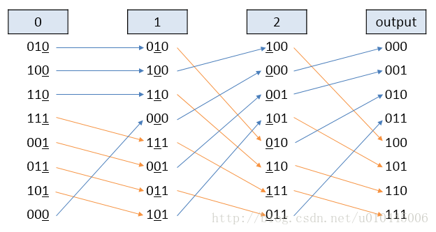
```C++
// CPU 版本的算法流程如下:
// maxBits 是输入元素的最大位数; numBits 是将多少个位做为一组来对比, k = 1 << numBits; 
for(int i=0; i<maxBits; i+=numBits)
{
    // 这个是额外的存储空间, 用来统计每个 k 的每个状态的元素个数和元素个数的前缀和
    std::vector<int> binHistogram(numBins, 0);
    std::vector<int> binScan(numBins, 0);

    // step 1 遍历 inVec, inVec 中第 i 位值为 [0, numBins-1] 的各有多少, 其值分别放到 binHistogram
    // step 2 遍历 binHistogram, 计算 binHistogram 的独占式累加和, 存入 binScan 中
    // step 3 遍历 inVec, 计算其值所属的桶, 得到前缀和, 放到输出的位置 outVec[binScan[bin]++] = inVec[j];
    // step 4 swap(intVec, outVec)
}

#include <iostream>
#include <vector>

// 基数排序是从最低位看起, 把这一位数字值相同的按照扫描顺序放入同一个桶里面, 值小的桶在前面。
// 当所有数字都扫描完，再使用高一位，循环上述步骤，直至达到所有数字所有的最高位数，最后输出的就是排序后的答案。
void radixSort(std::vector<unsigned int>& inputVals, int numBits = 2) {
    int n = inputVals.size();    // 输入元素的个数
    int numBins = 1 << numBits;  // numBins = 2^numBits, 桶的个数
    int maxBits = 32;  // Assuming unsigned int (32-bit)

    std::vector<unsigned int> outputVals(n);  // 存放排序后的结果
    for (int i = 0; i < maxBits; i += numBits){
        std::vector<int> binHistogram(numBins, 0);
        std::vector<int> binScan(numBins, 0);

        // Step 1: 计算统计图
        for (int j = 0; j < n; ++j) {  // 遍历所有元素, 统计每个桶中元素个数
            int bin = (inputVals[j] >> i) & (numBins - 1);
            binHistogram[bin]++;
        }

        // Step 2: 计算前缀和
        for (int j = 1; j < numBins; ++j) {  // 遍历所有桶, 统计元素个数的前缀和
            binScan[j] = binScan[j - 1] + binHistogram[j - 1];
        }

        // Step 3: 基于当前数字来排序
        for (int j = 0; j < n; ++j) {  // 遍历所有元素, 将输入元素赋值到输出对应的位置
            int bin = (inputVals[j] >> i) & (numBins - 1);  // 判断当前数字属于那个 bin, 调整其位置
            outputVals[binScan[bin]++] = inputVals[j];
            // binScan[bin]++;
        }

        // Step 4: 下一轮的排序基于当前排序的结果
        inputVals.swap(outputVals);
    }
}

int main() {
    std::vector<unsigned int> inputVals = {170, 45, 75, 90, 802, 24, 2, 66};
    radixSort(inputVals, 2);

    for (unsigned int val : inputVals) {
        std::cout << val << " ";
    }
    std::cout << std::endl;

    return 0;
}
```
### gpu 端写法
* gpu 端的写法与 cpu 端的写法非常相似。这里核心点主要是获取 `d_scan_block_sum` 和 `d_prefix_sums` 这两个数组。
* `d_scan_block_sum` 的大小为 `4 * num_block`, 其形式是 
    `[0, block0 中 way 0 的元素个数, block0-block1 中 way0 的元素个数, ..., 0, block0 中 way 1 的元素个数, block0-block1 中 way1 的元素个数]`
* `d_scan_block_sum` 的求法, 是先求 d_block_sum, 再在这个基础上进行求前缀和得到。`d_block_sum` 统计每个 block 负责的数据各个 way 的元素个数。
* `d_prefix_sums` 的大小是输入元素的个数, 其每个位置存放的是, 对应输入位置的元素其在 block 中的各个 way 的前缀和。
    `[0, 1, ..., 0, 1, 2, ..., 0, 1, ..., 0, ...]`
* `d_prefix_sums` 的求法。每个 block 迭代 4 次, 求每个 way 的前缀和。
* 当输入数组长度为 400 万时候, 比 `std::sort` 有 17 倍的加速, 在元素个数为 4 万的时候, 有 2 倍的加速比, 在 元素个数为 1 万的时候, 和其持平。
* 基数排序常用于无符号整数(unsigned int), 对于IEEE 754 其存储形式如下图，最高位表示数字的符号，8位表示指数，23位表示尾数。
* IEEE float有一个特性，除了最高的符号位，从0位到30位对数值的权重依次增加，这些位与32位无符号整数的排序方法相同，针对符号位可做如下的预处理：对于正浮点数，将最高的符号位取反(由0转化为1)。对于负浮点数，全部位取反，这样便可应用整数的基数排序方法(对浮点数应用位运算前需要将其转化为整形), 排序完成后再将其转化。
```C++
unsigned int *data_temp = (unsigned int *)(&src_data[i]);
*data_temp = (*data_temp >> 31 & 0x1)? ~(*data_temp): (*data_temp) | 0x80000000; 
```
```C++
void radix_sort(unsigned int* const d_out,
    unsigned int* const d_in,
    unsigned int d_in_len)  // d_in_len 要排序是数据元素总个数
{
    unsigned int block_sz = MAX_BLOCK_SZ;  // 一个 block 最大线程个数
    unsigned int max_elems_per_block = block_sz;
    unsigned int grid_sz = d_in_len / max_elems_per_block;  // 每个线程对应一个元素,总共分成多少个 block
    // Take advantage of the fact that integer division drops the decimals
    if (d_in_len % max_elems_per_block != 0)  // 向上取整
        grid_sz += 1;

    unsigned int* d_prefix_sums;  // 存放相对位置索引
    unsigned int d_prefix_sums_len = d_in_len;
    checkCudaErrors(cudaMalloc(&d_prefix_sums, sizeof(unsigned int) * d_prefix_sums_len));
    checkCudaErrors(cudaMemset(d_prefix_sums, 0, sizeof(unsigned int) * d_prefix_sums_len));

    unsigned int* d_block_sums;  // 统计每个线程块的各个桶的数量
    unsigned int d_block_sums_len = 4 * grid_sz; // 4-way split
    checkCudaErrors(cudaMalloc(&d_block_sums, sizeof(unsigned int) * d_block_sums_len));
    checkCudaErrors(cudaMemset(d_block_sums, 0, sizeof(unsigned int) * d_block_sums_len));

    unsigned int* d_scan_block_sums;  // 每个线程块各个桶的数量的前缀和
    checkCudaErrors(cudaMalloc(&d_scan_block_sums, sizeof(unsigned int) * d_block_sums_len));
    checkCudaErrors(cudaMemset(d_scan_block_sums, 0, sizeof(unsigned int) * d_block_sums_len));

    // shared memory consists of 3 arrays the size of the block-wise input
    // and 2 arrays the size of n in the current n-way split (4)
    unsigned int s_data_len = max_elems_per_block;  // 存放数据, 每个线程对应一个数据
    unsigned int s_mask_out_len = max_elems_per_block + 1;  // 
    unsigned int s_merged_scan_mask_out_len = max_elems_per_block;
    unsigned int s_mask_out_sums_len = 4; // 4-way split
    unsigned int s_scan_mask_out_sums_len = 4;
    unsigned int shmem_sz = (s_data_len 
                            + s_mask_out_len
                            + s_merged_scan_mask_out_len
                            + s_mask_out_sums_len
                            + s_scan_mask_out_sums_len)
                            * sizeof(unsigned int);


    // for every 2 bits from LSB to MSB:
    //  block-wise radix sort (write blocks back to global memory)
    for (unsigned int shift_width = 0; shift_width <= 30; shift_width += 2)
    {
        // 每个 block 上进行排序得到最终的结果
        gpu_radix_sort_local<<<grid_sz, block_sz, shmem_sz>>>(d_out, 
                                                            d_prefix_sums, 
                                                            d_block_sums, 
                                                            shift_width, 
                                                            d_in, 
                                                            d_in_len, 
                                                            max_elems_per_block);


        // scan global block sum array, 四路分别进行规约
        sum_scan_blelloch(d_scan_block_sums, d_block_sums, d_block_sums_len);

        // scatter/shuffle block-wise sorted array to final positions
        gpu_glbl_shuffle<<<grid_sz, block_sz>>>(d_in,
                                                d_out, 
                                                d_scan_block_sums, 
                                                d_prefix_sums, 
                                                shift_width, 
                                                d_in_len, 
                                                max_elems_per_block);
    }

    checkCudaErrors(cudaMemcpy(d_out, d_in, sizeof(unsigned int) * d_in_len, cudaMemcpyDeviceToDevice));
    checkCudaErrors(cudaFree(d_scan_block_sums));
    checkCudaErrors(cudaFree(d_block_sums));
    checkCudaErrors(cudaFree(d_prefix_sums));
}
```

## 快速排序算法
* 通过一趟排序将待定元素分成独立的两个部分, 其中一个部分记录的元素比另一个部分记录的元素要小。然后分别对这两个部分继续进行排序, 直到整个序列有序为止。平均时间复杂度为 `O(nlogn)`, 最坏时间复杂度为 `O(n^2)`, 是不稳定的排序算法。具体做法如下:
    - 选取基准元素base(选取首元素即可)
    - 以基准元素为基准, 将小于基准元素的放在前面, 大于基准元素的方法后面(实现方法, 就是交换 std::swap)。
    - 以基准元素为界限, 分成两组数据。进行递归再排序。
* 整体思路就是一个递归的方法, 使用 `引用&` 直接改变顺序。单次逻辑中 i 和 j 分别指向 start 和 end。当 `i < j` 时, 就一直来交换。因为选取首元素为 base, 所以先判断 j, 交换一次到 i。再从 i 判断, 交换到 j。依据 base 分成了两半, 然后再从这两半来进行遍历。
```C++
std::vector<unsigned int> quickSort(std::vector<unsigned int>&nums, int start, int end)
{
    // 注意这里的 start 和 end 都是左闭右闭
    // start >= end 时候, 这个部分就排序结束啦
    if (start >= end) return nums;

    int base = nums[start];  // 选择最开始的当作 base

    int i = start;
    int j = end;
    while (i < j)  // i 和 j 重合以后, 这段就排序完了
    {
        while (i < j && nums[j] >= base) j--; //从右往左，寻找比base小的数
        std::swap(nums[i], nums[j]);          //找到比base小的数，即与base交换位置, 即使 i == j 也不影响。
        while (i < j && nums[i] <= base) i++; //从左往右，寻找比base大的数
        std::swap(nums[i], nums[j]);          //找到比base大的数，即与base交换位置
    }
    quickSort(nums, start, i - 1);  // 分成两个部分来再次排序
    quickSort(nums, i + 1, end);    // 分成两个部分来再次排序

    return nums;
}
```

## 堆排序
* 堆排序(Heap Sort) 是一种基于堆数据结构的比较排序算法, 具有比较好的时间复杂度和空间复杂度。堆是一种完全二叉树(在完全二叉树中，除了最底层节点可能没填满外，其余每层节点数都达到最大值，并且最下面一层的节点都集中在该层最左边的若干位置)。
* 堆排序的基本思路:
    - 建立堆(分为最大堆和最小堆)。首先将无序数组调整为最大堆, 时间复杂度 `O(n)`。
    - 交换堆顶与堆尾元素。将最大值与数组的最后一个元素交换位置, 将剩余元素调整为新的最大堆。`O(nlog(n))`
* 数组存放堆的数据的注意点: a. 对于数组中下标为 i 的元素, 其父亲节点下标 parent(i) = (i-1)/2, 其左孩子下标 left(i)=2*i+1, 其右孩子下标 right(i)=2*i+2;  b. 堆中元素个数为 heapSize, 那么最后一个非叶子节点的索引为 `heapSize/2-1`。
* 在堆中插入元素后，为了维持堆的性质（最小堆或最大堆），需要进行“上浮”操作，即通过调整插入元素的位置使得堆仍然符合要求(整个的时间复杂度为`O(log(n))`):
    - 将元素插入堆的最后一个位置：通常堆是用数组来表示的，插入元素时，先将元素添加到数组的末尾, heapsize=heapsize+1。
    - 上浮调整: 与父节点比较, 如果插入的元素比父节点大(最大堆, 最小堆是插入的元素小于其父节点), 则进行交换, 重复此过程直到不需要交换或者到达根节点为止。
* 堆中删除元素(删除的是根节点的元素), 然后通过“下沉”操作来调整堆的结构，使其保持堆的性质。具体的步骤如下(时间复杂度为 `O(log(n))`)：
    - 删除堆顶的元素, 将堆顶元素与堆尾元素进行交换, heapsize=heapsize-1。
    - 下沉调整: 将堆顶元素与它的子节点进行比较, 对于最大堆，如果堆顶元素比任一子节点小，交换它和较大的子节点; 重复此过程, 直到堆元素的值都比其子元素大或者达到叶子节点。
```C++
#include <iostream>
#include <vector>

// 建立大根堆, 升序排序
// 将下标为 k 的节点进行下沉
// 整体思路是 k 必须为非叶子节点。
// 然后判断其值是否大于等于其左右子节点的最大值, 不大于等于的话就进行进行下沉操作, 直至 k 为叶子节点, 或者 k 的值大于其左右子节点的最大值
void HeapAdjust(std::vector<int>& nums, int heapSize, int k){
	while(k<heapSize/2)  // 最后一个非叶子节点索引为 heapSize/2-1
	{
		int largest = 2*k+1;  // 因为 k 不是叶子节点, 所以其左节点一定存在
		int right = 2*k+2;
		if(right<heapSize && nums[largest]<nums[right]) largest = right;
		if(nums[k] > nums[largest]) break;  // 这里应该是 break, 而不是 continue;
		std::swap(nums[k], nums[largest]);
		k = largest;
	}
}

// 建立小根堆, 降序排序
/*
void HeapAdjust(std::vector<int>& nums, int heapSize, int k){
	while(k<heapSize/2)  // 最后一个非叶子节点索引为 heapSize/2-1
	{
		int small = 2*k+1;  // 因为 k 不是叶子节点, 所以其左节点一定存在
		int right = 2*k+2;
		if(right<heapSize && nums[small]>nums[right]) small = right;
		if(nums[k] < nums[small]) break;  // 这里应该是 break, 而不是 continue;
		std::swap(nums[k], nums[small]);
		k = small;
	}
}
*/

void HeapSort(std::vector<int>& nums)
{
	int heapSize = nums.size();       // 最初的堆的大小
	// 建立堆。从最后一个非叶子节点开始, 依次将所有的非叶子节点进行下沉操作。
	// 建立堆需要将无序数组构建成一个堆, 时间复杂度为 O(n)。而每个节点下沉操作最多需要 O(log(n))。建堆时间复杂度为 O(n)
	for(int i=heapSize/2-1; i>=0; --i)
	{
		HeapAdjust(nums, heapSize, i);
	}

	// 堆排序。从最后一个元素开始, 每次将最后一个元素与第一元素进行交换, 然后调整第一个元素, 注意此时的 heapSize 已经减少了 1。
	// 需要执行 n-1 次, 每次调整是时间复杂度为 O(log(n)), 这部分时间复杂度为 O(nlog(n))。
	for(int i=heapSize-1; i>0; --i)
	{
		std::swap(nums[0], nums[i]);  // 将堆中最后一个元素与第一个元素进行交换
		HeapAdjust(nums, i, 0);       // 对堆中的第一个元素进行调整
	}
	// 由于有栈空间的支出。所以最好和平均的空间复杂度均为 O(log2(n)), 最坏为 O(n)[当元素均为逆序的时候, 每次划分的都不均衡]
}

int main()
{
	std::vector<int> arr {9, 5, 6, 3, 5, 3, 1, 0, 96, 66};
	std::cout << "排序前的结果为: " << std::endl;
	for(int i=0; i<arr.size(); ++i)
	{
		std::cout << arr[i] << " ";
	}
	std::cout << std::endl;

	HeapSort(arr);

	std::cout << "排序后的结果为: " << std::endl;
	for(int i=0; i<arr.size(); ++i)
	{
		std::cout << arr[i] << " ";
	}
	std::cout << std::endl;

	return 0;
}
```

## 归并排序
* 归并排序是建立在归并操作上的一种有效、稳定的排序算法, 该算法是采用 `分治`+`递归` 的思想。思路是将已经有序的子序列合并, 得到完全有序的序列; 即先每个子序列有序, 再使得子序列段间有序。归并排序的时间复杂度是 `O(nlog(n))`, 空间复杂度为 `O(n)`, 适用于数据量大, 稳定性有要求的场景。

```C++
#include <iostream>
#include <vector>

// 合并
void merge(std::vector<int>& arr, std::vector<int>& tempArr, int left, int mid, int right)
{
    // 标记左半区第一个未排序的元素
    int l_pos = left;
    // 标记右半区第一个未排序的元素
    int r_pos = mid + 1;
    // 临时数组元素的下标
    int pos = left;  // 当前存到哪里了

    // 合并
    while (l_pos <= mid && r_pos <= right)
    {
        if (arr[l_pos] < arr[r_pos])  // 左半区第一个剩余元素更小, 这里小于号保证了算法的稳定性, 如果是小于等于算法就是不稳定了
            tempArr[pos++] = arr[l_pos++];
        else  // 右半区第一个剩余元素更小
            tempArr[pos++] = arr[r_pos++];
    }

    // 合并左半区剩余的元素
    while (l_pos <= mid)
        tempArr[pos++] = arr[l_pos++];

    // 合并右半区剩余的元素
    while (r_pos <= right)
        tempArr[pos++] = arr[r_pos++];

    // 把临时数组中合并后的元素复制回原来的数组, 是在这里将排序后的数组拷贝到原始的输入数组中
    while (left <= right)
    {
        arr[left] = tempArr[left];
        left++;
    }
}

// 归并排序
void msort(std::vector<int>& arr, std::vector<int>& tempArr, int left, int right)
{
    // 如果只有一个元素，那么不需要继续划分
    // 只有一个元素的区域，本身就是有序的，只需要被归并即可
    if (left < right)
    {
        // 找中间点
        int mid = left + (right-left) / 2;
        // 递归划分左半区
        msort(arr, tempArr, left, mid);
        // 递归划分右半区
        msort(arr, tempArr, mid + 1, right);

        // 执行到这里的时候, [left, mid] [mid+1, right] 这两个区间已经有序了(某个区间只有一个元素也是有序), 合并已经排序的部分
        merge(arr, tempArr, left, mid, right);
    }
}

// 归并排序入口
void merge_sort(std::vector<int>& arr)
{
    // 分配一个辅助数组, 空间复杂度就在这里 O(n)
    std::vector<int> tempArr(arr.size());
    // 调用实际的归并排序
    msort(arr, tempArr, 0, arr.size() - 1);
}

int main()
{
    std::vector<int> arr = {38, 27, 43, 3, 9, 82, 10};
    
    std::cout << "排序前: ";
    for (int i : arr)
        std::cout << i << " ";
    std::cout << std::endl;

    // 调用排序函数
    merge_sort(arr);

    std::cout << "排序后: ";
    for (int i : arr)
        std::cout << i << " ";
    std::cout << std::endl;

    return 0;
}
```
* CUDA 实现 merge sort 其实省去了递归的步骤。直接从有序数组合并开始。始终都是一个线程负责两个有序数组的合并, 只不过最初的有序数组的长度为 1, 然后每次迭代都进行翻倍。注意几个特别的点:
    - 需要一个 global memory 上与输入数组大小相等的临时空间。
    - 每个 thread 一直都是负责两个有序数组的合并。
    - 有序数组大小从 1 开始, 每循环一次, 有序数组大小变为原来的 2 倍, 直至有序数组的大小超过输入数组的大小, 此时数组变得完全有序。
    - 注意 `for` 循环中每一个迭代步, 都需要停下来同步一下。
```C++
#include <iostream>
#include <cuda_runtime.h>

#define THREADS_PER_BLOCK 256  // 每个block中的线程数

// CUDA 核函数, 并行合并两个有序的子数组
__global__ void parallelMerge(int *arr, int *temp, int subArraySize, int n) {
    int threadId = blockIdx.x * blockDim.x + threadIdx.x;  // 全局线程ID
    int start = threadId * (2 * subArraySize);  // 当前线程负责的起始位置, 每个线程负责 2*subArraySize 的大小的数据

    // 保证在数组边界内
    if (start >= n) return;  // 因为 block 是向上取整分配的

    // 记录负责的这部分数据起始位置和终止位置
    int mid = min(start + subArraySize, n);      // 中间位置
    int end = min(start + 2 * subArraySize, n);  // 结束位置

    // 双指针合并两个子数组 [start, mid) 和 [mid, end)
    int i = start, j = mid, k = start;  // k 就是记录的写到 temp 的位置

    while (i < mid && j < end) {
        if (arr[i] <= arr[j]) {
            temp[k++] = arr[i++];
        } else {
            temp[k++] = arr[j++];
        }
    }

    while (i < mid) {
        temp[k++] = arr[i++];
    }

    while (j < end) {
        temp[k++] = arr[j++];
    }

    // 将合并结果复制回原数组
    for (i = start; i < end; i++) {
        arr[i] = temp[i];
    }
}

// 主程序
void mergeSortParallel(int *h_arr, int n) {
    // 设备端数组
    int *d_arr, *d_temp;  // d_temp 是临时内存, 其实就是空间复杂度是 O(n)
    cudaMalloc((void**)&d_arr, n * sizeof(int));
    cudaMalloc((void**)&d_temp, n * sizeof(int));

    // 复制数据到设备
    cudaMemcpy(d_arr, h_arr, n * sizeof(int), cudaMemcpyHostToDevice);

    // 确定每次合并的子数组大小, 初始为1, 逐步翻倍
    for (int subArraySize = 1; subArraySize < n; subArraySize *= 2) {
        // 相当于一个线程负责 2*subArraySize 大小的数据的合并, 其实是负责 2 个大小为 subArraySize 大小的数组的合并, 合并之后的结果是 2*subArraySize 的大小。
        int numBlocks = (n + (2 * subArraySize * THREADS_PER_BLOCK) - 1) / (2 * subArraySize * THREADS_PER_BLOCK);  // 分配的块数是向上取整
        parallelMerge<<<numBlocks, THREADS_PER_BLOCK>>>(d_arr, d_temp, subArraySize, n);
        cudaDeviceSynchronize();  // 因为是异步执行, 所以每一次 for 循环之后都需要进行一个同步
    }

    // 复制排序结果回主机
    cudaMemcpy(h_arr, d_arr, n * sizeof(int), cudaMemcpyDeviceToHost);

    // 释放设备内存
    cudaFree(d_arr);
    cudaFree(d_temp);
}

int main() {
    const int n = 100000;  // 输入数组长度
    int* h_arr = new int[n];

    // 随机初始化数据
    for (int i = 0; i < n; i++) {
        h_arr[i] = rand() % 1000000;
    }

    // 调用并行归并排序
    mergeSortParallel(h_arr, n);

    // 打印排序后的前 N 个元素
    std::cout << "Sorted array (first N elements): ";
    for (int i = 0; i < 30; i++) {
        std::cout << h_arr[i] << " ";
    }
    std::cout << std::endl;

    // 释放主机内存
    delete[] h_arr;

    return 0;
}
```
* 两个有序数组合并成一个大的有序数组的 CUDA 加速方法: 传统的合并算法是顺序的, 因为需要比较元素按照顺序插入。为了进行并行化加速, 我们需要一种方法来将合并操作划分为多个独立的子任务, 使得每个线程块可以独立地完成其任务。比如有序数组 A 的长度为 m, 有序数组 B 的长度为 n, 所以输出数组的总长度为 `L=m+n`。设定线程的个数为 T, 每个线程需要处理的元素个数为 `chunk_size = (L+T-1)/T` (向上取整以覆盖所有元素)。
    - 划分输出数组, 对于第 k 个 thread, 其负责的输出区间为 `[s, e)`:
        - 起始索引, s = k * chunk_size
        - 结束索引, e = std::min(s+chunk_size, L)
    - 确定输入数组的划分点, 对于每个输出块, 找到在 A 和 B 中的索引 i 和 j, 使得
        - `i+j=s`(总共跳过了 `s` 个元素);
        - `A[i-1]<=B[j]`(如果 i>0), `B[j-1]<=A[i]`(如果 j>0); 这两个条件保证了在位置 i 和 j 处划分不会导致元素顺序错乱。
        - 在 A 的搜索范围 `[max(0, s-n), min(s, m-1)]` 中进行搜索 i, 对于每个候选 i, 计算得到 `j=s-i`, 然后判断是否满足以上两个条件。A 的搜索范围是这样得到的, `i<=m-1` 即 i 不能超过其最大索引, 而且 `i+j=s`, 所以 `i<s` 即 i 不能超过 s。而 `s-i<=n`, 所以 `i>=s-n`。
    - 并行合并, 每个块确定了输入数组中的 i 和 j 之后, 使用标准的合并算法, 将这两个子区间合并到输出数组的对应位置 `C[s : e)`。
```C++
#include <iostream>
#include <cuda_runtime.h>

#define THREADS_PER_BLOCK 256  // 每个block中的线程数

// CUDA 核函数, 并行合并两个有序数组
__global__ void parallelMerge(int *A, int m, int *B, int n, int *C) {
    int L = m + n;
    int totalThreads = gridDim.x * blockDim.x;  // 总线程数
    int threadId = blockIdx.x * blockDim.x + threadIdx.x;  // 全局线程ID
    int chunk_size = (L + totalThreads - 1) / totalThreads;  // 每个线程处理的元素数量
    int s = threadId * chunk_size;  // 当前线程负责的输出数组起始位置
    int e = min(s + chunk_size, L);  // 当前线程负责的输出数组结束位置

    // 在 A 和 B 中寻找划分点 i 和 j
    int i_lower = max(0, s - n);
    int i_upper = min(s, m-1);
    int i, j;

    // 二分法查找 i 和 j
    while (i_lower <= i_upper) {
        i = (i_lower + i_upper) / 2;
        j = s - i;

        int A_i_1 = (i > 0) ? A[i - 1] : INT_MIN;
        int A_i = (i < m) ? A[i] : INT_MAX;
        int B_j_1 = (j > 0) ? B[j - 1] : INT_MIN;
        int B_j = (j < n) ? B[j] : INT_MAX;

        if (A_i_1 <= B_j && B_j_1 <= A_i) {
            break; // 找到合适的划分点
        } else if (A_i_1 > B_j) {
            i_upper = i - 1;
        } else {
            i_lower = i + 1;
        }
    }

    // 现在 i 和 j 是输入数组的起始位置
    int i_start = i;
    int j_start = s - i_start;

    // 合并操作，确保只处理当前线程的输出区间 [s, e)
    int idx = s;
    while (i_start < m && j_start < n && idx < e) {
        if (A[i_start] <= B[j_start]) {
            C[idx++] = A[i_start++];
        } else {
            C[idx++] = B[j_start++];
        }
    }

    while (i_start < m && idx < e) {
        C[idx++] = A[i_start++];
    }

    while (j_start < n && idx < e) {
        C[idx++] = B[j_start++];
    }
}

// CPU 端的归并函数：归并两个有序数组
void merge(int* A, int m, int* B, int n, int* C) {
    int i = 0, j = 0, k = 0;

    while (i < m && j < n) {
        if (A[i] <= B[j]) {
            C[k++] = A[i++];
        } else {
            C[k++] = B[j++];
        }
    }

    // 复制剩余元素
    while (i < m) {
        C[k++] = A[i++];
    }
    while (j < n) {
        C[k++] = B[j++];
    }
}

// 递归归并排序函数
void mergeSort(int* arr, int n) {
    if (n <= 1) {
        return; // 已经是有序的
    }

    int mid = n / 2;
    int* left = new int[mid];
    int* right = new int[n - mid];

    // 分割数组
    for (int i = 0; i < mid; i++) {
        left[i] = arr[i];
    }
    for (int i = mid; i < n; i++) {
        right[i - mid] = arr[i];
    }

    // 递归排序
    mergeSort(left, mid);
    mergeSort(right, n - mid);

    // 归并排序
    merge(left, mid, right, n - mid, arr);

    // 释放内存
    delete[] left;
    delete[] right;
}

// 主程序
int main() {
    const int n = 100000;  // 数据量10万
    int* h_A = new int[n];  // 数组A
    int* h_B = new int[n];  // 数组B
    int* h_C = new int[2 * n];  // 用于存放结果的数组C

    // 初始化数据
    for (int i = 0; i < n; i++) {
        h_A[i] = rand() % (n * 2);  // 随机数填充数组A
        h_B[i] = rand() % (n * 2);  // 随机数填充数组B
    }

    // CPU 归并排序
    mergeSort(h_A, n);
    mergeSort(h_B, n);

    // 打印归并后的结果（可以去掉，避免大数据量下打印影响性能）
    std::cout << "Array A sorted (first 10 elements): ";
    for (int i = 0; i < 20; i++) {
        std::cout << h_A[i] << " ";
    }
    std::cout << std::endl;

    std::cout << "Array B sorted (first 10 elements): ";
    for (int i = 0; i < 20; i++) {
        std::cout << h_B[i] << " ";
    }
    std::cout << std::endl;

    // 分配设备内存
    int *d_A, *d_B, *d_C;
    cudaMalloc((void**)&d_A, n * sizeof(int));
    cudaMalloc((void**)&d_B, n * sizeof(int));
    cudaMalloc((void**)&d_C, 2 * n * sizeof(int));

    // 复制数据到设备
    cudaMemcpy(d_A, h_A, n * sizeof(int), cudaMemcpyHostToDevice);
    cudaMemcpy(d_B, h_B, n * sizeof(int), cudaMemcpyHostToDevice);

    // 启动 CUDA 核函数进行并行归并
    int numBlocks = (2 * n + THREADS_PER_BLOCK - 1) / THREADS_PER_BLOCK;  // 计算需要的块数
    parallelMerge<<<numBlocks, THREADS_PER_BLOCK>>>(d_A, n, d_B, n, d_C);

    // 复制结果回主机
    cudaMemcpy(h_C, d_C, 2 * n * sizeof(int), cudaMemcpyDeviceToHost);

    // 打印结果（可以去掉，避免大数据量下打印影响性能）
    std::cout << "Merged array (first 10 elements): ";
    for (int i = 0; i < 30; i++) {
        std::cout << h_C[i] << " ";
    }
    std::cout << std::endl;

    // 释放设备内存
    cudaFree(d_A);
    cudaFree(d_B);
    cudaFree(d_C);

    // 释放主机内存
    delete[] h_A;
    delete[] h_B;
    delete[] h_C;

    return 0;
}
```
## YOLOv5 推理优化
* 预处理部分: yolov5 中的预处理主要由以下三个部分组成:  [B, srcH, srcW, srcC] -> [B, tarC, tarH, tarW]
    - Scale: 直接 Resize 和 LetterBox(保持原图比例, 将图片放到一个正方形的画布中, 多余部分用黑色填充)
    - Normalization: 归一化, 将像素值(unsigned char)缩放到 [0, 1] 间。
    - BGR2RGB: 颜色通道顺序调整。
    - BHWC->BCHW: 改变特征通道顺序。
    前两个操作其实是必须要经过的步骤, 后两个问题是因为 `OpenCV` 库导致的。
* 对预处理部分优化的思路是
    - 按照目标图像来分配线程, 每个元素对应个一个线程。`dim3 block(16, 16, 1); dim3 grid((tarW+16-1)/16, (tarH+16-1)/16, 3);`
    - 首先获取比率, `scale_w= srcW/tarW, scale_h=srcH/tarH`。处理每个线程的时候, 得到每个线程在目标图中的长 y_id 和宽 x_id, 然后计算其在目标图中的位置 `src_x1 = floor(x_i*scale_w), src_y1 = floor(y_i*scale_h)`, 其中 floor 是为了取到左上角的点。然后 `(src_x1+1, src_y1+1)` 就是其右下角的点。
    - 定位到这个点在原始图中的像素和在目标图中的位置，然后加权平均得到。
* 后处理部分: yolov5 COCO 预训练模型导出 ONNX, 可以查看到 3 个 head(shape 分别是 [255, 80, 80], [255, 40, 40], [255, 20, 20]), 经过 decode 得到最终的输出 output([25200, 85]), 再经过 NMS 就可以得到最终的检测框。一共是 9 个 anchor, 每个 head 对应 3 种 anchor。所以是 [255, 80, 80] 可以转换为 [3, 85, 80, 80]([3, (tx, ty, tw, th, score, [0, 0, 1,...,0,0,0]), 80, 80])。
* 对后处理优化是思路是:
    - 先循环特征图, 然后再循环head。相当于最后的结果为 [batch1_layer1, batch2_layer1, batch1_layer2, batch2_layer2, batch1_layer3, batch2_layer3]
    - 线程组织形式是, `dim3 block(16, 16, 1);  dim3 grid(featureW/block.x, featureH/block.y, numAnchors/block.z);  numAnchors 是每个 head 对应的 anchor 个数`
    - kernel 的逻辑是: 依据每个位置对应的 score, 确定是否要处理, 处理的话就让原子操作 value + 1; 处理的话, 就是取得其在网格中的 x, y 和 对应 anchor 长宽和缩放比例来处理; 每个线程还要进行一次排序, 找到最大的类别是什么; 最后依据原子操作的值, 将其放到对应的位置。

## 全局内存管理
* 全局内存的分配与释放(其实全局内存的分配与释放是没有什么花样的, 都是固定的函数, 有花样的是 host 端内存)
```C++
// 全局内存分配
// count : 所分配全局内存的字节 
// devptr：指针返回该内存的地址
cudaError_t cudaMalloc(void **devPtr, size_t count);

// 全局内存的释放
cudaError_t cudaFree(void *devPtr); 
```
* host 端与 device 端内存的传输(分为同步传输和异步传输)
```C++
// 同步传输
cudaMemcpy(void *dst, const void *src, size_t count, enum cudaMemcpyKind kind);

// 异步传输
cudaMemcpyAsync(void *dst, const void *src, size_t count, enum cudaMemcpyKind kind, cudaStream_t stream);

/*
    * 函数从内存位置 src 复制 count 字节到内存位置 dst
    * kind 表示内存传输方向(要与src到dst保持一致)
        kind取值：
        cudaMemcpyHostToHost
        cudaMemcpyHostToDevice
        cudaMemcpyDeviceToHost
        cudaMemcpyDeviceToDevice
    * 注意同步传输的时候, 主机内存可以是分页内存和页锁定内存。而异步传输的时候，主机内存必须是页锁定内存。
*/
```
* 分页内存和页锁定内存。对于主机端而言，malloc 和 new 分配的都是分页内存。可能被操作系统调度机制交换到硬盘上，导致无法保证 GPU 访问的持续性和稳定性。当可分页内存传输到设备内存时，CUDA会先分配固定的主机内存，将可分页数据拷贝到固定内存(页锁定内存)中，然后再将固定内存传输数据给设备内存。也可以直接分配页锁定内存。锁页内存能够确保内存一直驻留在物理内存中，这使得 GPU 可以直接通过 DMA（直接内存访问）来快速访问这些数据，允许 cudaMemcpyAsync 等异步函数在传输过程中不阻塞 CPU 的执行。
* 固定内存能被设备直接访问，所以比可分页内存进行更高带宽读写。但分配过多的固定内存可能会降低主机系统的性能，同时固定内存的分配和释放成本更高。
```C++
// 页锁定内存分配
cudaError_t cudaMallocHost(void **devPtr, size_t count);
cudaError_t cudaHostAlloc(T **ptr, size_t size, unsigned int flags)

// 页锁定内存释放
cudaError_t cudaFreeHost(void *ptr);
```
* 零拷贝内存(也叫 mapped pinned memory)。GPU 线程可以直接访问零拷贝内存, 这部分内存在主机端一定是页锁定内存。
```C++
// 零拷贝内存的分配
cudaError_t cudaHostAlloc(void **pHost, size_t count, unsigned int flags);
/*
    flags 有以下情况:
    cudaHostAllocDefault: 默认分配策略, 默认分配普通的页锁定内存, 不会为 GPU 提供直接访问能力。
    cudaHostAllocPortable: 分配的内存可以跨不同的 GPU 设备, 意味着在一个设备上分配的内存可以在多个设备之间使用, 适用于多 GPU 环境。但并不意味着分配的主机内存能够被多个 GPU 直接访问。它的实际含义是，这段内存可以跨多个 CUDA 上下文（contexts）共享使用。
    cudaHostAllocMapped: 分配的主机内存是映射的, 允许 GPU 直接访问, 减少了主机和设备之间的数据拷贝开销。
*/

// 零拷贝内存的释放, 其实就是页锁定内存的释放函数
cudaError_t cudaFreeHost(void *ptr); 

// 就是需要注意, 零拷贝虽然不需要显示地传递到设备上, 但是设备不能通过 pHost 直接访问对应的内存地址, 设备需要访问主机上的零拷贝内存, 需要先获得另外一个地址,这个地址帮助设备访问到主机对应的内存。
cudaError_t cudaHostGetDevicePointer(void ** pDevice,void * pHost,unsigned flags);  //这里将flags设置为0
```
* NVIDIA Drive series 和 NVIDIA Jetson series 都是统一内存的, 即 GPU 和 CPU 都是使用相同的一块物理内存。通常可以利用零拷贝消除在独立 CPU 和 GPU 系统中 host->device 的内存拷贝花销。
* 在 CPU 和 GPU 使用同一块物理内存的系统中, 使用零拷贝内存(mapped pinned memory) 是非常有效的。真正能够消除内存拷贝的动作。
* 而在独立的 CPU 和 GPU 的内存系统中, 零拷贝内存相比于普通的页锁定内存来说(non-mapped pinned memory)速度能有 15% 左右的增幅。
* 统一虚拟寻址(UVA)的内存机制, 即设备端和主机端共享同一个地址空间。这样的话cudaHostAlloc函数分配的固定主机内存具有相同的主机和设备地址，可以直接将返回的地址传递给核函数。那么cudaHostGetDevicePointer这个函数基本没啥用了。

## DMA 介绍
* DMA (Direct Memory Access) 即直接存储访问, 借助内部的控制器来实现内存和外设之间的数据传输。有了 DMA, CPU 可以专注于内存数据的存取, 外设数据的搬运过程就交给 DMA 硬件完成。
* DMA 的优势有那些:
    - 降低 CPU 的使用率。 不需要 CPU 的干预就可以服务于外设, 这样 CPU 就可以去处理别的事物, 提高系统效率。
    - 提高设备的吞吐能力。DMA 有块传输和单字传输很多种传输方式, 而CPU通过总线传输，一个时钟周期最多存取一次总线，所以使用DMA能使设备的吞吐能力大为增强。
* 其实为什么异步拷贝的时候，需要分配页锁定内存。就是因为只有页锁定内存才能使用 DMA 来进行内存和 device 的异步传输（不阻塞CPU）。

## CUDA Graph
* CUDA 中启动 kernel 的时候会有一定的开销, 这种开销主要来自以下几个方面:
    - 主机与设备之间的通信(主要耗时)。启动 kernel 时候, 主机需要通过驱动程序将指令发送到GPU(设备), 这就涉及到主机与设备之间的通信, 会产生一定的延迟(CUDA代码会在 host 端通过 `nvcc` 编译器生成适合的 GPU 执行机器指令, 然后发送给 GPU 执行)。
    - 硬件资源的调度。GPU 在执行 kernel 之前, 需要调度线程块、寄存器、共享内存。这些调度涉及到GPU内部的硬件管理, 需要一定时间完成资源分配和调度。
    - 参数解析的开销。驱动程序需要对 kernel 参数进行解析和传递, 这也会引入一定的开销。
* 随着 GPU 算力的提升, 计算任务的执行时间在慢慢的缩小, 一个 GPU 执行单元可能在 us 或者 ms 级别完成。通常一个好的 kernel 运算时间应该长一些, 从而使 GPU 的性能更好地发挥。因为启动 kernel 也是有开销的, 通常是 0.x us。所以如果业务场景中有很多小 us 级别的 kernel 要执行, 整个系统的性能会随着短 kernel 比例增加整体性能输出越来越差。
* CUDA Graph 可以通过 Capture 或 Create 的方式将多个 kernel 组合在一起生成一个 Graph。与 kernel 融合不同, Graph 内仍然是多个 kernel 的形式存在, 但是启动操作只需要一次。如果将尽可能多的 kernel 组合在一起, 理论上能够节约很多 kernel 提交的开销。但是 CUDA graph 的限制如下:
    - CUDA graph 的参数和结构是固定的, 通常难以变换。
    - 实例化这个 graph 是比较耗时的, 但是这个快照被反复执行(replay)足够多的次数, 实例化 graph 的时间是可以忽略不计的。
* 总结一下就是: CUDA Graph 通过组合 Kernel 的方式可以将 Kernel 提交频率大幅降低，提高GPU的性能输出，但对于执行时间长的Kernel性能优化不明显。
* CUDA graph 的使用方式：
    - 定义。程序中创建图中操作的描述以及他们之间的依赖关系。
    - 实例化(获取图模板的快照, 也称为可执行图)。执行大部分工作的设置和初始化, 最大限度的减少启动时需要完成的工作。
    - 在流中启动可执行图。可以在不重复实例化的情况下启动任意多次。
* CUDA graph 创建方式(显示API 和 流捕获的方式):
    - 定义 graph 和 graphExec。
    - 通过捕获提交到 `cudaStreamBeginCapture` 和 `cudaStreamEndCapture` 调用之间流的 GPU 活动来创建 graph。
    - 调用 `cudaStreamInstantiate` 创建 graphExec, 来创建并预初始化所有内核工作描述, 以便他们尽可能的重复启动。
    - 最后通过调用 `cudaGraphLaunch` 将 graphExec 加入到指定的流中。

## CUDA Context
* CUDA Context 是 CUDA 编程模型中的一个概念, 是对管理 GPU 资源的一种抽象的软件表示。CUDA 提供了 `Runtime API` 和 `Driver API`, 其中 `Runtime API`(以cuda开头) 只能隐式地管理上下文, `Driver API`(以cu开头)可以显示的创建和管理上下文。每个 Context 都包含了与应用程序相关的设备内存(memory)、内核函数(modules)、流(stream)、事件(Event) 等信息。
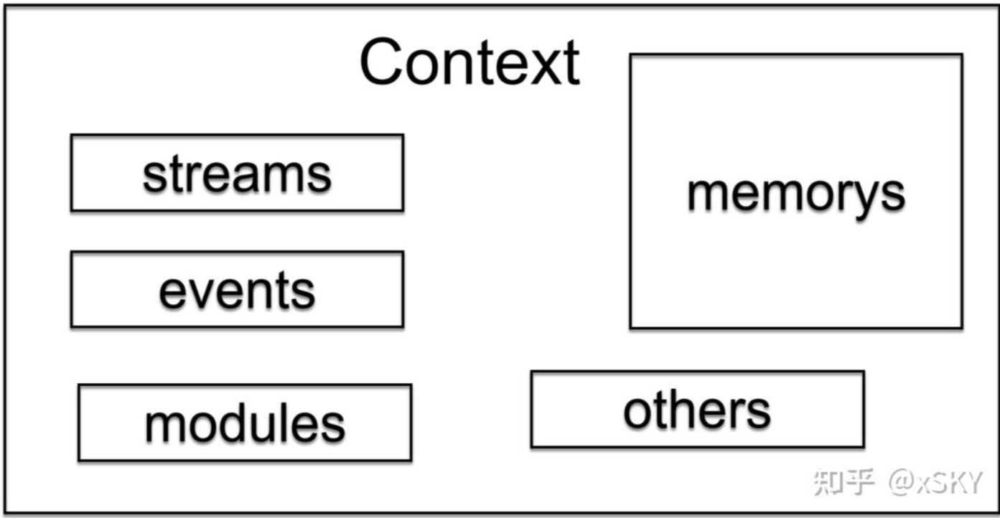
* 主要特点和实际应用：
    - 不同的 CUDA Context 之间是彼此独立的, 一个 Context 内的操作不会影响到另一个 Context。
    - 在多 GPU 系统中, 每个 GPU 设备通常都有自己的 CUDA Context, 程序需要在不同的 CUDA Context 之间切换以控制不同的 GPU。
    - CUDA 驱动为每个 CPU 线程都维护了内部的 context 栈, 活跃的线程为当前栈顶的 context。同一个context可以被进程内所有线程使用。需要注意如果一个context被推入多个线程的栈中, 在某一个线程里destroy, 依然在其他线程context栈中, 若不在当前context栈顶, 是可能保存在栈中被后续使用到引发错误。一个 context 在同一线程中可以被多次入栈, 栈中可以保存多个相同context, 因此需要用户控制 context 出入栈成对使用, 调用destroy的逻辑要谨慎以保证逻辑正确。
* primary context: primary Context 对每个 Device 只有一个, 不能被 destory, 是由驱动维护的。cudaSetDevice只会把对应 Device 的 primary context 设置为栈顶context。对于大多数的场景, 只需要 `Runtime API` 和 `primary context` 就够了, 而且 Device 上如果创建了过多的context也是对资源的浪费，context会占用默认数量的显存，对显存要求较高的场景，多个context可能会引入显存不够的问题。
* `cudaMalloc/cuMemAlloc` 申请的显存和 `cudaMallocHost/cuMemAllocHost` 申请的 host 内存, 是由当前 context 管理的, 属于当前 context 所对应的 device。但是其对当前 device 上的其他的 context 是可见的, 对于其他 device 上的 context 也是可见的。这个是 CUDA Context 与 CPU 进程有明显区别的地方。
* 以下是实际中的使用场景:
```C++
// 多线程环境的上下文管理, 每个线程独立地与 GPU 交互。问了避免上下文冲突, 需要确保每个线程正确的管理自己的 CUDA 上下文。
// 每个线程调用 cudaSetDevice(device), 设置其使用的 GPU 设备, 其实就是会把对应 Device 的 primary context 设置为栈顶 context。
#include <cuda_runtime.h>
#include <thread>
#include <vector>
#include <iostream>

void gpuTask(int device) {
    cudaSetDevice(device);

    // 在该线程中执行 GPU 操作
    // 分配内存、启动内核等
    // ...

    // 线程结束时，CUDA 资源会自动释放
}

int main() {
    int deviceCount = 0;
    cudaGetDeviceCount(&deviceCount);

    std::vector<std::thread> threads;
    for (int device = 0; device < deviceCount; ++device) {
        threads.emplace_back(gpuTask, device);
    }

    // 等待所有线程完成
    for (auto& t : threads) {
        t.join();
    }

    return 0;
}
```
```C++
// 同一个线程管理多个设备, 让每个设备执行不同的任务。但是上下文切换会带来性能开销，应尽量减少切换次数。
// 上下文创建和销毁成本高：应尽量重用上下文，避免频繁的创建和销毁操作。
// cuDeviceGet(CUdevice *device, int ordinal) 返回 ordinal 指定的设备的函数句柄。
// cuCtxCreate() 是宏定义, cuCtxCreate(CUcontext *pctx, unsigned int flags, CUdevice dev), 创建 a CUDA Context。
#include <cuda.h>
#include <iostream>

int main() {
    CUdevice cuDevice1, cuDevice2;
    CUcontext cuContext1, cuContext2;

    cuInit(0);
    cuDeviceGet(&cuDevice1, 0);
    cuDeviceGet(&cuDevice2, 1);

    cuCtxCreate(&cuContext1, 0, cuDevice1);
    cuCtxCreate(&cuContext2, 0, cuDevice2);

    // 切换到上下文1
    cuCtxSetCurrent(cuContext1);
    // 在设备1上执行操作
    // ...

    // 切换到上下文2
    cuCtxSetCurrent(cuContext2);
    // 在设备2上执行操作
    // ...

    // 清理资源
    cuCtxDestroy(cuContext1);
    cuCtxDestroy(cuContext2);

    return 0;
}

```
```C++
// 想要使用 CUDA Driver API, 必须包含头文件 <cuda.h>,  <cuda_runtime.h> 是运行时 API
// 显示的上下文管理, 通常用在一个设备上需要多个上下文, 而 CUDA Runtime API 隐式的管理上下文不太满足要求。
// CUDA Driver API 显示地创建和管理上下文, 提供更细粒度的控制。
// cuInit(0); 初始化 CUDA Driver API, 必须在其他 CUDA Driver API 调用之前调用, 其中的 flags 参数必须为 0。
// cuCtxCreate 显示创建 CUDA Context, 注意每个线程是通过 Context stack 来管理的; cuCtxDestroy 销毁上下文, 释放资源。
#include <cuda.h>
#include <iostream>

int main() {
    CUdevice cuDevice;
    CUcontext cuContext;
    int deviceCount = 0;

    cuInit(0);
    cuDeviceGetCount(&deviceCount);

    for (int device = 0; device < deviceCount; ++device) {
        cuDeviceGet(&cuDevice, device);
        cuCtxCreate(&cuContext, 0, cuDevice);

        // 使用 Driver API 进行操作，如内存分配、内核加载等
        // ...

        cuCtxDestroy(cuContext);
    }

    return 0;
}

```

## Byte Transformer [原文](https://zhuanlan.zhihu.com/p/656342974)
* Byte Transformer 是针对自然语言处理常见的可变长输入, 论文提出了一套优化算法, 在保证正确性的前提下, 成功避免了传统实现中的冗余计算。其实 ByteTransformer 更适合于处理 BERT 这种 encoder-only 的大语言模型。
* Byte Transformer 的创新之处主要在于以下几点:
    - padding-free 的方法, 将变长的输入张量打包, 并计算 bach_seq_offset 和 wordIdx, 避免填充和 padding token 的计算。
    - 融合 MHA(Multi-Head Attention), 减少 MHA 中间矩阵的内存开销, 也利用 WMMA 使用 TensorCore 进行加速。
* paddfing-free:
    - 在整个 Transformer 的结构中, 其实只有在进行求 $softmax(Q\times K^{T})\times V$ 的时候才要求多个 batch 中的句子长度是对齐的, 所以可以在计算这个之前进行 `fused rebuild padding & add bias`, 这里是 fused 是因为为了减小这个操作的影响, 将其与其他的操作进行融合。attention 运算完成之后, 再利用 `fused zero padding & transpose` 来去除 padding, 这里能够融合 transpose 是因为调用的 cublas 是列主序的(内存一定, 列主序就是行主序的转置)。
* 融合 MHA:
    - 整体思路是依据 `seq_len` 的大小来分别撰写不同的 kernel 来减少中间矩阵的存储。当 `seq_len<80` 时(80应该是依据硬件的 shared_memory 的大小得来的), 将 Q, K, V 全部加载到 shared_memory 中, 利用 WMMA 来调用 TensorCore 来加快 attention 的计算, V 复用 K 的shared_memory。当 `seq_len > 80` 时, 分段将 Q 加载到 shared_memory, K 仍然是全部加载, V 复用 K 的 shared_memory。

## PagedAttention
* 文中对 KV Cache 利用 PagedAttention 进行了显存的管理。主要是 CacheManager 类维护了 `block_table`, 数据类型是 `std::unordered_map<int64_t, std::vector<std::pair<int64_t, int64_t>>> block_table`。其中 key 是 batch(相当于每个batch 都有一个自己的映射表), value 是占用的内存块的序号数 和 使用的这个块的大小。还有一个数据成员是 `free_blocks`, 数据类型是 `std::set<int64_t>`, 存放的是空闲 block 的索引。
* 维护了几个成员函数, 核心的成员函数是 `update`, 根据当前 next_token 的状态来判断是否还要继续增加新的 token 的 kv Cache。其中涉及到了某个 batch 生成结束, free 整个 batch 的显存。还有得到新的空闲的 block 索引(依据 free_blocks 来得到, 取出第一个, 并将其中元素删除掉)。

## Im2Col+gemm 卷积计算方法 [原文](https://zhuanlan.zhihu.com/p/687598264)
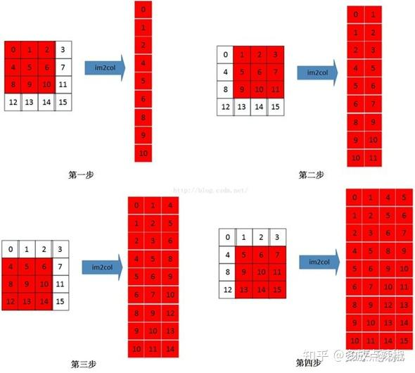
* 利用 im2col + gemm 实现卷积计算的优点:
    - 可以利用高度优化的矩阵乘法库。将卷积操作转换成了矩阵乘法的操作, 可以利用高度优化的线性代数库, 如 cublas, OpenBlas, 大大提高效率。
    - 更好利用缓存。卷积计算过程涉及大量内存访问操作, `im2col` 将对应的感受野区域展平, 更好的利用缓存, 提高数据局部性, 减少内存访问延迟。
    - 方便移植, 矩阵乘法是比较通用的方法, 可以额方便地移动到不同的平台上, 只需要替换底层的 GEMM 实现即可。
* 利用 im2col + gemm 实现卷积计算的缺点:
    - 内存消耗大。将数据展开为一个更大的矩阵, 显著增加内存使用。
    - `im2col` 本身也是一个访存密集型的操作, 也是有比较大的访存开销。
* 其实可以利用分治的思想来对 `im2Col + GEMM` 算法进行优化。如下图所示, 其实是将输入特征图 $IC\times IH\times IW$ 按照行分成多个组, 那么每个组能够产生 $(FH\times FW\times IC)\times blockSize$ (这里的 blockSize 其实是将 $OH\times OW$ 进行分组, 得到的每组的大小)大小的输入数据, 然后与权重矩阵进行矩阵乘法, 得到最终的部分结果, 等待其他结果然后拼接在一起。这种方法其实是优化了访存, 因为原始的方法处理的数据太多, 缓存可能放不下。

## Winograd 卷积计算方法 [原文](https://zhuanlan.zhihu.com/p/524344248)
* Winograd 的核心思想是将卷积操作分解成一系列小矩阵的乘法, 通过矩阵变换和逆变换, 将卷积操作优化为`更少的乘法和更多的加法`操作。
* Winograd 将卷积操作分解为 3 个步骤, 权重变换、输入变换、输出变换。
    - 权重变换: 对卷积核 g 进行类似的变化。使用另一个预定义的变换矩阵 `G` 对卷积核进行变换, 得到变换后的卷积核为 `U`。$U=G\cdot g \cdot G^T$。
    - 输入变换: 使用预定义的变换矩阵 B, 将输入特征图的块 d 进行变换, 得到变换后的输入矩阵 `V`。其实这个变换是将输入数据转换到另一个空间中, $V=B^T \cdot d \cdot B$。
    - 变换后的输入块 U 和卷积核块 V, 在 Winograd 域中进行逐元素的相乘得到 `M`。$M=V \odot U$。
    - 输出变换, 在用一个预定义矩阵 A进行逆变换, 回到原来的空间, 得到最终的卷积输出 `Y`。$Y=A^T \cdot M \cdot A$。
    - 对所有小块的结果进行合并, 得到最终的卷积输出特征图。
    - 整个过程的公式为 $Y=A^T[(GgG^T)\odot (B^TdB)]A = A^T[U\odot V]A$。
* 接下来都以卷积核大小为 $3\times 3$, stride 为 1 的卷积操作来举例, 即 F($2\times 2$, $3\times 3$)。其中 $2\times 2$ 也就是输出尺寸, 代表卷积过程中生成的输出块的尺寸。$3\times 3$ 表示卷积核(滤波器)的尺寸。其实能够推导出来, 输入的尺寸为 $n=m+r-1=2+2-1=4, 4\times 4$。
    - 那么此时 G 的大小为 $4\times 3$, 所以 $GgG^T$ 的大小为 $4\times 4$。B 的大小为 $4\times 4$, 所以 $B^TdB$ 的大小为 $4\times 4$。A 的大小为 $4\times 2$, 所以最终 Y 的大小为 $2\times 2$。
    - 其实整个的流程是实现输入矩阵尺寸是 $4\times 4$, 卷积核尺寸是 $3\times 3$, 最终的输出矩阵尺寸是 $2\times 2$。直接计算是需要 36 次乘法和 32 次加法。如果是直接套用那个公式, 其实计算量变得很大了。比如 `Gg` 是 `(4*3)@(3*3)` 这就需要 `4*3*3=36` 次乘法, `4*3*3-4*3=24` 次加法。其实计算量变大了很大。
    - 优化的手段, 第一点, $GgG^T$ 是可以直接提前计算出来的, 不需要运行时计算。第二点, 因为 B 和 B^T 中元素均为 `0` 和 `+-1`, `B^TdB` 是通过固定写死加法, 这使得原本需要的 64 次乘法可以全部省掉。第三点, `因为 A 和 A^T 中元素均为 `0` 和 `+-1`, `A^T[U\odot V]A` 外层的乘法可以全部省掉。这样一操作, 乘法只剩下内层的 $U\odot V$ 一共 16 次乘法(因为是 $4\times 4$ 逐元素乘以 $4\times 4$)。还有 92 次加法。
    - 以上是分析了对于单个通道的小的输入矩阵的卷积操作过程, 接下来分析下对于正常的多个特征通道的输入特征图的卷积流程: [原文](https://mp.weixin.qq.com/s/-bXUUyUyzULIUWmxLyaosA)
        - 把输入的 feature map 和 weight 进行 `Winograd` 转换;
        - 把转换后的 feature map 和 weight 做批量 matmul;
        - 把矩阵乘的结果进行输出转换, 得到最终结果。
    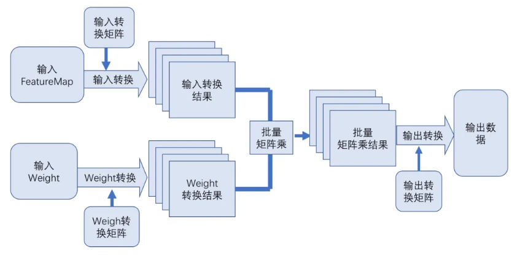
    - 详细的框图如下图所示:
        - 上半部分是 weights 的转换。对卷积核中每个 $3\times 3$ 大小的矩阵都左乘 $G, 4\times 3$, 右乘 $G^T, 3\times 4$, 这操作就使得卷积核中的每个矩阵的大小变为 $4\times 4$, 此时卷积核的大小为 $OC\times IC \times 4\times 4$。然后进行一次 relayout, 将卷积核大小变成 $4\times 4\times OC \times IC$。
        - 下半部分是 输入 FeatureMap 的转换。首先将输入 FeatureMap 进行按照 $4\times 4$ 大小的 tile 进行切分, 然后每个 tile 通过 B 和 B^T 转换为 $4\times 4$ 的矩阵。此时输入矩阵的形状被切分为 $NTiles\times IC \times 4\times 4$。然后进行一次 relayout, 将输入特征图变成 $4\times 4\times IC \times NTiles$。
        - 此时权重大小为 $4\times 4\times OC \times IC$, 输入特征图大小为 $4\times 4\times IC \times NTiles$, 进行后两个维度的矩阵乘法计算, 得到最终的输出结果为 $4\times 4\times OC \times NTiles$。再使用 `A^T` 和 `A` 来进行计算, 将此时的输出结果变换为 $2\times 2\times OC \times NTiles$, 然后写入最终的结果变成 $OC\times OH \times OW$。
        - 优化的策略有几点: 对于权重部分的转换, 其实在模型运行之前转换就可以了。对于下半部分的转换, B^TdB 的部分其实可以把所有的乘法全都省了。对于最后的 A^T 和 A 的部分也可以把所有的乘法全部省了。其实这样一算的话, 是真的节省了大概一半的乘法运算。
    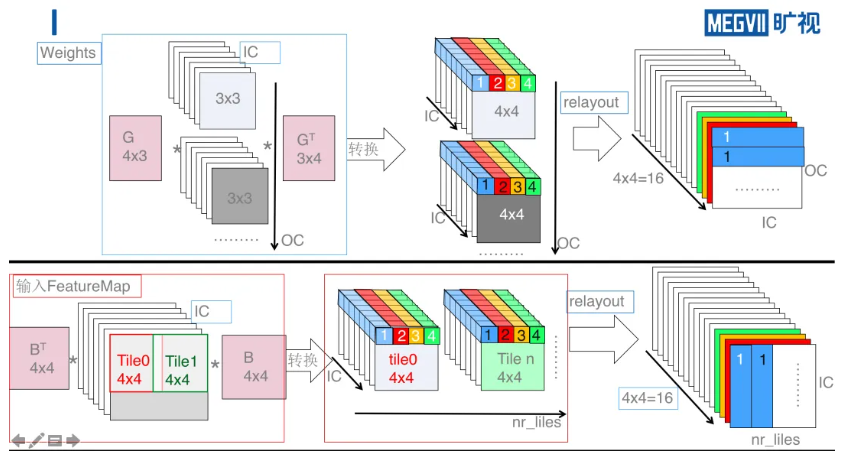
* Winograd 的卷积算法的形式通常表示为 `F(m*m, n*n)`, 其中 `m` 是输出块的大小(如$2\times2$), `n` 是卷积核的大小(如 $3\times 3$)。对于任意卷积核大小为 `n*n`, 变换矩阵 `B`, `G`, `A` 是基于多项式插值的方法生成的。变换矩阵的内容可以通过特定的数学公式推导得到, 并且随着 `m` 和 `n` 的变化而不同。
* 优点:
    - 减少乘法次数, 提高计算效率。通过变换输入和权重, 将原本复杂的卷积计算转化为更少的矩阵乘法和更多的加法。
    - 适用于小卷积核, 在小卷积核 `3*3` 和 `5*5` 上的计算最为高效, 适合常见的 CNN 模型（例如 ResNet、VGG 等）中广泛使用的小尺寸卷积核。
* 缺点:
    - 有精度误差, 可能会影响模型性能。Winograd 中涉及到多个加法和减法操作, 这些操作容易累计数值误差, 尤其是在低精度的情况下。
    - 不适合于过大的卷积核。虽然可以扩展到不同大小的卷积核, 但是对于大尺寸的卷积核, 变换矩阵的计算复杂性增加, 导致计算的收益变小, 需要更多的内存。

## Cooperative Groups (协作组)
* 协作组是一种编程模型, 用于更灵活地组织线程并协调线程之间的合作, 帮助开发者更高效地实现多线程的同步与协作, 优化 GPU 性能。其主要功能如下:
    - 灵活的线程分组。Cooperative Groups 允许开发者在任意层次上的一线程组(thread group), 可以创建 warp 级别, block 级别, grid 级别的线程组。从而实现更大范围内线程的同步, 而不再局限于传统的 __syncthreads() 只在一个 block 内同步。
    - 提高代码的适用性, 提高兼容性。显示分组将函数的需求显示化, 减少误用函数的机会。
* Cooperative Groups 是一个 API，用于定义和同步 CUDA 程序中的线程组，可以在任何与 CUDA 9 兼容的支持 CUDA 的 GPU 上工作。意味着 Kepler 和更高版本的 GPU (计算能力 3.0+)。
```C++
// 1.
// Cooperative Groups 中的基本数据类型是 thread_group, 是一组线程的函数句柄。该函数句柄只能由它组内的线程成员访问。
// unsigned size();  // 获取线程组中线程的个数
// thread_rank();    // 组中查找调用线程的索引 (介于 0 到 size()-1)
// 线程组提供了在组中所有线程之间执行集体操作的能力(分成线程组的意义), 集体操作是指需要在一组指定的线程之间进行同步或者通信的操作, 最简单的集体操作就是一个屏障, 不传输任何数据, 只是同步线程组中的线程。
// 第一个集体操作调用 cooperative_groups::sync() 来同步线程组, 此时组内的所有线程都会进行一个同步。g.sync(); cg::syncthronize(g);

using namespace cooperative_groups;
using cooperative_groups::thread_group;

// 开发者可以自由指定多少个线程为一组进行规约求和, 如果线程组的大小为 warpSize, 则等价于 warpReduceSum。如果线程组的大小为 block size, 就等价于 blockReduceSum
__device__ int reduce_sum(thread_group g, int *temp, int val)
{
    int lane = g.thread_rank();  // 得到线程组中线程的索引序号

    // i 的初始值为线程组中线程的个数, val 对每个线程私有
    for (int i = g.size() / 2; i > 0; i /= 2)
    {
        // 这种思路是利用 shared_memory 做一个线程间信息交换的介质
        temp[lane] = val;
        g.sync();  // wait for all threads to store
        if(lane<i) val += temp[lane + i];
        g.sync();  // wait for all threads to load
    }
    return val;  // note: only thread 0 will return full sum
}

// 2.
// thread blocks。Cooperative Groups 引入了新的数据类型 thread_block, thread_block block = this_thread_block(); 每个线程都会得到线程块的实列。
// 其实线程块组的意思是一个 block 中的所有线程分成一个组。
// __syncthreads();  block.sync();  cg::synchronize(block);  都是同一个意思

// 3.
// Partitioning Groups。Cooperative Groups 为开发者提供了通过划分现有组来创建新组的方法。cg::tiled_partition() 就负责将一个线程块组划分成多个组。
// thread_group tile32 = cg::partition(this_block_thread(), 32);  // 每个线程都将获得一个 32 线程组的函数句柄。

// 4.
// Cooperative Groups 的真正用途在于模块化, 将组做为显示参数传递给函数, 利用模块化统一接口。有效的减少了竞争和死锁的情况。
// 每个 block 中只有一部分的线程会调用 sum() 函数, 并非块中的所有线程都会达到 __syncthreads(), 因此存在死锁情况。
__device__ int sum(int *x, int n) 
{
    ...
    __syncthreads();
    ...
    return total;
}

__global__ void parallel_kernel(float *x, int n)
{
    if (threadIdx.x < blockDim.x / 2)
        sum(x, count);  // error: half of threads in block skip
                        // __syncthreads() => deadlock
}

// 使用协作组之后
__device__ int sum(thread_block block, int *x, int n) 
{
    ...
    block.sync();
    ...
    return total;
}

__global__ void parallel_kernel(float *x, int n)
{
    sum(this_thread_block(), x, count); // no divergence around call
}

// 5.
// Cooperative Groups 提供了 cg::tiled_partition() 的一个替代版本，它将分组大小作为模板参数，返回一个静态大小的组，称为 thread_block_tile. 在编译时了解分组大小可以提供更好的优化机会。
thread_block_tile<32> tile32 = tiled_partition<32>(this_thread_block());
thread_block_tile<4>  tile4  = tiled_partition<4> (this_thread_block());

// thread Block Tiles 也提供了一些 warp-level 原语操作。
// .shfl()  .shfl_down()  .shfl_up()  .shfl_xor()

```
## Atomic Functions (原子操作) [原文](https://zhuanlan.zhihu.com/p/578195193)
* 原子操作对驻留在`全局内存或共享内存`中的一个 32 位或者 64 位单词执行 `读-修改-写原子操作`。例如, `atomicAdd()` 在全局或共享内存中的某个地址读取一个单词，向其中添加一个数字，然后将结果写回相同的地址。原子函数只能在`设备函数`中使用。
* 原子操作有 算数运算函数 和 按位操作函数。
    - 算数运算函数: `atomicAdd()`, `atomicSub()`, `atomicMin()`, `atomicMax()`
    - 按位操作函数: `atomicAnd()`, `atomicOr()`, `atomicXor()`
    - 交换函数: `atomicExch()`, `atomicCAS()`
* 其中的 `atomicExch(int* address, int val)` 是从第一个参数 address 指针指向的内存地址(可以是全局内存或共享内存)中读取32位或64位数据(记做旧值 old), 然后将 val 值写入到 address 地址处, 并返回未做交换前的旧值 old。这三个操作仍然在一个原子事务中执行。
* 其中的 `atomicCAS(int* address, int compare, int val)` 是从第一个参数 address 指针指向的内存地址(可以是全局内存或共享内存)中读取32位或64位数据(记做旧值 old), 比较 old 值是否与 compare 相等, 相等的话, 将 val 写入到 address 地址处, 不相等的话, 就不改变 address 处的值。任何原子操作都可以基于 atomicCAS() 实现。

## Online Softmax 实现
* softmax 是一种激活函数, 可以将一个数值向量归一化为一个概率分布向量。将 $(-\infty, \infty)$ 范围内的数值映射为一个 $(0,1)$ 区间的数值, 公式如下
$$ Softmax(z_{i})=\frac{e^{z_{i}}}{\sum_{j=1}^n{e^{z_j}}} $$
* 实际的操作过程中会出现数值溢出的问题, 所以需要减去最大值来缩小数值, 利用的性质就是 $e^{x-\max x} = e^x \times e ^{-\max x}$, 其实就是分子, 分母同时乘以同一个值。
$$ Softmax(z_{i})=\frac{e^{z_{i}-\max z}}{\sum_{j=1}^n{e^{z_j - \max z}}} $$
* softmax 的实现其实分成两个步骤, 以输入矩阵为 $M\times N$, 针对每一个行进行 softmax 操作。1. 寻找每一行数据的最大值(需要所有数据)  2. 计算指数和(需要先从所有数据中找到最大值)  3. 计算输出结果, 接下来先是一个简单的 CPU 版本的代码。
```C++
// CPU 版本的实现
void softmax_cpu(float* input, float* output, const int M, const int N) {
    // 一行一行的处理
    for (int m = 0; m < M; ++m) {
        // 先获取这一行的最大值
        float maxval = -INFINITY;
        const float* x = input + m * N;
        for (int n = 0; n < N; ++n) {
            maxval = x[n] > maxval ? x[n] : maxval;
        }

        // 依据最大值获取这行的指数和
        float s = 0.0f;
        for (int n = 0; n < N; ++n) {
            s += exp(x[n] - maxval);
        }

        // 依据这行的最大值和指数和得到输出
        float* y = output + m * N;
        for (int n = 0; n < N; ++n) {
            y[n] = exp(x[n] - maxval) / s;
        }
    }
}
```
* Online Softmax 是将前两个循环合并成一个来完成, 即只需要两个循环。第一个循环一边求最大值, 一边求总和。第二个循环仍然是依据第一个循环求得的最大值和指数和遍历得到输出的结果。对于第一个循环, 假设遍历到了下标 $i$, 求得了 $sum$ 和 $max$, 当 $x_{i} > max$ 时, 对于 $sum$ 的更新方式为 $sum=e^{max-x_{i}}\times sum + e^{x{i}-x{i}}$, 更新最大值 $max$。以下是 C++ 代码:
```C++
// online 的 softmax cpu 版本
void online_softmax_cpu(float* input, float* output, const int M, const int N) {
    // 一行一行的处理
    for (int m = 0; m < M; ++m) {
        const float* x = input + m * N;
        // 两个循环合并成一个(合并求最大值和求指数和)
        float maxval = -INFINITY;  // 这里初始化为 负无穷也是有讲究的, 对于第一次计算 s, 前一项为 0
        float s = 0.0f;
        for (int n = 0; n < N; ++n) {
            float bigger = std::max(maxval, x[n]);          // 历史最大值和当前值选个大的
            s = s * exp(maxval-bigger) + exp(x[n]-bigger);  // 历史最大值是否更迭, 都能用这个公式。假如没有更迭, 前一项就是 s, 更迭的话前一项就会更新, 后一项是没有任何问题的。
            maxval = bigger;                                // 始终每一步都取得最大值
        }

        // 第二个循环, 依据最大值和指数和输出得到结果
        float* y = output + m * N;
        for (int n = 0; n < N; ++n) {
            y[n] = exp(x[n] - maxval) / s;
        }
    }
}
```
* GPU 上加速 Softmax 的方法一般有, warp 处理一行和 block 处理一行。warp 处理一行的思路是: 每个线程维护一个最大值, 指数和, 遍历数据进行迭代。然后就是 warp 内的规约, 利用 `__shfl_xor_sync()`, 先得到其对应的线程的 最大值和指数和, 然后根据最大值的大小关系判断更新那一个, 最后 sum += offsetsum。warp 中的每个线程都拿到了整个行的最大值和指数和, 遍历输出结果就可以啦。
```C++
// blockSize = 128, 每个 warp 处理一个行。
// dim3 grid((M*32 + blockSize-1)/blockSize, 1, 1);  dim3 block(blockSize, 1, 1);
__global__ void online_softmax_kernel3(float* __restrict__ input, float* __restrict__ output, const int M, const int N) {
    const int tid = threadIdx.x;                         // 块中的线程索引 id
    const int warpId = tid / warpSize;                    // 此线程位于块内的第几个 warp
    const int laneId = tid % warpSize;                    // 此线程位于一个 warp 中的线程索引
    const int warpsPerBlock = blockDim.x / warpSize;      // 一个 block 的 warp 个数
    const int numWarps = warpsPerBlock * gridDim.x;       // 一个 grid 中总的 warp 个数
    const int idx = warpsPerBlock * blockIdx.x + warpId;  // 当前这个 warp 的 id

    for (int m = idx; m < M; m += numWarps) {  // 这里其实就已经把可能多分配的 warp 给排除了
        // 1) 找对每个 warp 对应的输入和输出的位置
        const float* x = input + m * N;
        float* const y = output + m * N;

        // 2) 先将值汇总到每个线程的寄存器中。经过这里的步骤之后, 每个线程中保留了其负责的那部分数据的最大的值和指数和。
        float maxval = -INFINITY, sum = 0.0f;  // 
        for (int i = laneId; i < N; i += warpSize) {
            float bigger = fmaxf(maxval, x[i]);  // 得到更大的值
            sum = sum * expf(maxval - bigger) + expf(x[i] - bigger);  // 这里就没有判断了, 直接做就可以啦
            maxval = bigger;
        }

        // 3) warp 内的规约, 因为 warp 中的每个线程都保留了其负责那部分数据的最大值和指数和, 这里要对这些部分进行规约。
        for (int offset = warpSize / 2; offset > 0; offset >>= 1) {
            // 在一个 warp 内部强制同步，确保在调用该函数之前的所有指令已经被所有参与同步的线程执行完毕，随后这些线程才继续执行后续的代码。它类似于 CPU 编程中的屏障（barrier），但仅限于 warp 内部。通常用于一个 warp 中有条件分支, 可能会有某些线程会提前执行到某一行代码, 而其他线程还没有执行完之前的部分。
            __syncwarp();  // warp 内的同步操作
            // 先得到与自己对应的那个线程的最大值和指数和。
            float offsetMax = __shfl_xor_sync(0xFFFFFFFF, maxval, offset);  // 得到其他局部块的最大值
            float offsetSum = __shfl_xor_sync(0xFFFFFFFF, sum, offset);     // 得到其他局部块的指数和
            // 一定是根据这两个线程对应的数据, 更新最大值和指数和
            if (maxval < offsetMax) {  // 如果本线程的比另一个线程的最大值小, 更新自己的最大值和指数和
                sum *= expf(maxval - offsetMax);  // 将自己的 sum 乘以 exp
                maxval = offsetMax;               // 将自己的 maxval 更新
            } else {  // 本线程的比另一个线程的最大值大, 更新另一个线程指数和
                offsetSum *= expf(offsetMax - maxval);  // 更新另一个块的
            }
            sum += offsetSum;  // 最后肯定是 更新自己块+其他块   或  自己块+更新其他块
        }

        // 4) 这样操作一遍, warp 中的每个线程的最大值和指数和都是全局的了, 直接遍历一次得到最终结果
        for (int i = laneId; i < N; i += warpSize) {
            y[i] = expf(x[i] - maxval) / sum;
        }
    }
}
```
* 以下代码是 GPU 上, block 处理一行的思路。blockSize 大小为 128 的话, 一个 block 中有 4 个 warp。将一行的数据均分给每个warp, 找到每个 warp 的数据起始位置和终止位置。然后归约到 warp 内每个线程的寄存器上(迭代的方法来做)。warp 内的规约, 就是先求最大值再求指数和。将数据放到第一个 warp 上, 利用shared memory 将数据放到第一个 warp 的线程中, 然后再来规约(迭代的规约方法)。最终通过 SM, 将结果同步到块内的每个线程, 然后计算求值。
```C++
// 每个 block 处理一行, dim3 grid(M, 1, 1);  dim3 block(blockSize, 1, 1);
// shared_memory 的大小为 numwarp*2*sizeof(float), 前 numwarp 个 float 存放的是每个 warp 对应数据的最大值;
// 后 numwarp 个 float 存放的是每个 warp 对应的数据的指数和
__global__ void online_softmax_kernel4(float*__restrict__ input, float*__restrict__ output, const int M, const int N) {
    // further, each block handles one row
    if (blockIdx.x < M) {
        extern __shared__ float shared[];
        const int laneId = threadIdx.x % warpSize;                // warp 中第几个线程
        const int warpId = threadIdx.x / warpSize;                // block 中第几个 warp
        // 计算每个 block 中的 warp 个数和每个 warp 负责的数据总个数
        const int warpsPerBlock = ceilDiv(blockDim.x, warpSize);  // 每个 block 中 warp 的个数
        const int dataPerWarp = ceilDiv(N, warpsPerBlock);        // 每个 warp 负责的数据总个数
        // 得到每个 warp 负责数据的起始位置和终止位置
        const int start = dataPerWarp * warpId;                   // 每个 warp 负责的数据开始的位置
        const int end = min((warpId + 1) * dataPerWarp, N);       // 每个 warp 负责的数据结束的位置
        const float* x = input + blockIdx.x * N;
        float* const y = output + blockIdx.x * N;

        // 获取最大值起始位置的共享内存
        float* const maxVals = shared;                  // 先存放每个 warp 的最大值
        // 获取指数和起始位置的共享内存
        float* const sumVals = shared + warpsPerBlock;  // 再存放每个 warp 的指数和

        // 每个 warp 先将其负责的部分数据归约到自己的寄存器中
        float maxval = -INFINITY, sumval = 0.f;
        for (int i = start + laneId; i < end; i += warpSize) {
            float newLaneMax = fmaxf(maxval, x[i]);  // 每检索一个 x, 就求一次最大值
            sumval = sumval * expf(maxval - newLaneMax) + expf(x[i] - newLaneMax);  // 依据最大值进行更新
            maxval = newLaneMax;
        }

        // 每个 warp 内进行规约, 得到 warp 内最大值和指数和, 其实这里就没有是求 max 和 求 sum 进行同时处理
        float maxvalOld = maxval;            // 保留每个线程中旧的 maxVal
        maxval = warpReduceMax(maxval);      // warp 内进行 MaxReduce, 得到一个 warp 中的最大的 maxval
        sumval *= expf(maxvalOld - maxval);  // 更新每个线程中指数和
        sumval = warpReduceSum(sumval);      // 得到一个 warp 内指数和的 Reduce

        // 将warp 中的数据放到共享内存中, 为了后续的 warp 间的规约
        if (laneId == 0) {
            maxVals[warpId] = maxval;
            sumVals[warpId] = sumval;
        }
        __syncthreads();
        // re-init for the next block reduce process

        // 在一个 block 中, 将每个 warp 内的结果放倒共享内存中
        if (warpId == 0) {
            // 通过 shared_memory 将数据取到第 0 个 warp 的线程的寄存器中
            if (laneId < warpsPerBlock){
                maxval = maxVals[laneId];
                sumval = sumVals[laneId];
            } else {
                maxval = -INFINITY;  // 没有的默认值
                sumval = 0.f;
            }
            // 对第 0 warp 进行再次规约操作, 这时候 Max 和 sum 就是同时来做了
            for (int offset = warpSize / 2; offset > 0; offset >>= 1) {
                float otherMax = __shfl_xor_sync(0xFFFFFFFF, maxval, offset);
                float otherSum = __shfl_xor_sync(0xFFFFFFFF, sumval, offset);
                if (maxval < otherMax) {
                    sumval = sumval * expf(maxval - otherMax) + otherSum;
                    maxval = otherMax;
                } else {
                    sumval += otherSum * expf(otherMax - maxval);
                }
            }
        }
        __syncthreads();

        // 利用共享内存做为中间介质, 将整个 block 的最大值和指数和发送给每个线程
        // update the blockwise sum and max to smem
        if (warpId == 0 && laneId == 0) {
            maxVals[0] = maxval;
            sumVals[0] = sumval;
        }
        __syncthreads();

        // 将值传递给每个线程
        // warps take the blockwise max and sum and do the final calculation
        float blockSum = sumVals[0], blockMax = maxVals[0];
        for (int i = start + laneId; i < end; i += 32) {
            y[i] = expf(x[i] - blockMax) / blockSum;
        }
    }
}
```
* Softmax 中还会引入 temperature。越低的温度使模型对其首选越有信心，而高于1的温度会降低信心。0 温度相当于 argmax 似然，而无限温度相当于均匀采样。
$$ Softmax(z_{i})=\frac{e^{\frac{z_{i}-\max z}{T}}}{\sum_{j=1}^n{e^{\frac{z_j - \max z}{T}}}} $$
* 以下代码的测试中, 结果如图所示, 温度 T 越高, 各个 token 之间的概率相差越小, 越容易采到一些乱 token, 但是创造性强, 温度 T 越低, 各个 token 之间相差越大, 语句越通顺:
```Python
import numpy as np

def softmax_with_t(x, T=1):
    return np.exp(x/T)/sum(np.exp(x/T))

plt.figure(figsize=(6,3))
logits = np.asarray([1, 5, 7, 10])
Ts = [0.01, 0.1, 1, 10, 100, 1000]
for T in Ts:
    plt.plot(softmax_with_t(logits, T), '-o')
plt.legend(['T=0.01', 'T=0.1', 'T=1', 'T=10', 'T=100'])
```
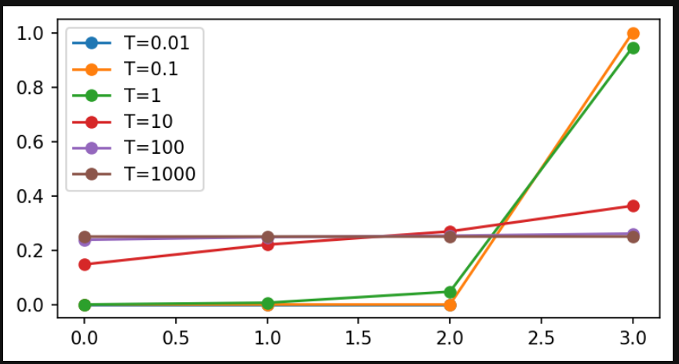

## RoPE 旋转位置编码
* Llama2 中在每个 Attention 层中分别对 Q 和 K 进行旋转位置编码, 也就说在每次计算 Attention 时都分别要对 `Q` 和 `K` 进行旋转位置编码。
* RoPE 的出发点就是 `通过绝对的位置编码方式实现相对位置编码`, 通过给 q, k 添加绝对位置信息, 如以下公式所示, 经过 `attention` 处理之后, 会对 $\bar{q}_m, \bar{k}_n$ 进行内积运算, 带入 $m-n$ 的这个相对位置信息, 其中 $f_q(x_m, m)$ 和 $f_k(x_n, n)$ 都是待求解的函数。
$$\bar{q}_m=f_q(x_m, m), \bar{k}_n=f_k(x_n, n), <f_q(x_m, m), f_k(x_n, n)>=g(x_m, x_n, m-n)$$
* 最终得到的解为, 这个是 $d=2$ 的情况, 当 $d>2$ 时, 可以通过两两一组的方式来实现这种机制, 起始从矩阵可以看出, 就是两个为一组, 逆时针旋转 $m\theta$ 角度。
    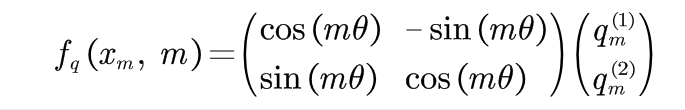
* 其中 m 和 $\theta$ 的求取公式为, $m\in[0, 1, 2, 3, ..., maxSeq-1]$, m 就是在这个句子中的第几个 token, $\theta _{i}=\frac{1}{10000^{\frac{2i}{d}}}, i\in [0, 1,..., \frac{d}{2}-1]$, $\theta$ 就是针对隐藏层的维度来说的, 两两一组有一个唯一的 $\theta$, 然后就能得到 $m\theta$, 直接旋转就可以了。
```Python
# RoPE 是应用在形状为 [bs, num_head, seq_len, head_dim] 张量上, RoPE 被应用到查询 Q 和 K 向量的每个注意 head 上
import torch

bs = 1              # batchSize
seq_len = 10        # 当前句子的长度
max_seq_len = 128   # 最大的句子长度
num_head = 32       # 头的个数
head_dim = 64       # 隐藏层维度

# 依据隐藏层维度 dim, 最大句子长度 end, base, 得到一个 [end, dim/2] 大小的结果(其中的每个值时 m\theta) -> [end, dim/2](复数的形式, 笛卡尔坐标系)
def precompute_freqs_cis(dim, end, base=10000.0):
    theta = 1.0 / (base ** (torch.arange(0, dim, 2) / dim)) # [dim/2]       eg: [32]
    m = torch.arange(end)                                   # [end]         eg: [128]
    freqs = torch.outer(m, theta)                           # [end, dim/2]  eg: [128, 32], 这里是计算外积
    freqs_cis = torch.polar(torch.ones_like(freqs), freqs)  # 转换成复数, 模长为1, 角度为 m\theta, cis 代表 cos + isin
    return freqs_cis                                        # [end, dim/2]  eg: [128, 32]

xq = torch.randn([bs, seq_len, num_head*head_dim])                    # [1, 10, 32*64]
xq = xq.reshape([bs, seq_len, num_head, head_dim]).transpose(1, 2)    # [1, 32, 10, 64]
print(xq.reshape(*xq.shape[:-1], -1, 2).shape)                        # [1, 32, 10, 32, 2]
xq_ = torch.view_as_complex(xq.reshape(*xq.shape[:-1], -1, 2))        # [1, 32, 10, 32], 变成复数后最后一个维度减半了，因为相邻两个元素组成了一个复数
freqs_cis = precompute_freqs_cis(head_dim, max_seq_len)               # [128, 32], 矩阵中每个元素都是复数，实部是cos，虚部是sin
freqs_cis_ = freqs_cis[:seq_len].unsqueeze(0).unsqueeze(1)            # [1, 32, 10, 32], 取出需要的那个部分编码参数
rope_q_ = xq_ * freqs_cis_                                            # [1, 32, 10, 32], 复数相乘
print(torch.view_as_real(rope_q_).shape)                              # [1, 32, 10, 32, 2], 视为实数
rope_q = torch.view_as_real(rope_q_).flatten(-2)                      # [1, 32, 10, 64]  # 把复数表示全部还原成了实数

# 其实计算的原理就是
# 原始的旋转的方式
    R             Wx 
[[cos  -sin]      [x1    =    [x1*cos - x2*sin      #结果元素1
 [sin   cos]]      x2]         x1*sin + x2*cos]     #结果元素2
# 变成复数相乘的形式, 也得到了同样的结果
(x1 + jx2) * (cos + jsin) = (x1*cos - x2*sin) + j(x1*sin+x2*cos)
```
* CUDA 代码的实现方式如下所示。输入是 [bs, seq_len, num_head, head_dim], 这里使用了常量内存 `__constant__`, 存储了提前计算的 `cos(m\theta)` 和 `sin(m\theta)`, cos_theta_p 和 sin_theta_p 的大小均为 [seq_len, num_pair], 注意这里是 `num_pair`, 为 head_dim/2。
* 线程的组织分配方式为 dim3 grid(num_head, seq_len, bs); dim3 block(32); 每个 block 是一包含一个 warp。kernel 中依据每个线程所在的 seq_id 和在 num_pair 中的位置来偏移 cos_theta_p 和 sin_theta_p。一个warp遍历的范围直接为 num_pair, 相当于直接组合好了。
```C++
// batchSize 为 2, seq_len 为 64, num_head 为 32, head_dim 为 128
#define NUM_PAIRS 64  // head_dim / 2
#define SEQ_LEN 64

// Precomputed θ_i values stored in constant memory, 存储角度值
__constant__ float theta[NUM_PAIRS];

// Precomputed cosine and sine values for θ_i * p, 存储 m*theta 的 sin 和 cos 值, 形状是 [seq_len, num_pairs], 先存 seq_len 的所有 num_pair
__constant__ float cos_theta_p[SEQ_LEN * NUM_PAIRS];
__constant__ float sin_theta_p[SEQ_LEN * NUM_PAIRS];

__global__ void RoPE(float *x, int batchSize, int seq_len, int num_head, int head_dim) {
    // Each block processes one (batch_id, seq_id, head_id)
    int batch_id = blockIdx.z;
    int seq_id = blockIdx.y;
    int head_id = blockIdx.x;
    int tid = threadIdx.x;

    int num_pairs = head_dim / 2;
    int total_threads = blockDim.x;    // 一个 block 中的总的线程个数

    int p = seq_id;
    int theta_offset = p * num_pairs;  // 找 theta 的偏移

    for (int i = tid; i < num_pairs; i += total_threads) {
        int idx = 2 * i;

        // Retrieve precomputed cosine and sine values
        float cos_theta = cos_theta_p[theta_offset + i];
        float sin_theta = sin_theta_p[theta_offset + i];

        // Compute offset
        int offset = batch_id * seq_len * num_head * head_dim 
                        + seq_id * num_head * head_dim + 
                            head_id * head_dim + idx;

        float x1 = x[offset];
        float x2 = x[offset + 1];

        // Apply rotation
        float x1_new = x1 * cos_theta - x2 * sin_theta;
        float x2_new = x1 * sin_theta + x2 * cos_theta;

        // Write back
        x[offset] = x1_new;
        x[offset + 1] = x2_new;
    }
}
```
## 常量内存
* `CUDA 常量内存` 是 CUDA 中的一种特殊的内存类型, 专门用于存储在设备代码中的不变数据。常量内存的容量较小, 通常为 64KB, 常见的使用方法如下:
    - 定义常量内存: 通过 `__constant__` 关键字定义在设备端。
    - H2D: 在主机端通过 `cudaMemcpyToSymbol()` 从主机端将数据复制到常量内存中。
    - 在device的内核中使用: 常量内存数据只能在设备端读取, 不可修改, 用法与普通的数组一致。
    - D2H: 通过 `cudaMemcpyFromSymbol()` 从设备端常量内存拷贝到主机端。
```C++
#include <cuda_runtime.h>
#include <iostream>

__constant__ float constData[256];  // 定义常量内存

__global__ void kernel() {
    // 设备端代码可以读取常量内存
    printf("Thread %d: constData[0] = %f\n", threadIdx.x, constData[0]);
}

int main() {
    float hostData[256];
    
    // 初始化数据
    for (int i = 0; i < 256; ++i) {
        hostData[i] = static_cast<float>(i);
    }

    // 将数据从主机端拷贝到设备端的常量内存
    cudaMemcpyToSymbol(constData, hostData, sizeof(hostData), 0, cudaMemcpyHostToDevice);

    // 启动内核，读取常量内存中的数据
    kernel<<<1, 10>>>();
    cudaDeviceSynchronize();

    // 从常量内存拷贝回主机
    float resultData[256];
    cudaMemcpyFromSymbol(resultData, constData, sizeof(resultData), cudaMemcpyDeviceToHost);

    // 打印拷贝回来的数据，确认是否正确
    std::cout << "Data copied from constant memory back to host: " << resultData[0] << std::endl;

    return 0;
}
```
* 常量内存的适用场景:
    - 小规模共享的常量数据: 常量内存的大小通常是固定且较小的, 常用于存储配置参数, 查找表, 而且其是全局可见的, 所有线程都可以访问相同的常量数据。
    - 更适合于一个 warp 中的大部分线程访问同一个地址: 当常量内存被所有线程以相同的地址访问时，它会被常量缓存加载，这样可以显著提升内存访问速度。
* 常量内存相比于 global 的优势:
    - 缓存机制: 利用常量缓存提升了读取速度, 而 global memory 没有这样的缓存, 且访问延迟更高。
    - 更低的带宽消耗: 由于常量缓存的存在, 其读取效率通常高于 global memory, 其是在访问模式局部性好的情况下, 占用更少的带宽。
    - 常量缓存是一个较为特定的缓存机制，主要提升访问常量数据的效率，而 L1 和 L2 缓存是更通用的缓存，用于加速对全局内存和局部内存的访问。

## LayerNorm
* LayerNorm 更多的被用于 NLP 领域, 其公式如下:
$$ LayerNorm(x)=weight*\frac{x-mean(x)}{\sqrt{var(x)+eps}} + bias $$
* 整体的优化思路有以下几点:
    - 使用每个 warp 处理一行, 一共需要 $B\times C$ 个 warp。
    - Var(X) 是方差, 方差可以通过 $Var(x)=E(X^2)-E(X)^2$
    - 因为会多次用到输入数据, 输入数据都是存放在 DARM 中的, 所以可以第一次读取 DARM 的时候就将数据缓存到 SM 中
    - Var(X) 变形原理如下图所示:
    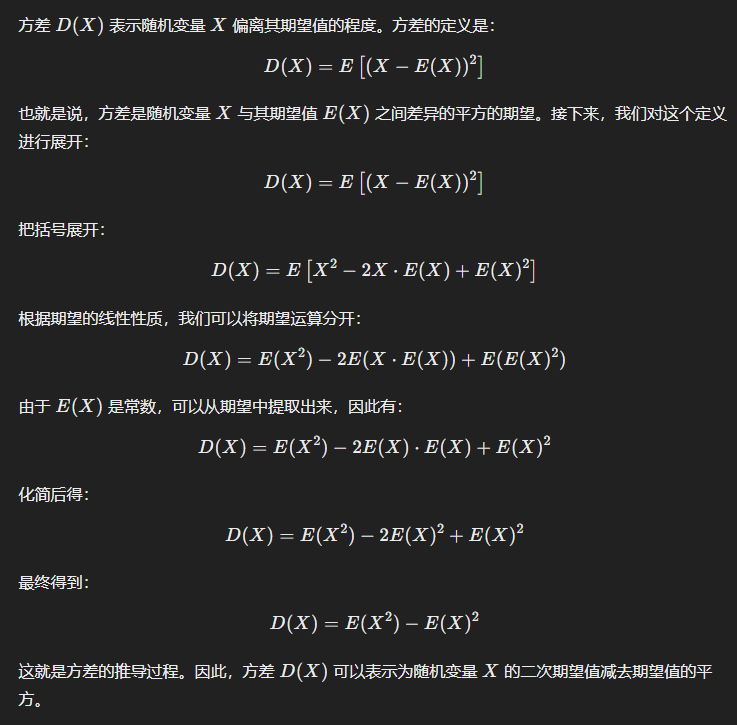
* CUDA 代码如下所示:
```C++
#include <cuda_runtime.h>

// 输入矩阵的大小为 (B, T, C) = (8, 1024, 768)  B 为 batchSize, T 为 sequence 的长度, C 是 embedding 的维度
constexpr int B = 8;
constexpr int T = 1024;
constexpr int C = 768;
constexpr int eps = 1e-5;
constexpr int blockSize = 128;

// 这个没什么心意, 就是注意这里可以进行 unroll
template <typename T1>
__device__ T1 warpReduceSum(T1 val) {
    #pragma unroll
    for (int offset = warpSize / 2; offset > 0; offset >>= 1) {
        val += __shfl_xor_sync(0xFFFFFFFF, val, offset);
    }
    return val;
}

// 1. 利用了个公式 Var(X) = E(x^2) - E(X)^2, 这样就能节省一个循环
// 2. 每个 warp 处理一行
// 3. 因为 输入数据会被多次用到, 所以利用 shared_memory 来进行缓存输入数据
__global__ void layernorm_forward_kernel6(float *input, float *out, float *weight,
                                          float *bias, float eps, int B, int T, int C) {
    // one warp one row
    // use smem to store the shift (x - mean) values
    // use D(X) = E(X^2) - E(X)^2
    assert((C % warpSize) == 0);
    extern __shared__ float sharedX[];
    int warpsPerBlock = blockDim.x / warpSize;           // 每个 block 中的 warp 个数
    int warpId = threadIdx.x / warpSize;                 // 当前线程的 warp id
    int laneId = threadIdx.x % warpSize;                 // 当前线程的 lane id
    int numWarps = gridDim.x * warpsPerBlock;            // grid 的所有 warp 个数
    float *const xSharedWarp = sharedX + warpId * C;     // 当前 warp 用到的 SM 的起始地址

    for (int row = blockIdx.x * warpsPerBlock + warpId; row < B * T; row += numWarps)
        if (row < B * T) {
            // 定位到当前 warp 处理的全局内存的起始地址
            float *const x = input + row * C;
            float *const y = out + row * C;

            float partialSum = 0.0f, partialSum2 = 0.0f;
            for (int i = laneId; i < C; i += warpSize) {
                float xi = x[i];     // 先从共享内存读取到寄存器中, 这样再从寄存器到其他的寄存器和 SM 就快了
                xSharedWarp[i] = xi;
                partialSum += xi;
                partialSum += xi * xi;
            }

            float mean = warpReduceSum(partialSum) / C;    // warp 规约求 E(X)
            float mean2 = warpReduceSum(partialSum2) / C;  // warp 规约求 E(X^2)
            float var = (mean2 - mean * mean);             // 依据公式求得方差
            float inv_std = 1.0f / sqrt(var / C + eps);

            // 写到输出中
            for (int i = laneId; i < C; i += warpSize) {
                y[i] = weight[i] * (sharedX[i] - mean) * inv_std + bias[i];
            }
        }
}

int main(){

    float *inputGPU = nullptr;
    float *outputGPU = nullptr;
    float *weightGPU = nullptr;
    float *biasGPU = nullptr;
    cudaMalloc(&inputGPU, B * T * C * sizeof(float));
    cudaMalloc(&outputGPU, B * T * C * sizeof(float));
    // weight 和 bias 都是在 C 这个维度展开的
    cudaMalloc(&weightGPU, C * sizeof(float));
    cudaMalloc(&biasGPU, C * sizeof(float));

    const int smemSize = blockSize / 32 * C * sizeof(float);  // 每个 warp 处理一个 C, 那就需要 一个block中 warp 个数*C*sizeof(float)
    layernorm_forward_kernel6<<<B * T * 32 / blockSize, blockSize, smemSize>>>(inputGPU, outputGPU, weightGPU, biasGPU, eps, B, T, C); 

    return 0;
}
```

## 大模型采样策略
* 在文本生成任务中, 需要让模型逐个预测每个 `token`, 直到达到终止条件(特殊符号或最大长度)。在每一步的预测中, 模型会给出一个概率分布(softmax), 表示它对下一个单词的预测。如何从这个概率分布中选择下一个单词, 这个就是采样策略。常见的方法有:
    - 贪心策略: 直接选取概率最高的单词。简单高效, 但是会导致生成的文本过于单调和重复。
    - 随机采样(top-k 和 top-p): 按照概率分布随机选择一个单词。增加生成的多样性, 可能会导致文本不连贯和无意义。
    - Beam Search: 维护大小为 k 的候选序列集合, 每一步都从每个候选序列的概率分布中选择概率最高的 k 个单词, 然后保留总概率最高的 k 个候选序列。可以平衡生成质量和多样性, 但是可能导致生成的文本过于保守和不自然。
* `top-k` 和 `top-p` 均是依概率分布进行选择, 但是其选择的范围并不是所有是 token。其均是先依据概率对 token 进行排序, top-k 是从前 k 个 token 中以概率选取, top-p 是先排序后的概率累加和, 选取概率累加和刚好超过 p 的所有 token, 然后在这里进行依概率选取。
* 以下是 `top-k` 的 `Python` 代码:
```Python
# k 越大，生成的多样性越高，但是生成的质量越低；k 越小，生成的质量越高，但是生成的多样性越低
# k 取值多少是非常难以确定的
import torch

def top_k_sampling(logits, k):
    """
    从给定的 logits 中使用 Top-k 采样策略选择下一个词的索引。

    参数：
    - logits: 张量, 形状为 (vocab_size,) 这个是 softmax 之后输出的概率分布
    - k: 整数, 表示选择概率最高的前 k 个词

    返回：
    - 选中词的索引（整数）
    """
    # 获取 logits 的前 k 个值及其对应的索引
    topk_logits, topk_indices = torch.topk(logits, k)

    # 对前 k 个 logits 应用 softmax，得到概率分布
    topk_probs = torch.nn.functional.softmax(topk_logits, dim=0)

    # 从概率分布中随机采样一个词的索引
    sampled_index = torch.multinomial(topk_probs, num_samples=1)

    # 映射回原始词汇表的索引
    token_index = topk_indices[sampled_index]

    return token_index.item()
```
* top-p 在每一步，只从累积概率超过某个阈值 p 的最小单词集合中进行随机采样，而不考虑其他低概率的单词, 这种方法也被称为核采样(nucleus sampling), 因为只关注核心的部分, 忽略了尾部的部分。避免采样到一些不合适或不相关的单词，同时也可以保留一些有趣或有创意的单词。`top-p` 代码如下所示:
```Python
import torch

def top_p_sampling(logits, p):
    """
    从给定的 logits 中使用 Top-p (核) 采样策略选择下一个词的索引。

    参数：
    - logits: 张量，形状为 (vocab_size,)  softmax 之后的结果
    - p: 浮点数，概率阈值，范围在 (0, 1] 之间

    返回：
    - 选中词的索引（整数）
    """
    # 对 logits 应用 softmax，得到概率分布
    probs = torch.nn.functional.softmax(logits, dim=0)

    # 按概率从大到小排序
    sorted_probs, sorted_indices = torch.sort(probs, descending=True)

    # 计算累积概率
    cumulative_probs = torch.cumsum(sorted_probs, dim=0)

    # 找到累积概率超过阈值 p 的位置
    cutoff_index = torch.where(cumulative_probs > p)[0][0]

    # 截断概率分布
    selected_probs = sorted_probs[:cutoff_index + 1]
    selected_indices = sorted_indices[:cutoff_index + 1]

    # 重新归一化被截断的概率分布
    normalized_probs = selected_probs / selected_probs.sum()

    # 从归一化的概率分布中采样一个索引
    sampled_index = torch.multinomial(normalized_probs, num_samples=1)

    # 映射回原始词汇表的索引
    token_index = selected_indices[sampled_index]

    return token_index.item()
```
* Beam-search 是一种启发式搜索算法, 与贪心搜索不同, Beam Search 在每个时间步保留了 k 个最有可能的部分序列, 从而在搜索空间中探索更多的可能性，提高生成序列的质量。以下是 Python 代码:
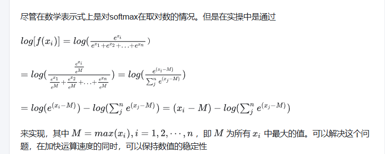
```Python
# 可以发现以下的代码中使用了 log_softmax, 原理是因为 log 是单调递增的, log_softmax 与 softmax 的各个元素的排序结果是一样的。优势主要有:
# 1. 在 Beam Search 中，我们需要比较不同序列的总概率。由于概率值很小，累乘可能导致下溢出。使用对数概率，可以将乘法转换为加法，避免数值问题。
# 2. 减少乘除操作, 加快计算速度。
import torch
import torch.nn.functional as F

def beam_search(model, input_ids, beam_width, max_length, tokenizer):
    """
    使用 Beam Search 生成序列。

    参数：
    - model: 语言模型，例如 GPT 或其他 Transformer 模型
    - input_ids: 初始输入的 token ids，形状为 (1, sequence_length)
    - beam_width: Beam Search 的宽度（保留的候选序列数量）
    - max_length: 生成序列的最大长度
    - tokenizer: 分词器，用于解码 token ids

    返回：
    - 生成的序列列表，按得分从高到低排序
    """
    # 全局的, 初始化序列，分数和完成状态, 记录每个序列的状态和概率
    sequences = [(input_ids, 0.0)]
    complete_sequences = []  # 存放最终的结果

    for _ in range(max_length):
        all_candidates = []  # 存放所有序列的扩展候选, 对候选序列选前 top-k 个, 做为新的 seqences
        # 对于当前的每个序列，扩展候选 
        for seq, score in sequences:  # 这里的 seq 是一个 Tensor 
            # 如果序列已经达到结束标记，则跳过扩展
            if seq[0, -1].item() == tokenizer.eos_token_id:
                complete_sequences.append((seq, score))
                continue

            # 模型前向传播，获取下一个 token 的 logits
            with torch.no_grad():
                outputs = model(seq)
                logits = outputs.logits[:, -1, :]  # 取最后一个时间步的输出

            # 对 logits 应用对数概率
            log_probs = F.log_softmax(logits, dim=1)

            # 选择 beam_width 个最可能的下一个 token
            topk_log_probs, topk_indices = torch.topk(log_probs, beam_width)

            # 为每个可能的下一个 token 创建新的候选序列
            for i in range(beam_width):
                next_token = topk_indices[0, i].unsqueeze(0).unsqueeze(0)
                next_score = score + topk_log_probs[0, i].item()
                candidate_seq = torch.cat([seq, next_token], dim=1)
                all_candidates.append((candidate_seq, next_score))

        # 从所有候选序列中选择得分最高的 beam_width 个序列做为新的 sequcences
        sequences = sorted(all_candidates, key=lambda x: x[1], reverse=True)[:beam_width]

        # 如果所有序列都已完成，提前退出
        if len(sequences) == 0:
            break

    # 将未完成的序列加入完成的序列中
    complete_sequences.extend(sequences)
    # 根据得分对完成的序列进行排序
    complete_sequences = sorted(complete_sequences, key=lambda x: x[1], reverse=True)

    # 解码序列
    generated_sequences = []
    for seq, score in complete_sequences:
        text = tokenizer.decode(seq.squeeze(), skip_special_tokens=True)
        generated_sequences.append((text, score))

    return generated_sequences
```
## DropOut
* DropOut 是一种常见的正则化技术, 广泛应用于深度学习模型中, 主要目的是为了防止模型过拟合, 提高模型的泛化能力。DropOut 核心思想是在训练过程中, 随机丢弃一部分神经元的输出。在训练过程中, 按照一定的概率 `p` 随机将一些神经元的输出设置为 0, 并对未被丢弃的激活值进行缩放(除以 1-p)。在推理过程中, dropOut 不会对输入进行任何的修改。以下是起作用的主要原因:
    - 减少神经元之间的共适应性: 当某些神经元总是一起工作时，模型可能会依赖特定的神经元组合。
    - 防止权重过大: DropOut 通过随机失活，迫使模型的权重不能过度依赖某些输入，促进了权重的均衡。
```Python
import torch
import torch.nn as nn

class DropOut(nn.Module):
    def __init__(self, p=0.5):
        """
        自定义的 DropOut 类，用于实现 Dropout 正则化

        参数：
        - p: 进行 dropout 的概率，默认为 0.5
        """
        super(DropOut, self).__init__()
        if p < 0 or p > 1:
            raise ValueError("dropout 概率必须在 0 到 1 之间。")
        self.p = p

    def forward(self, x):
        if not self.training:
            # 在评估模式下，不进行 dropout
            return x
        else:
            # 使用 torch.rand_like 生成与 x 形状相同的均匀分布随机数, 这里是均匀分布的随机数
            random_tensor = torch.rand_like(x)
            # 生成 mask, 当随机数大于 dropout 概率时，保留对应的神经元
            mask = (random_tensor > self.p).float()
            # 对激活值进行缩放, 防止训练和测试时的值偏差
            return x * mask / (1 - self.p)
```
* CUDA 实现其实也是很好实现的, 逐元素的操作, 每个线程处理 4 个元素(四个元素为一组, float4)。还有就是其中的可能不够 4 整除的问题, 可以读入每个元素的时候都进行判断一次, 不符合条件就置为 0。写入的时候也是类似, 只不过先判断是否可以写入, 能写入再写入, 就是注意其中生成随机数的方法。还有就是考虑的完备性, 当处于推理阶段时, 不需要 dropOut, 就是直接的进行 copy; 当处理训练阶段时, 先判断是否是 drop 概率为 1, 是的话直接置为 0, 最后的情况才是依据概率进行 dropOut。
```C++
// Dropout kernel function
__global__ void DropoutKernel(const float* __restrict__ x,
                              uint8_t* __restrict__ mask,
                              float* __restrict__ y,
                              size_t n,
                              float dropout_prob,
                              bool is_upscale_in_train,
                              unsigned int seed) {

    // Calculate global thread ID
    int idx = blockIdx.x * blockDim.x + threadIdx.x;  // 计算线程的 id
    int stride = gridDim.x * blockDim.x;              // 所有线程的总数

    // Initialize the random number generator state
    curandStatePhilox4_32_10_t state;
    curand_init(seed, idx, 0, &state);

    float inv_prob = 1.0f / (1.0f - dropout_prob);  // 提前计算出来

    // Loop over the elements, processing four elements per thread for efficiency
    for (size_t i = idx * 4; i < n; i += stride * 4) {
        // Generate 4 random numbers
        float4 rand = curand_uniform4(&state);  // 一次得到 float4 的随机数

        // Load 4 input values, 因为输入不一定是 4 的整数倍, 所以可以直接展开, 超的直接置为 0 就可以了
        float4 x_val;
        x_val.x = (i + 0 < n) ? x[i + 0] : 0.0f;
        x_val.y = (i + 1 < n) ? x[i + 1] : 0.0f;
        x_val.z = (i + 2 < n) ? x[i + 2] : 0.0f;
        x_val.w = (i + 3 < n) ? x[i + 3] : 0.0f;

        // Initialize output values and masks, 保存输出值和mask
        float4 y_val;
        uint8_t m_val[4];

        // Apply dropout, 小于 dropout 概率, 都置为 0, 还需要依据 is_upscale_in_train 来判断是否需要缩放
        y_val.x = (rand.x >= dropout_prob) ? (is_upscale_in_train ? x_val.x * inv_prob : x_val.x) : 0.0f;
        y_val.y = (rand.y >= dropout_prob) ? (is_upscale_in_train ? x_val.y * inv_prob : x_val.y) : 0.0f;
        y_val.z = (rand.z >= dropout_prob) ? (is_upscale_in_train ? x_val.z * inv_prob : x_val.z) : 0.0f;
        y_val.w = (rand.w >= dropout_prob) ? (is_upscale_in_train ? x_val.w * inv_prob : x_val.w) : 0.0f;

        // Set mask values, 存储 mask
        m_val[0] = (rand.x >= dropout_prob);
        m_val[1] = (rand.y >= dropout_prob);
        m_val[2] = (rand.z >= dropout_prob);
        m_val[3] = (rand.w >= dropout_prob);

        // Store the results back to global memory, 展开着写回, 防止超越边界
        if (i + 0 < n) {
            y[i + 0] = y_val.x;
            mask[i + 0] = m_val[0];
        }
        if (i + 1 < n) {
            y[i + 1] = y_val.y;
            mask[i + 1] = m_val[1];
        }
        if (i + 2 < n) {
            y[i + 2] = y_val.z;
            mask[i + 2] = m_val[2];
        }
        if (i + 3 < n) {
            y[i + 3] = y_val.w;
            mask[i + 3] = m_val[3];
        }
    }
}
```
* CUDA 中生成随机数都依赖于库函数 `<curand_kernel.h>`, cuRAND 提供了几种不同的随机数生成器类型, 每种都有其不同的特性和使用场景。
    - curandStatePhilox4_32_10_t: 高效且推荐用于高性能的随机数生成。
    - curandStateXORWOW_t: 经典的 XORWOW 生成器，性能较好，适合一般的随机数生成。
    - curandStateMRG32k3a_t: 多重递归生成器，适合高精度随机数的生成。
    - curandStateMTGP32_t: 基于 Mersenne Twister 算法，适合大规模生成随机数，但其初始化开销较大。
* 使用的步骤是:
    - 初始化随机数生成器状态: 在内核中使用 `curand_init()` 函数初始化状态, 确保每个线程生成不同的随机数序列。
    - 根据生成器类型调用不同的 curand_* 函数生成随机数，支持生成浮点数、整型数等多种数据类型。
```C++
// curand_init(seed, thread_id, offset, &state) 是 cuRAND 中用于初始化随机数生成器状态的函数, 它为每个线程生成独立的随机数序列。
// seed: 用于初始化随机数生成器的种子，它决定了生成的随机数序列的起点。相同的种子会生成相同的随机数序列
// thread_id: 是用于区分不同线程的标识符，它确保每个线程生成不同的随机数序列。通常将 thread_id 设为每个线程的唯一标识符（如 threadIdx.x + blockIdx.x * blockDim.x），确保每个线程拥有独立的随机数生成器状态，从而生成不同的随机数。
// offset: 用于偏移随机数序列的起点，它决定了每个线程从随机数序列中的哪个位置开始生成随机数。用于在同一个线程中跳过随机数序列的前几个数。通常可以设置为 0。
// state: state 是一个指向 curandState 类型的指针，表示线程的随机数生成器状态。

// Calculate global thread ID
int idx = blockIdx.x * blockDim.x + threadIdx.x;  // 计算线程的 id
int stride = gridDim.x * blockDim.x;              // 所有线程的总数

// Initialize the random number generator state
curandStatePhilox4_32_10_t state;
curand_init(seed, idx, 0, &state);
float rand = curand_uniform(&state);    // 生成 0-1 之间的均匀分布
float4 rand = curand_uniform4(&state);  // 生成四个
```

## Kernel 中使用自定义的类
* CUDA 设备代码的执行环境和普通的 CPU 不同, CUDA kernel 中使用 C++ 类时, 以下要注意:
    - 类的所有成员变量都必须位于设备内存中。因此要避免使用 `new` 和 `malloc`; 不支持大部分 C++ 标准库(std::vector, std::map, std::string); 
    - 类的所有方法都必须在设备上(包括构造和析构), 即要包含 `__device__` 的标识。
    - 避免使用虚函数(不支持动态的多态), 支持普通的继承, 支持静态的多态(模板, 函数重载)。
    - 可以将类对象以值传递和指针传递的方式做为 CUDA Kernel 的参数。

## NVIDIA GPU 的发展架构
* NVIDIA 在 1999 年发明了 GPU, 到如今为止, NVIDIA GPU 架构已经从 2010 年的 `Fermi 架构` 到 2024 年的 `Blackwell 架构`, 经历了共 9 代的架构。架构图如下所示(其实从 2010 至 2024 年都是每两年发布新一代的架构, 只有 2017 年特殊又单独发布了一代, `8+1=9`):

* 接下来将介绍几个重点的架构:
    * `Fermi`(费米, 2010): 首个完整的 GPU 计算架构, 整个 GPU 有 4 个 GPC, 然后一个 GPC 有 4 个 SM 和 1 个光栅引擎(Raster Engine), 此时也是第一次出现 CUDA Core 的概念(以前称为 SP)。
    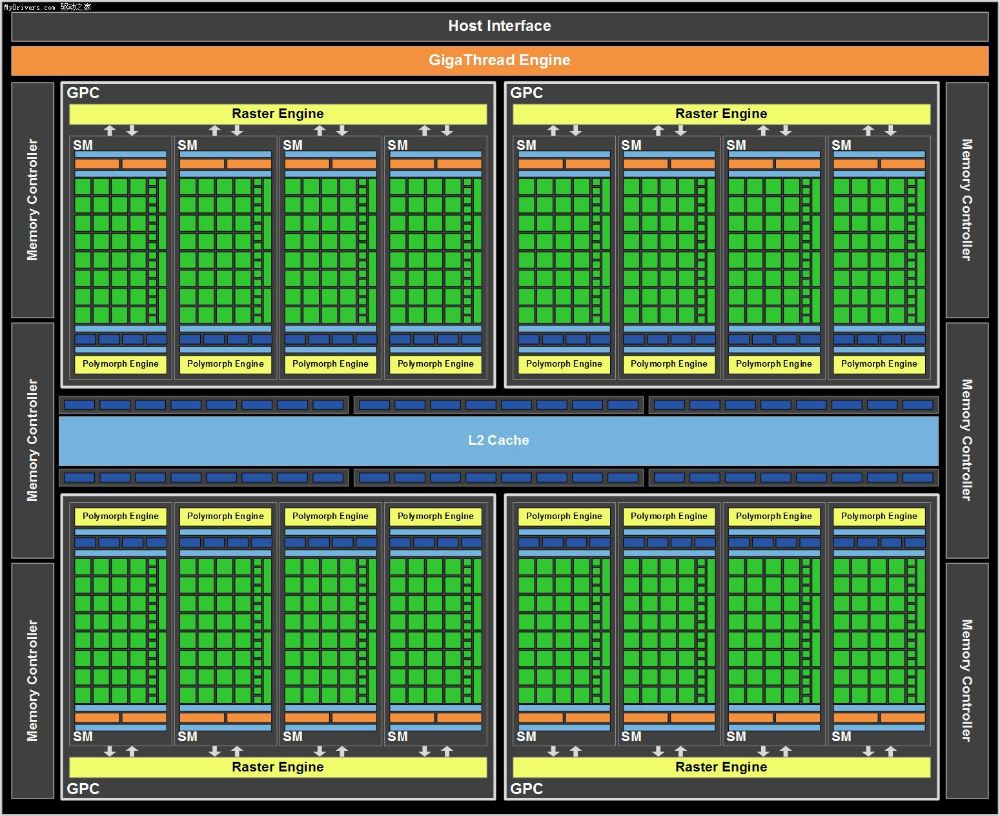
    * 每个 SM 中有 32 个 CUDA Core 和 32 个 LD/ST Unit。注意 CUDA Core 中包含了 FP Unit 和 INT Unit, 分别用来计算浮点数和整数, 但是一个 CUDA Core 同时只能执行其中的一种操作。
    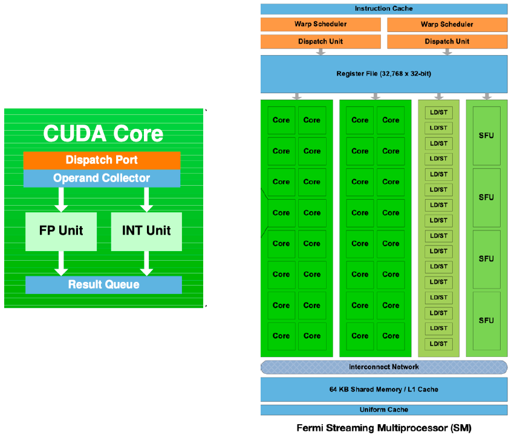
    * `Pascal`(帕斯卡, 2016, 1080Ti): 第一款面向 AI 的架构, 第一代的 NVLink(用于单卡内多个 GPU 内点到点通信), 第一次支持 FP16 半精度计算。此时整个 GPU 由多个 GPC 组成, 每个 GPC 又由多个 TPC 组成, 一个 TPC 中包含两个 SM。
    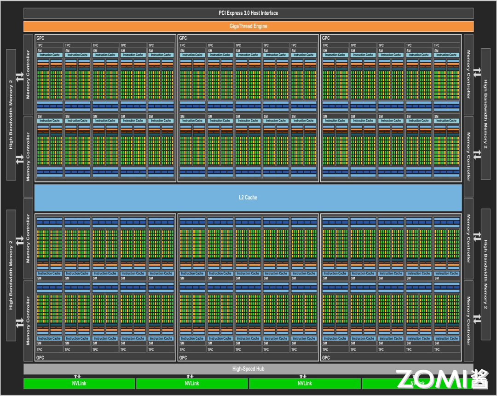
    * 注意每个 SM 中有 64 个 CUDA Core(有处理 FP16 的能力), 有 32 个 DP Unit(用于处理 FP64 计算的)。
    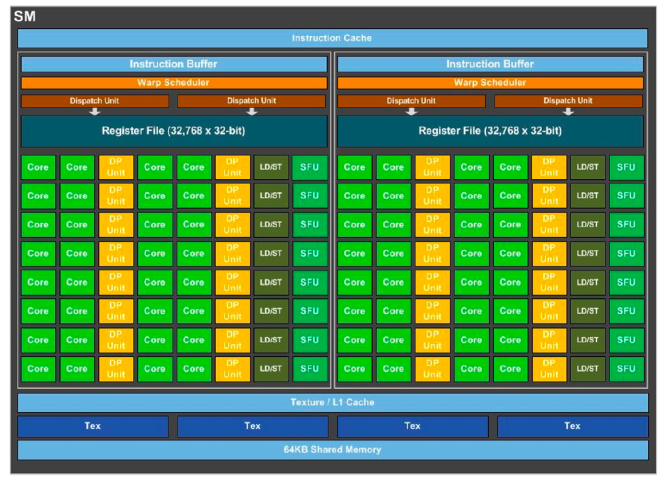
    * `Volta`(伏特, 2017, V100): NVLink2.0, 第一次提出 TensorCore(TensorCore 1.0), 用于加速矩阵乘法计算。将 CUDA Core 拆分(其实从这以后, CUDA Core 就消失了), 分离 FPU 和 ALU(因为原来一直有一个 CUDA Core 内只能执行一种操作的限制)。改进 SIMT 架构, 使得每个线程都有独立的 PC(Program Counter) 和 stack(被一些人诟病其行为是忘记了 `SIMT` 的祖训)。
    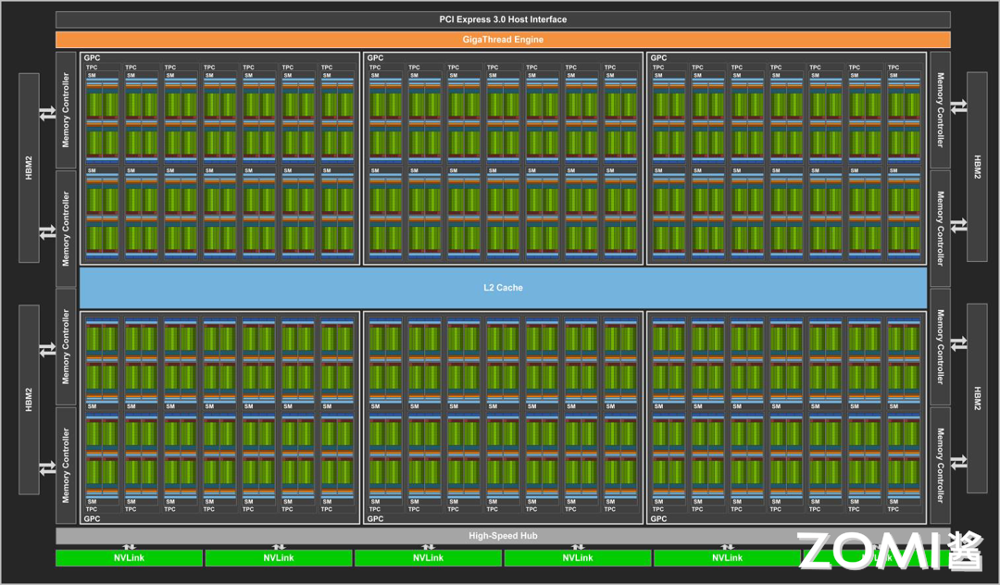
    * 注意, 包含 64 个 FP32 Core, 64 个 INT32 Core, 32 个 FP64 Core, 8 个 TensorCore, 32 个 LD/ST Unit, 4 个 SFU。因为是独立的, 所以此时, FP32, INT32, FP64, TensorCore 运算都可以同时执行。
    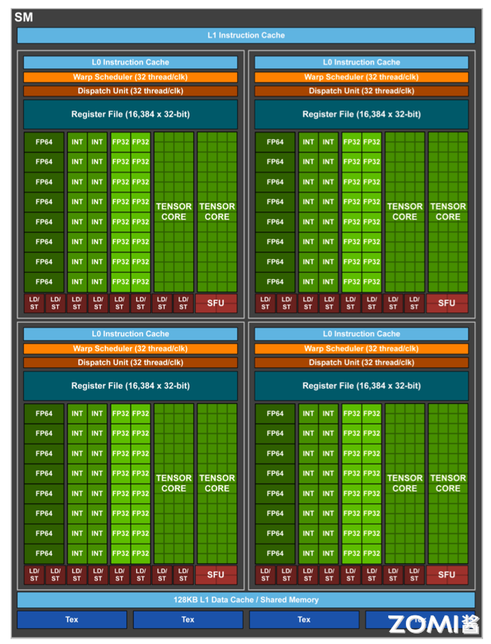
    * `Ampere`(安培, 2020, A100): 引入了 TF32, BF16 的支持, TensorCore 3.0, RT Core 2.0, 第一次使得 TensorCore 支持一个 2:4 的结构化稀疏矩阵与另一个稠密矩阵直接相乘(其实在剪枝的时候, 就会将一些矩阵中的元素置为 0, 然后矩阵就能变得很稀疏, 那么就能够加快推理速度)。
    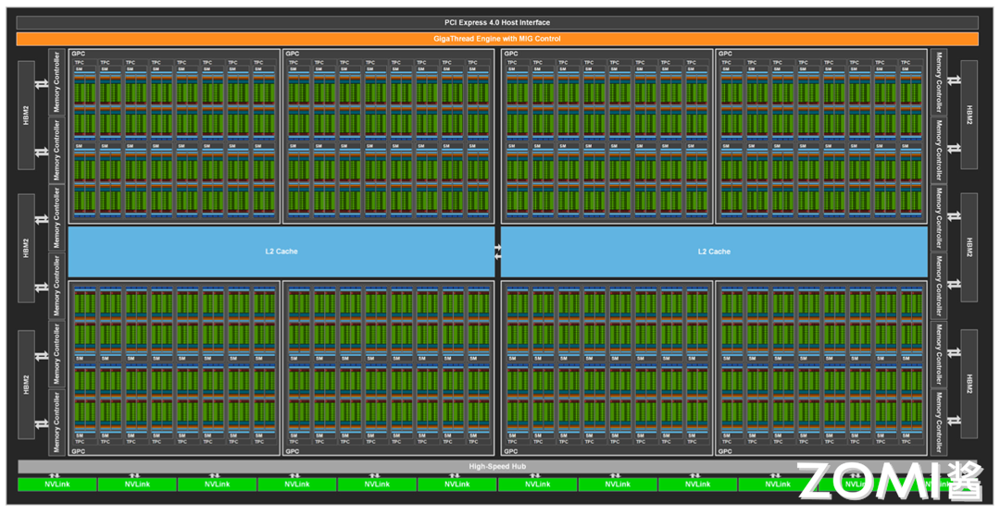
    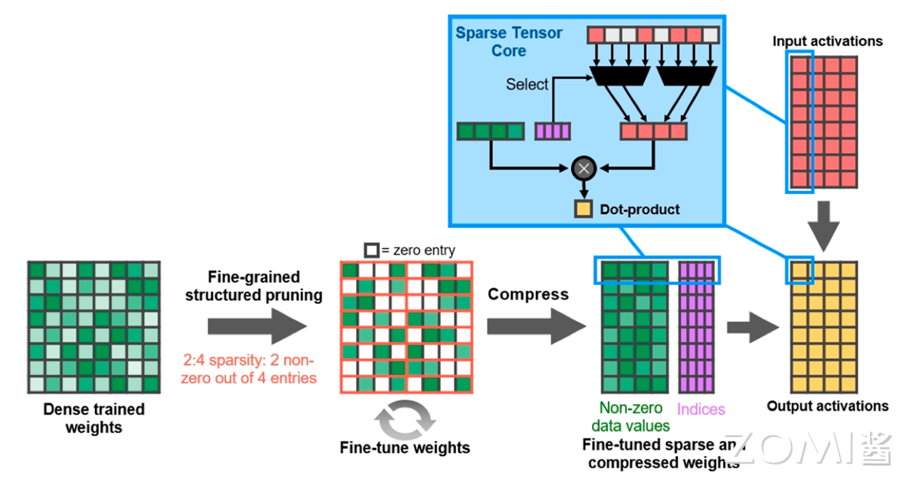
* 认识下 SM 中各个结构的功能:
    - 经常说的 L1 Cache 与 Shared Memory 是共享内存的, 其实指的是 L1 Data Cache(L1 Cache 由 L1 Data Cache 和 L1 Instruction Cache 两部分组成)
    - 其中的 warp Scheduler(warp 调度器) 与 Dispatch Unit(指派单元) 是用于管理和调度并行线程执行的关键组件。
        * warp scheduler: 一个 SM 通常配备有多个调度器, 每个调度器负责在一个时钟周期内选择一个或者多个 warp。warp sceduler 依据当前执行状态, 数据依赖性, 资源可用性选择当前可以执行的 warp。如果一个 Warp 正在等待数据，例如因为内存访问延迟，Warp Scheduler 会将其他准备好执行的 Warp 进行调度，从而隐藏延迟。
        * Dispatch Unit: 将已被 warp scheduler 选中的 warp 发送到相应的执行单元(其实就是 FP32 Core, INT32 Core 这些组件)。一旦 Warp Scheduler 选择了要执行的 Warp, Dispatch Unit 会根据指令的类型将其派发到相应的硬件资源中。例如, 整数计算会派发到整数执行单元, 浮点计算则派发到浮点执行单元。
        
        * 通俗的理解这两个的作用, 如下图所示。假如有 n 个线程等待处理, 在一个时钟周期中会有 3 个 warp 加载到 warp scheduler(一个时钟周期, 一个 warp shceduler 可以同时加载 一个 warp (32 个线程)的指令)。一个 warp scheduler 只有一个 dispatch, 而这个任务发射器连接到了 4 个 FPU, 所以这个 32 个浮点数的计算就需要 8 个时钟周期才可以计算完成。其实这样也就理解了为什么 GPU 图中是那样画的, SM 中又分成了 4 份, 而且为什么一份中的 Core 的个数都是 32 的整数倍。
        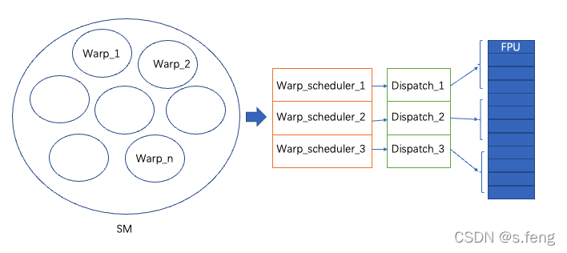
    - CUDA 中每个 SM warp 的利用率从硬件的角度来解释。假设一个 warp scheduler 最多可以管理 8 个 warp, 一个 SM 上有 4 个 warp scheduler, 所以一个 SM 上最大的活跃 warp 个数为 `4*8=32`。active warp 还能再被分成 `stalled`, `eligible`, `selected`。对于一个warp scheduler(指令发射器)，每个时钟周期可以发射出一个指令（因为只有一个 issue slot, 只能有一个黄色的）。
        
        - 其中红色的是处于 `stalled`(阻塞), 黄色的是 `selected`(当下被发射的), 绿色的是 `eligible`(可以被发射的)。4 个 时钟周期, 只有 `5+5+4+6=20` 个 active warp, 所以 warp 利用率为 `20/(4*8)=62.5%`。发射槽的利用率为 `3/4=75%`。

## TensorCore 的发展历程
* 混合精度是指在底层硬件算子层面, 使用 FP16 做为输入和输出训练, 使用全精度(FP32) 进行中间结果计算而不损失过多精度的技术。
* Volta 的第一代 TensorCore($4\times 4\times 4$): 
    - 每个 TensorCore 每个时钟周期能够执行 `4*4*4` GEMM, 64 个 FMA, 执行计算 `D=A*B+C`, 其中 A, B, C, D 均是 `4*4` 的矩阵。A 和 B 是 FP16 矩阵, 累加矩阵 C 和 D 是 FP16 或 FP32 矩阵。其中每个 SM 上有 8 个 TensorCore, 那么一个时钟周期就能够执行 512 个浮点计算。其实对应到这一代 SM 架构的话, 每个 SM 分成了 4 个区域, 每个区域每个时钟周期能够执行 64 个 FMA, 也就是 128 个浮点计算。一个 SM 非 TensorCore 部分, 每个时钟周期最多能够执行 128 次浮点计算。
    
    - CUDA 将 Tensor Core 以 Warp Level 的操作提供了 `CUDA C++ WMMA API` 对外提供, 一个 warp 可以同时操作多个 TensorCore, 来提供 `16*16*16` 的矩阵计算。
    - 每个 Sub-Core 包含 TensorCore + FP64 + +FP32 + INT8 + 特殊函数处理单元 SFU。其中 Warp Scheduler 向 Tensor Core 发送矩阵乘法GEMM(不再经过 Dispatch Unit 模块)运算指令。
    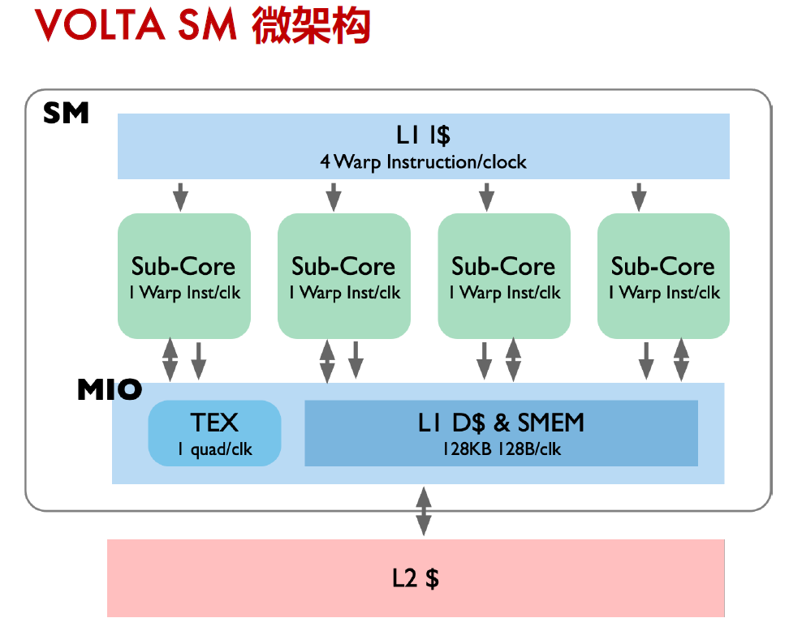
    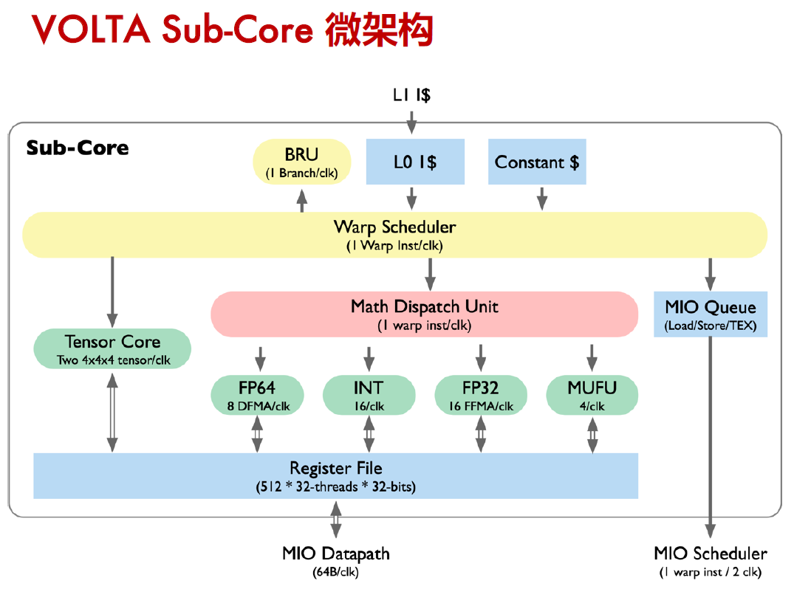
* Turing 的第二代 TensorCore($8\times 8\times 4$):
    - 增加了 INT8 和 INT4 类型支持, 多了 FP16 fast path;
    - FP16 fast path: 在第一代 Tensor Core（如 Volta 架构）中，Tensor Core 支持 FP16 的矩阵乘法和累加操作，但其结果会使用 FP32（32 位浮点数）存储和累加。第二代 Tensor Core（如 Ampere 架构）进一步改进了这一点，增加了专门的 FP16 fast path，使得某些操作（如矩阵乘法和累加操作）在 FP16 精度下可以直接执行，不需要中间转换为 FP32。
    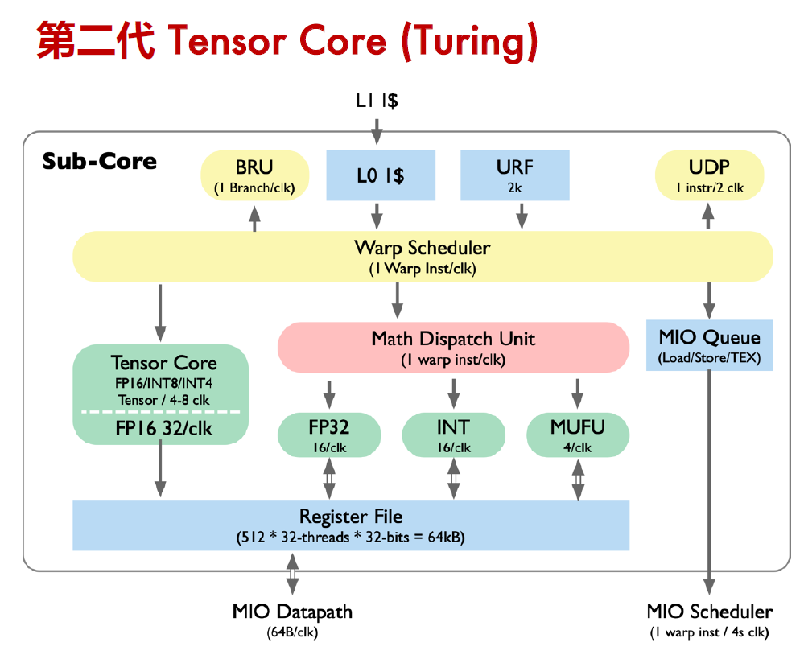
* Ampere 的第三代 TensorCore($16 \times 16 \times 16$):
    - 提供异步拷贝机制(软件层的异步拷贝机制); 前两代的 TensorCore, 数据的流通是 `DRAM->L2->L1->RF->SMEM->RF`(必须先把数据加载到寄存器, 然后再写入共享内存中)。Ampere 架构提供了异步的内存拷贝机制, 实现全局内存不经过寄存器直接到共享内存的数据加载。
    - 在 Volta 架构的 TensorCore 中, 将一个 warp 分成若干个组(每 8 个为一组, 彼此共享数据); Ampere 架构中一个 warp 不再分组, 整个 warp 中 32 个线程都可以共享数据。Ampere 架构的 Tensor Core 允许一个 warp 内的所有 32 个线程更自由、广泛地交换和共享数据, 从而在矩阵计算中实现更高的并行度和效率, 减少了线程间通信和数据传递的开销。
    - 引入 TF32, BF16 的支持。第一次使得 TensorCore 支持一个 2:4 的结构化稀疏矩阵与另一个稠密矩阵直接相乘(其实在剪枝的时候, 就会将一些矩阵中的元素置为 0, 然后矩阵就能变得很稀疏, 那么就能够加快推理速度)。
    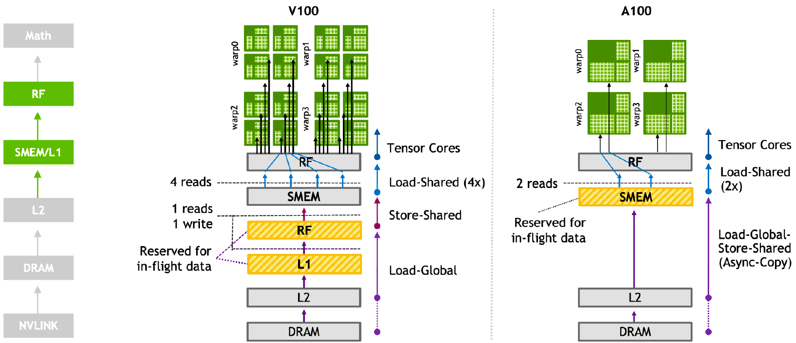
* Hopper 的第四代 TensorCore($16 \times 16 \times 16$):
    - 引入了 TMA(Tensor Memory Accelerator): 硬件的异步加载器, 全局内存中的数据可以被异步的加载到共享内存中。
    
    - 引入了 GPC 内部交叉通信互联网络, GPC 内的 SM 可以高效地访问彼此的共享内存, 因此 CUDA 中也引入了 `thread block Cluster` 的概念。
    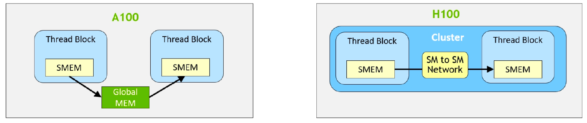
    - 引入 FP8 的支持。
* 历代 TensorCore 的主要提升点:
    - memory improvemnt 提高内存读写效率, 使用更高效的读写方式
    - 提供更多的执行格式(最开始是 $4\times 4\times 4$ GEMM)
    - 提供更多的 CUDA 编程模式(输入输出类型支持更多, CUDA C WMMA, PTX)